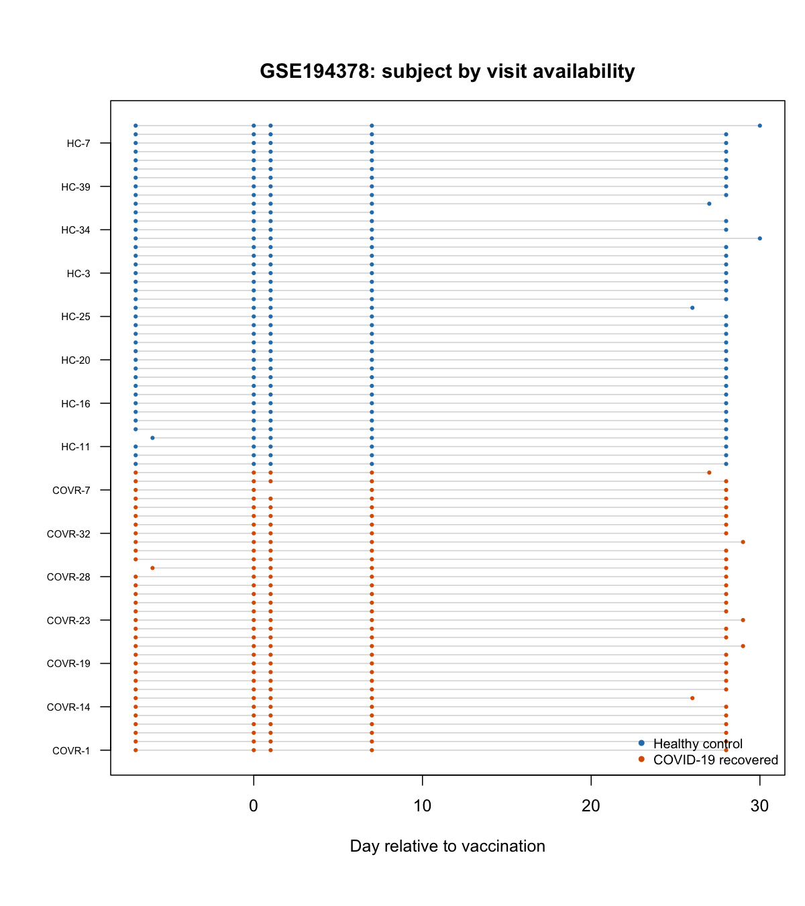

```{r setup, include=FALSE}
knitr::opts_chunk$set(
  echo = TRUE,
  message = FALSE,
  warning = FALSE,
  fig.align = "center",
  fig.width = 8,
  fig.height = 5
)

project_root <- normalizePath(".", winslash = "/", mustWork = FALSE)
```

# Status

**Current stage:** Stage 1 — data feasibility  
**Stage 0:** complete. `bayesSYNCfm` installs alongside the unmodified `bayesSYNC` and reproduces it exactly.  
**Next gate:** vanilla bayesSYNC behaves sensibly on a 200–500-gene pilot from the real dataset.

This report is the running scientific record for EmbedSYNC. It should contain enough narrative, checks, tables and figures to understand what was done and what was learnt without rerunning expensive analyses.

Expensive model fits should be saved by the analysis scripts and read from cached outputs here. Knitting this report should remain reasonably quick.

# Reproducibility snapshot

The software columns are read from `analysis/results/metrics/00_provenance.csv`, written by the analysis scripts, so this table cannot drift away from what was actually run.

```{r reproducibility-snapshot}
prov_file <- file.path(project_root, "analysis", "results", "metrics",
                       "00_provenance.csv")
prov <- if (file.exists(prov_file)) {
  utils::read.csv(prov_file, stringsAsFactors = FALSE)
} else {
  data.frame(item = character(), value = character())
}

lookup <- function(item, default = "not yet recorded") {
  hit <- prov$value[prov$item == item]
  if (length(hit) == 1L && !is.na(hit)) hit else default
}

snapshot <- data.frame(
  item = c(
    "EmbedSYNC commit",
    "Upstream bayesSYNC commit (origin of bayesSYNCfm)",
    "Reference bayesSYNC version (Test A)",
    "bayesSYNCfm version",
    "Primary dataset",
    "Dataset retrieval date",
    "scGPT checkpoint",
    "Reactome source/version",
    "R version",
    "Python version"
  ),
  value = c(
    lookup("EmbedSYNC commit"),
    lookup("bayesSYNC upstream commit"),
    lookup("bayesSYNC version (reference)"),
    lookup("bayesSYNCfm version"),
    "GSE194378",
    "not yet recorded",
    "not yet recorded",
    "not yet recorded",
    R.version.string,
    "not yet recorded"
  ),
  stringsAsFactors = FALSE
)

knitr::kable(snapshot, col.names = c("Item", "Value"))
```

# Stage 0 — scaffold

## Objective

Establish the software baseline against which the grouped prior will be developed and tested.

## Work completed

The group-informed prior is implemented in **bayesSYNCfm**, an R package derived from bayesSYNC at commit `de32614`. It carries its own package name, so it installs alongside the unmodified bayesSYNC rather than replacing it, and both can be loaded in the same session. The exported function names are shared, so the two are distinguished by namespace, `bayesSYNC::bayesSYNC()` against `bayesSYNCfm::bayesSYNC()`, and neither is attached with `library()`.

Keeping the original implementation installed matters for the validation strategy. Every change to the prior can then be checked by regression against a reference that is known to be unmodified, rather than by reading the diff. This is what Test A in the analysis plan asks for, and it only works if the reference cannot be overwritten by the development version.

At this stage bayesSYNCfm differs from bayesSYNC in package identity alone. The likelihood, temporal basis, FPCA representation, variational updates and ELBO are untouched, so the two packages must give identical results. Establishing that agreement now fixes the baseline, so that any later difference can be attributed to the prior.

The analysis scaffold was also created. `analysis/R/00_setup.R` holds the path helpers, the seeds used throughout, and a `provenance()` function recording the R version, the package versions and the commits, which every script saves alongside its results.

## Checks and QC

`analysis/R/00_check_package_rename.R` simulates a small dataset from the model, fits it under both packages with the same seed and identical arguments, and compares every output that later stages depend on. The fits are capped at 30 iterations, since the check is exact agreement between two runs rather than convergence.

```{r stage0-rename-check}
check_file <- file.path(project_root, "analysis", "results", "metrics",
                        "00_package_rename_check.csv")
if (file.exists(check_file)) {
  check <- utils::read.csv(check_file, stringsAsFactors = FALSE)
  knitr::kable(check, col.names = c("Output", "Identical"))
} else {
  cat("Not yet run.")
}
```

The script also compares the source of `bayesSYNC_core()`, which contains the whole variational algorithm, between the two packages. At this stage it is byte-identical. Once the grouped prior is added it will no longer be, and the numerical outputs above become the operative check.

## Results

Every compared output agrees exactly, including the ELBO, the loadings `B_hat`, the posterior inclusion probabilities `ppi` and the reconstructed trajectories.

This is the baseline for Test A. When `prior_groups` is added, calling bayesSYNCfm with `prior_groups = NULL` must still reproduce these values.

## Figures and tables

- `analysis/results/metrics/00_package_rename_check.csv`
- `analysis/results/metrics/00_provenance.csv`

No figures at this stage.

## Decisions

An unmodified bayesSYNC is kept installed as a reference implementation for the duration of the project, so that the default path can be validated by regression at every stage rather than only at the end.

Authorship and the GPL-3 licence of bayesSYNC are carried over unchanged, bayesSYNCfm being a derivative work. Provenance is recorded through the upstream commit it was derived from.

Analysis scripts depend on `here`, so that paths resolve identically whether a script is run from the console, run with `Rscript`, or evaluated while knitting this report.

## Open issues

None.

## Files created or changed

- `bayesSYNCfm/` — the group-informed package, derived from bayesSYNC `de32614`
- `analysis/README.md`
- `analysis/R/00_setup.R`
- `analysis/R/00_check_package_rename.R`

## Next step

Stage 1, data feasibility. Retrieve the GSE194378 processed matrix and metadata, separate biological samples from technical controls and resequenced samples, reconstruct the subject and time structure, and inspect the expression scale.

# Stage template

Copy the section below for each substantive stage. Keep provisional and negative results when they influence later choices.

## Objective

State the question or gate.

## Work completed

Describe what was run or changed and point to the scripts.

## Checks and QC

Record diagnostics, tests and important numerical checks.

## Results

Report the first useful numerical or qualitative findings. Include null or negative results.

## Figures and tables

Prefer figures generated from saved outputs. For an existing image file, use for example:

```{r example-figure, eval=FALSE}

```

For small result tables, read the saved CSV/RDS rather than hard-coding values.

## Decisions

Record choices that affect later analyses and why they were made.

## Open issues

List unresolved points that could affect interpretation or implementation.

## Files created or changed

List important scripts, data products, results and figures.

## Next step

State the smallest next action and the gate it addresses.
