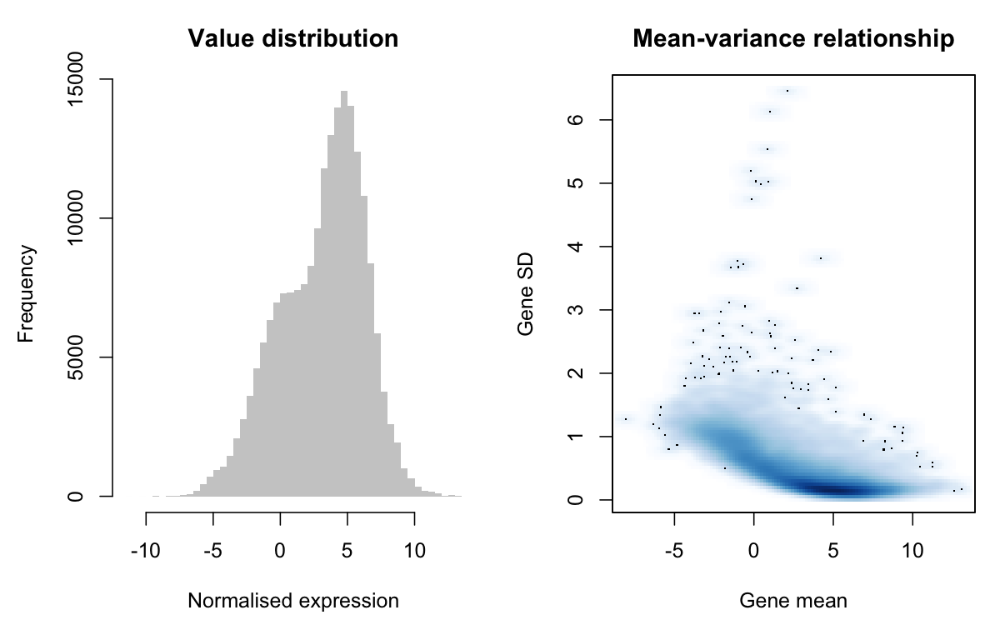
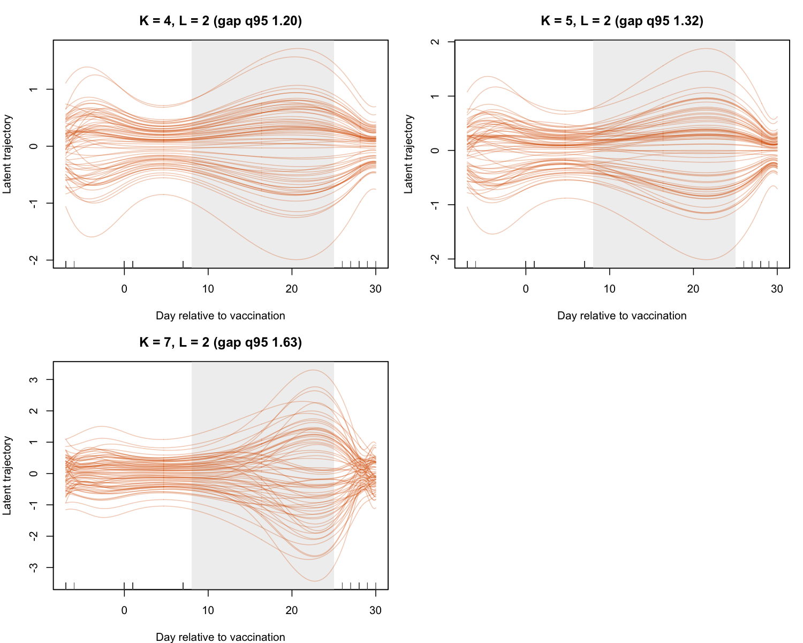
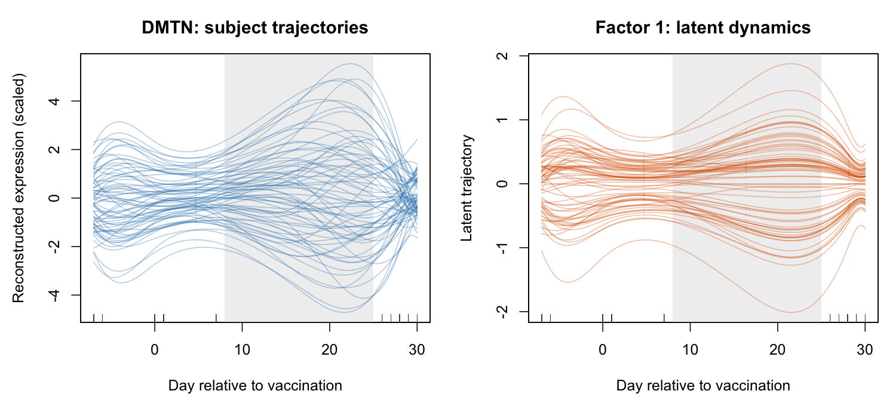
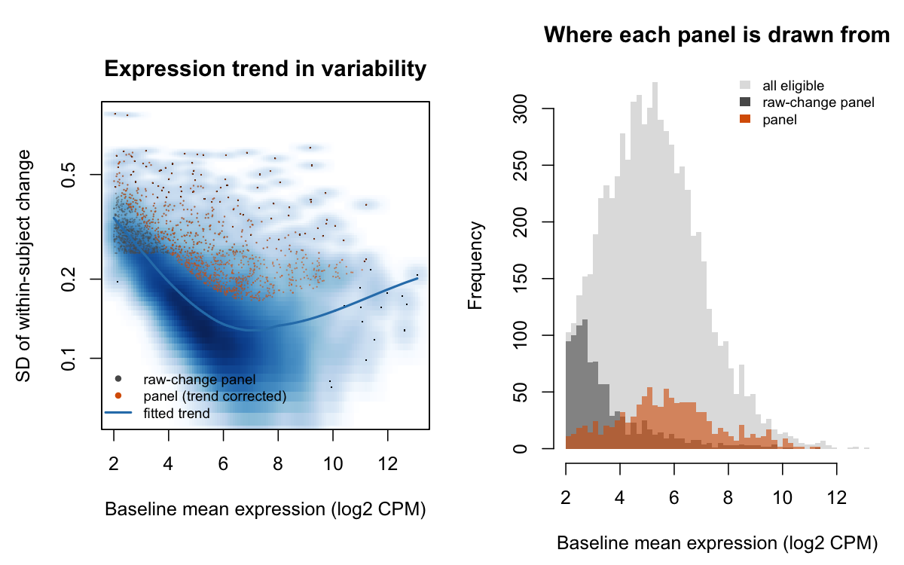
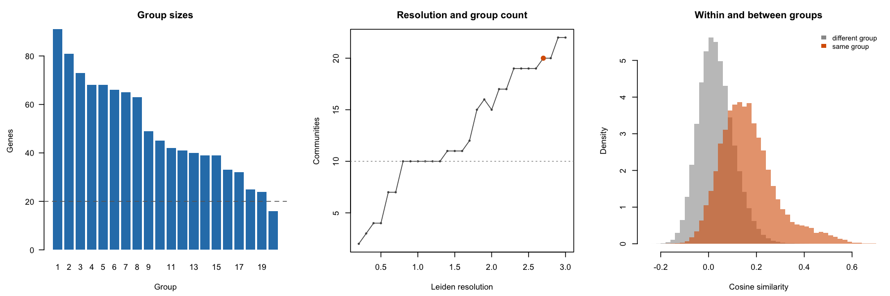
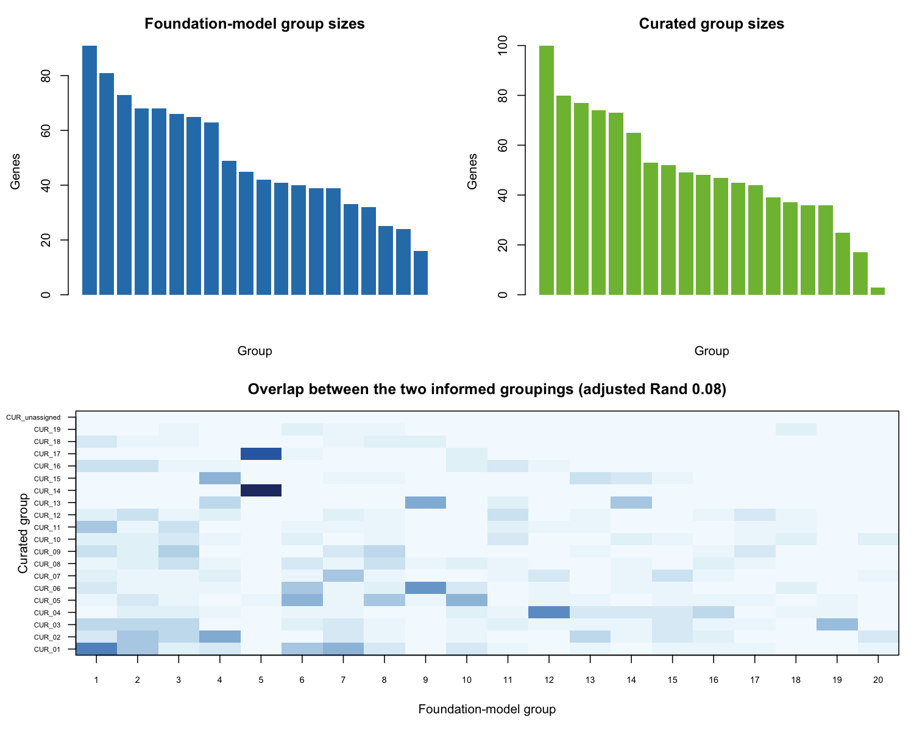
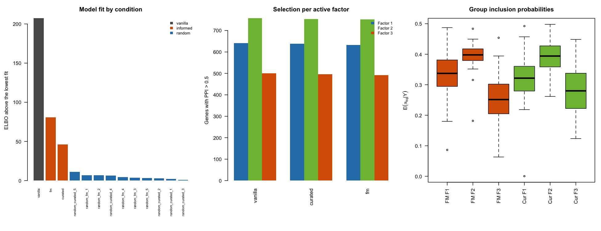
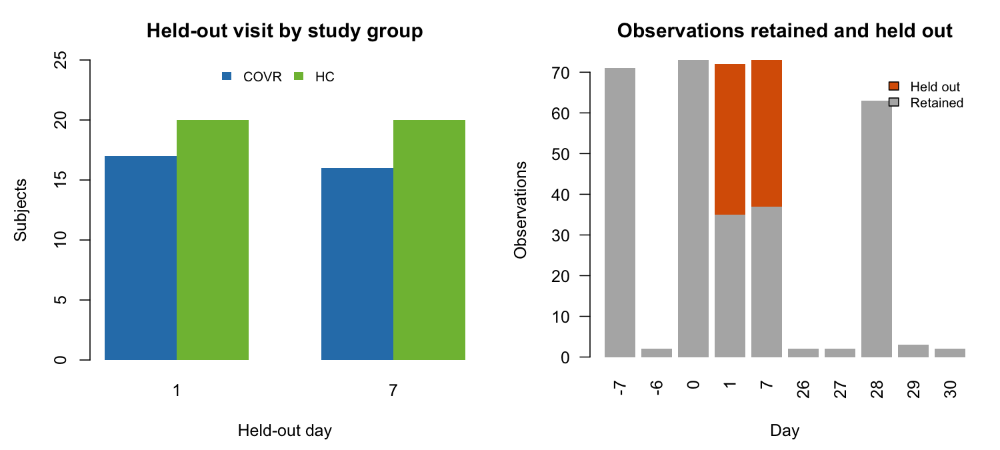

EmbedSYNC progress report
================
07 September 2026

- [Status](#status)
- [Reproducibility snapshot](#reproducibility-snapshot)
- [Stage 0 — Software baseline](#stage-0--software-baseline)
  - [Objective](#objective)
  - [Implementation](#implementation)
  - [Checks](#checks)
  - [Results](#results)
  - [Saved outputs](#saved-outputs)
  - [Decisions](#decisions)
  - [Limitations and open points](#limitations-and-open-points)
  - [Files](#files)
  - [Next](#next)
- [Stage 1 — Data and temporal
  feasibility](#stage-1--data-and-temporal-feasibility)
  - [Objective](#objective-1)
  - [Implementation](#implementation-1)
  - [Checks](#checks-1)
  - [Results](#results-1)
  - [Saved outputs](#saved-outputs-1)
  - [Decisions](#decisions-1)
  - [Limitations and open points](#limitations-and-open-points-1)
  - [Files](#files-1)
  - [Next](#next-1)
- [Stage 2 — Gene panel](#stage-2--gene-panel)
  - [Objective](#objective-2)
  - [Implementation](#implementation-2)
  - [Checks](#checks-2)
  - [Results](#results-2)
  - [Saved outputs](#saved-outputs-2)
  - [Decisions](#decisions-2)
  - [Limitations and open points](#limitations-and-open-points-2)
  - [Files](#files-2)
  - [Next](#next-2)
- [Stage 3 — Foundation-model groups](#stage-3--foundation-model-groups)
  - [Objective](#objective-3)
  - [Implementation](#implementation-3)
  - [Checks](#checks-3)
  - [Results](#results-3)
  - [Saved outputs](#saved-outputs-3)
  - [Decisions](#decisions-3)
  - [Limitations and open points](#limitations-and-open-points-3)
  - [Files](#files-3)
  - [Next](#next-3)
- [Stage 4 — Curated and random
  controls](#stage-4--curated-and-random-controls)
  - [Objective](#objective-4)
  - [Implementation](#implementation-4)
  - [Checks](#checks-4)
  - [Results](#results-4)
  - [Saved outputs](#saved-outputs-4)
  - [Decisions](#decisions-4)
  - [Limitations and open points](#limitations-and-open-points-4)
  - [Files](#files-4)
  - [Next](#next-4)
- [Stage 5 — Grouped-prior
  implementation](#stage-5--grouped-prior-implementation)
  - [Objective](#objective-5)
  - [Implementation](#implementation-5)
  - [Checks](#checks-5)
  - [Results](#results-5)
  - [Saved outputs](#saved-outputs-5)
  - [Decisions](#decisions-5)
  - [Limitations and open points](#limitations-and-open-points-5)
  - [Files](#files-5)
  - [Next](#next-5)
- [Stage 6 — Full-data comparison](#stage-6--full-data-comparison)
  - [Objective](#objective-6)
  - [Implementation](#implementation-6)
  - [Checks](#checks-6)
  - [Results](#results-6)
  - [Saved outputs](#saved-outputs-6)
  - [Decisions](#decisions-6)
  - [Limitations and open points](#limitations-and-open-points-6)
  - [Files](#files-6)
  - [Next](#next-6)
- [Stage 7 — Held-out evaluation](#stage-7--held-out-evaluation)
  - [Objective](#objective-7)
  - [Implementation](#implementation-7)
  - [Checks](#checks-7)
  - [Results](#results-7)
  - [Saved outputs](#saved-outputs-7)
  - [Decisions](#decisions-7)
  - [Limitations and open points](#limitations-and-open-points-7)
  - [Files](#files-7)
  - [Next](#next-7)

# Status

The project has reached Stage 7, the held-out evaluation. Stages 0–6 are
complete. The package extension and its validation tests are in place,
the 1,000-gene panel is frozen, and all 13 full-data conditions have
fitted cleanly. The next question is whether the informed priors improve
reconstruction of observations that were not used for fitting.

| Stage | Status |
|:---|:---|
| 0 — Software baseline | Complete. `bayesSYNCfm` installs alongside the unmodified `bayesSYNC` and reproduces it exactly. |
| 1 — Data feasibility | Complete. GSE194378 supports the design and vanilla bayesSYNC fits it cleanly. |
| 2 — Gene panel | Complete. The 1,000-gene panel is covered by scGPT and Reactome. |
| 3 — FM groups | Complete. All genes assigned to 20 groups of 16–91 genes. |
| 4 — Comparator groups | Complete. Curated and matched-random groups built; 12 grouping vectors aligned to the panel. |
| 5 — Grouped prior | Complete. Tests A–F pass. |
| 6 — Full-data comparison | Complete. All 13 conditions fit cleanly under identical settings. |
| 7 — Held-out evaluation | In progress. The first mask is built and checked; the masked refits are next. |

The report records the analyses, checks and decisions as the work
progresses. Expensive fits are run by the analysis scripts and saved;
the report reads their outputs so that it can be rendered without
refitting the models.

# Reproducibility snapshot

Software provenance is read from
`analysis/results/metrics/00_provenance.csv`, which is written by the
analysis scripts. The table therefore reflects the versions recorded
when the analyses were run.

| Item | Value |
|:---|:---|
| EmbedSYNC commit | de4be1eb993cc1fc56c5fc8dcaa751d495b30bc1 |
| Upstream bayesSYNC commit (origin of bayesSYNCfm) | de326142f15c8a087f544c84f18d83511aae50f1 |
| Reference bayesSYNC version (Test A) | 0.1.0 |
| bayesSYNCfm version | 0.1.0 |
| Primary dataset | GSE194378 |
| Dataset retrieval date | 2026-09-06 |
| Gene panel size | 1000 genes |
| scGPT checkpoint | wanglab/scGPT-human (whole-human, CellxGene census May 2023), embsize 512 |
| Reactome source/version | reactome.db 1.95.0 |
| R version | R version 4.5.2 (2025-10-31) |
| Python version | 3.9.6 (torch 2.8.0) |

# Stage 0 — Software baseline

## Objective

Establish the software baseline against which the grouped prior will be
developed and tested.

## Implementation

The group-informed prior is implemented in **bayesSYNCfm**, derived from
bayesSYNC at commit `de32614`. The package has its own name and can be
installed alongside the unmodified version. Both can be used in the same
session through explicit namespaces, `bayesSYNC::bayesSYNC()` and
`bayesSYNCfm::bayesSYNC()`, without attaching either with `library()`.

Keeping an unmodified reference allows every change to be checked
numerically against the original implementation, rather than relying on
the diff alone. At this stage the packages differ only in their
identity: the likelihood, temporal basis, FPCA representation,
variational updates and ELBO are untouched. Their outputs should
therefore agree exactly. This establishes the baseline for Test A and
makes it possible to attribute later differences to the prior extension.

The analysis scaffold was also created. `analysis/R/00_setup.R` holds
the path helpers, the seeds used throughout, and a `provenance()`
function recording the R version, the package versions and the commits,
which every script saves alongside its results.

## Checks

`analysis/R/00_check_package_rename.R` simulates a small dataset from
the model, fits it under both packages with the same seed and identical
arguments, and compares every output that later stages depend on. The
fits are capped at 30 iterations, since the check is exact agreement
between two runs rather than convergence.

| Output             | Identical |
|:-------------------|:----------|
| B_hat              | TRUE      |
| ppi                | TRUE      |
| omega_hat          | TRUE      |
| factor_ppi         | TRUE      |
| ELBO_iter          | TRUE      |
| i_iter             | TRUE      |
| list_Y_hat         | TRUE      |
| list_h_hat         | TRUE      |
| list_Zeta_hat      | TRUE      |
| list_mu_hat        | TRUE      |
| list_list_Phi_hat  | TRUE      |
| list_cumulated_pve | TRUE      |
| time_g             | TRUE      |

The script also compares the source of `bayesSYNC_core()`, which
contains the variational algorithm. It is byte-identical at this stage.
Once the grouped prior is added, numerical agreement on the unchanged
path becomes the operative check.

## Results

Every compared output agrees exactly, including the ELBO, `B_hat`, `ppi`
and the reconstructed trajectories. This is the baseline for Test A:
after the extension, `prior_groups = NULL` must still reproduce these
values.

## Saved outputs

- `analysis/results/metrics/00_package_rename_check.csv`
- `analysis/results/metrics/00_provenance.csv`

No figures at this stage.

## Decisions

An unmodified bayesSYNC is kept installed as a reference implementation
for the duration of the project, so that the default path can be
validated by regression at every stage rather than only at the end.

Authorship and the GPL-3 licence of bayesSYNC are carried over
unchanged, bayesSYNCfm being a derivative work. Provenance is recorded
through the upstream commit it was derived from.

Analysis scripts depend on `here`, so that paths resolve identically
whether a script is run from the console, run with `Rscript`, or
evaluated while knitting this report.

## Limitations and open points

None.

## Files

- `bayesSYNCfm/` — the group-informed package, derived from bayesSYNC
  `de32614`
- `analysis/README.md`
- `analysis/R/00_setup.R`
- `analysis/R/00_check_package_rename.R`

## Next

Stage 1, data feasibility. Retrieve the GSE194378 processed matrix and
metadata, separate biological samples from technical controls and
resequenced samples, reconstruct the subject and time structure, and
inspect the expression scale.

# Stage 1 — Data and temporal feasibility

## Objective

Establish whether GSE194378 supports the analysis, and whether vanilla
bayesSYNC behaves sensibly on it, before any methodological change.

## Implementation

`analysis/R/01_prepare_data.R` retrieves the processed data and
metadata, reconstructs the design and checks the expression scale.
`analysis/R/01b_pilot_vanilla_fit.R` fits vanilla bayesSYNC to a small
pilot panel.

The series description does not fully specify the analysis-ready sample
set. Three aspects of the design needed to be resolved from the
metadata.

Each RNA isolation batch carried a technical control drawn from a single
healthy donor. These are 25 of the 412 libraries and are not biological
subjects, so they are excluded.

Some subject-visit pairs appear more than once, for two different
reasons: eleven libraries were re-sequenced on a second instrument to
replace initial ones, and some visits were sequenced twice on the
original instrument. Exactly one library is kept per subject-visit.
Where a re-sequenced copy exists it is kept, since the authors describe
those as replacements; otherwise the copy with the larger library size
is kept. Library size is a sequencing quality measure, so neither
criterion involves expression contrasts, subject group or the visits
that will later be held out. For the re-sequenced visits the two
criteria agree, which is a small check on the rule.

The sample metadata are stored as ragged key/value characteristics.
COVID-19 recovered subjects have four fields that healthy controls do
not, so the entries cannot be aligned by position. Parsing by key avoids
silently misassigning visit day and subject group.

| Item | Value |
|:---|:---|
| GEO accession | GSE194378 |
| Retrieval date | 2026-09-06 |
| Libraries in series matrices | 412 |
| Technical control libraries | 25 |
| Biological libraries | 387 |
| Re-sequenced libraries | 11 |
| Duplicated subject-visit pairs resolved | 24 |
| Biological libraries retained | 363 |
| Subjects | 73 |
| Distinct RNA-seq days | -7, -6, 0, 1, 7, 26, 27, 28, 29, 30 |
| Genes in normalised matrix | 17060 |
| Genes mapping to a current symbol | 16865 |
| Subjects with a day 1 visit | 72 |
| Subjects with a day 7 visit | 73 |
| Subjects eligible for held-out evaluation | 73 |

## Checks

The nominal visits are days -7, 0, 1, 7 and 28, but the actual days
recorded are -7, -6, 0, 1, 7, 26, 27, 28, 29 and 30. The drift is
confined to the day -7 and day 28 visits; days 0, 1 and 7 are exact for
every subject. The actual days are kept rather than rounded to the
nominal visit, since bayesSYNC models irregular observation times and
does not require a shared grid, and rounding would discard real
information about when blood was drawn. Days 1 and 7, the candidate
held-out visits, remain exact, so they can be placed exactly on the
dense grid `time_g` as the evaluation requires.

| Nominal visit | Actual day | Samples |
|:--------------|-----------:|--------:|
| Day -7        |         -7 |      71 |
| Day -7        |         -6 |       2 |
| Day 0         |          0 |      73 |
| Day 1         |          1 |      72 |
| Day 7         |          7 |      73 |
| Day 28        |         26 |       2 |
| Day 28        |         27 |       2 |
| Day 28        |         28 |      63 |
| Day 28        |         29 |       3 |
| Day 28        |         30 |       2 |

The final sample set contains 73 subjects, 363 libraries, 71 subjects
with all five visits and 2 with four.

The authors’ normalised matrix is on a log2 counts-per-million scale:
continuous, roughly symmetric about 5 for expressed genes, with 18% of
values negative. No further transformation is needed for the Gaussian
observation model. Variance is concentrated in lowly expressed genes,
the usual behaviour of log counts-per-million at low counts, which is
what the baseline expression filter in Stage 2 is for.

| Item                   |   Value |
|:-----------------------|--------:|
| Minimum                | -11.460 |
| 1st quartile           |   0.910 |
| Median                 |   3.660 |
| 3rd quartile           |   5.440 |
| Maximum                |  13.910 |
| Proportion negative    |   0.184 |
| Spearman cor(mean, sd) |  -0.797 |

The matrix rows are NCBI Entrez gene identifiers carrying a `gene`
prefix. 16,865 of 17,060 map to a current symbol, so identifier
resolution is not an obstacle to the scGPT and Reactome coverage checks
in Stage 2.

## Results

The design is well suited to the project: near-complete five-visit
longitudinal sampling on 73 subjects, with days 1 and 7 available as
internal post-vaccination visits for every subject bar one.

The main difficulty is temporal. Four of the five visits fall within the
first week, with the last around day 28, leaving three weeks without
observations. The interior knots of the O’Sullivan basis are placed at
quantiles of the pooled observation times, so none fall in this gap and
the spline spans it as one long segment. The missing interval cannot be
recovered from the data; the concern is whether the basis introduces
implausible structure there.

We therefore checked the basis explicitly. Candidate values of `K` were
compared on how much each varies across the gap, measured for every
subject and selected gene as the reconstruction range over days 8 to 25
relative to its range over the observed part of the study. Both the
median and the 95th percentile are reported, since a basis may behave
well for most curves while producing large excursions for a minority.
The comparison uses no external grouping or held-out visit.

| K | L | Iterations | ELBO | Runtime (min) | Active factors | Genes selected | Gap ratio (median) | Gap ratio (95th pct) |
|---:|---:|---:|---:|---:|---:|---:|---:|---:|
| 4 | 2 | 130 | -158363.6 | 5.1 | 3 | 256 | 0.99 | 1.20 |
| 5 | 2 | 126 | -158248.2 | 5.7 | 3 | 259 | 0.91 | 1.32 |
| 7 | 2 | 283 | -158317.1 | 12.2 | 3 | 254 | 1.09 | 1.63 |

All three configurations keep the 95th percentile below 1.7, so none is
dominated by unconstrained behaviour. `K = 5` is used: it has the best
ELBO, the lowest median gap ratio and the fastest convergence, and
`K = 7` shows visibly more spread across the gap for no gain in fit.

With `K = 5`, `L = 2` and `Q = 4` deliberately over-specified, the model
converged in 126 iterations over about six minutes and switched one
factor off entirely, leaving three active. This is the intended
behaviour of the sparsity prior under over-specification. Individual
trajectories are well constrained where data exist, fan out moderately
across the gap and reconverge at day 28, retaining between-subject
variation.

Vanilla bayesSYNC fits this design cleanly and the temporal
representation behaves sensibly. The Stage 1 gate is therefore passed,
without needing a fallback dataset.

| Item                                  | Value     |
|:--------------------------------------|:----------|
| Subjects                              | 73        |
| Genes                                 | 300       |
| Observations                          | 363       |
| Q                                     | 4         |
| L                                     | 2         |
| K                                     | 5         |
| Iterations to convergence             | 126       |
| Final ELBO                            | -158248.2 |
| Runtime (minutes)                     | 5.7       |
| Active factors (factor PPI \> 0.5)    | 3         |
| Genes with PPI \> 0.5 on any factor   | 259       |
| Gap amplitude ratio (median)          | 0.91      |
| Gap amplitude ratio (95th percentile) | 1.32      |
| Temporal basis gate                   | passed    |

| Factor | Factor PPI | Genes with PPI \> 0.5 | Max \|loading\| | PVE component 1 (%) |
|:---|---:|---:|---:|---:|
| Factor_1 | 1 | 206 | 2.702 | 98.7 |
| Factor_2 | 1 | 181 | 2.104 | 93.5 |
| Factor_3 | 0 | 0 | 0.000 | NA |
| Factor_4 | 1 | 95 | 3.182 | 86.8 |

## Saved outputs

- `analysis/figures/progress/01_subject_time_availability.png`
- `analysis/figures/progress/01_expression_scale.png`
- `analysis/figures/progress/01b_pilot_basis_comparison.png`
- `analysis/figures/progress/01b_pilot_trajectories.png`
- `analysis/results/metrics/01_*.csv`, `01b_*.csv`
- `analysis/metadata/01b_pilot_gene_panel.csv`

## Decisions

Actual visit days are used rather than nominal visit labels, because
bayesSYNC supports irregular observation times and the candidate
held-out days are exact.

One library is kept per subject-visit, by the re-sequencing and
library-size rule above, rather than by averaging duplicates, which
would mix sequencing batches.

The authors’ normalised matrix is used as supplied. It is already on a
log scale suitable for a Gaussian likelihood.

The pilot gene panel is selected from pre-vaccination visits only,
filtering on baseline expression and ranking on between-subject
variation at baseline. This is the same principle the final panel will
use, so the pilot does not depend on the measurements the evaluation
will hold out.

## Limitations and open points

The pilot selection rule favoured static structure. Ranking genes by
between-subject standard deviation at baseline selects for large, stable
individual differences. Decomposing each active factor’s latent
trajectories over the observed window shows the consequence: for two of
the three active factors the within-subject temporal variation is far
smaller than the variation between subject means (ratios 0.23 and 0.15),
so those factors largely encode which subject a sample came from rather
than how that subject responded. Only one factor is genuinely dynamic
(ratio 1.11).

A panel dominated by stable individual differences would make the main
comparison less informative: each method could reconstruct a held-out
visit largely by estimating the subject’s own level, leaving little room
for the external grouping to distinguish itself. The final panel is
therefore ranked by within-subject change between day -7 and day 0, both
pre-vaccination and so leakage-free, which concentrates the panel where
the grouping can matter. The residual risk, that only two
pre-vaccination visits make this ranking partly sensitive to technical
noise, is carried forward to Stage 2.

There are no observations between day 7 and day 28. The basis check
suggests that the fitted curves do not introduce much structure there,
but the curves remain interpolations rather than evidence about the
intervening period. Interpretation should focus on the first week after
vaccination and the day 28 endpoint. The held-out evaluation is
unaffected by this gap because it uses visits inside the observed
window.

`L = 1` cannot be used. It fails in bayesSYNC, and in the unmodified
package on its own simulated data, so this is a package limitation
rather than anything to do with these data: in `bayesSYNC_core`,
`setdiff(1:L, l)` is empty when `L = 1`, so the enclosing
`rowSums(sapply(...))` receives an empty list and errors. `L = 2` is the
smallest usable number of FPCA components. This is recorded rather than
fixed: it lies in the inference code that this project deliberately
leaves untouched, and changing it would make bayesSYNCfm diverge from
the reference before the Test A baseline has been used.

Runtime is not a binding constraint at the intended panel size. Timed on
this design with `K = 5`, `L = 2`, `Q = 4` and all 73 subjects, a fit
takes 5.7 minutes at 300 genes, 7.0 at 600 and 12.2 at 1,000. The
per-iteration cost grows roughly in proportion to the number of genes,
but the iteration count falls a little, so the total grows more slowly
than the gene count. At 1,000 genes the full-data comparison across
vanilla, curated, foundation-model and ten matched-random partitions is
about 2.6 hours, and each held-out masking replicate costs the same
again.

## Files

- `analysis/R/01_prepare_data.R`
- `analysis/R/01b_pilot_vanilla_fit.R`
- `analysis/R/00_setup.R` — fixed day-to-time mapping shared by all
  stages

## Next

Stage 2, the final gene panel. Check scGPT vocabulary and Reactome
coverage for the mapped genes, apply the prespecified baseline-only
feature rule, and freeze one ordered gene list for every model.

# Stage 2 — Gene panel

## Objective

Freeze one ordered gene list, covered by both external information
sources, for every model to use.

## Implementation

`analysis/R/02_define_gene_panel.R` builds the panel. Genes must be
reliably measured, present in the scGPT vocabulary and annotated in
Reactome. Requiring all three costs little, because the eligible pool is
far larger than the panel, and it removes the need for the `unassigned`
curated group that the analysis plan holds in reserve.

| Step                                            | Genes |
|:------------------------------------------------|------:|
| Genes in normalised matrix                      | 17060 |
| Mapping to a current symbol                     | 16865 |
| In scGPT vocabulary                             | 16387 |
| of which matched via an alias                   |   300 |
| Annotated in Reactome                           |  8618 |
| Reliably measured (baseline mean \> 2)          | 11323 |
| Globin transcripts excluded                     |     4 |
| Eligible: measured, scGPT, Reactome, non-globin |  6795 |
| Panel                                           |  1000 |

Two points about coverage are worth recording. The scGPT vocabulary is
keyed by gene symbol and was built from a 2023 CellxGene release,
whereas the symbols here come from a current annotation. Matching on the
current symbol alone discards genes purely because the symbol has since
changed, so unmatched genes are retried against their aliases; this
recovers 300 genes that would otherwise have been lost to nomenclature
drift. Reactome is the binding constraint at 50.5% of genes, not scGPT
at 96.1%.

## Checks

Globin transcripts are excluded. Ranking on within-subject change placed
HBD, HBB, HBA2 and HBA1 at four of the top six positions. Globins are
expressed here at log2 counts-per-million of 8 to 9, and their abundance
varies between blood draws largely through handling and globin-depletion
efficiency, so they would carry large loadings and risk anchoring a
factor that represents how much globin was in the tube. Excluding them
is standard for whole-blood RNA-seq. The exclusion is deliberately
narrow: erythroid genes that are not globins, such as ALAS2, SLC4A1 and
CA1, are kept, because their variation reflects genuine reticulocyte
content.

The ranking is corrected for the expression trend in variability. Raw
within-subject standard deviation selects partly for noise, because
variability falls steeply with expression on this scale and lowly
expressed genes therefore show large apparent change simply from being
measured less precisely. Without correction the panel fills from the low
end of the expression range. The panel instead ranks on the residual
from a fitted trend of log variability against mean expression, which
selects genes whose change is large *for their expression level*. This
is the same idea as variance-stabilised feature selection in single-cell
analysis, and it keeps the criterion pre-vaccination and leakage-free.

| Item                                                       |  Value |
|:-----------------------------------------------------------|-------:|
| Shared with the pilot rule (between-subject SD)            | 536.00 |
| Shared with raw within-subject change, no trend correction | 427.00 |
| Median baseline expression, this panel                     |   5.71 |
| Median baseline expression, raw-change panel               |   3.02 |
| Median baseline expression, all eligible genes             |   5.13 |
| Median pathways per panel gene                             |   8.00 |

The correction matters. It changes 57% of the panel relative to ranking
on raw change, and moves the median baseline expression from 3.02 to
5.71, slightly above the median of the eligible pool at 5.13, so the
panel is no longer drawn preferentially from the noisy low end.

## Results

The panel holds 1,000 genes from an eligible pool of 6,795, with a
median of 8 Reactome pathways each.

The genes at the top are interpretable as things that genuinely change
within a person over a week: glucocorticoid and circadian responders
(`FKBP5`, `DDIT4`, `PER1`), a plasma-cell marker (`JCHAIN`), eosinophil
and granulocyte genes (`ALOX15`, `SIGLEC8`), reticulocyte content
(`ALAS2`, `SLC4A1`) and metabolic switching (`CPT1A`).
Interferon-stimulated genes such as `RSAD2`, `IFI44L` and `IFIT1` also
enter the panel, which matters because those are the genes expected to
respond to vaccination.

## Saved outputs

- `analysis/metadata/02_gene_panel.csv` — the frozen ordered panel
- `analysis/figures/progress/02_panel_selection.png`
- `analysis/results/metrics/02_coverage.csv`, `02_rule_comparison.csv`

## Decisions

The panel requires membership of both external sources, so that vanilla,
curated, foundation-model and matched-random models all run on exactly
the same genes and no model is advantaged by coverage.

Globin transcripts are excluded; other erythroid genes are retained.

The ranking is the residual from the expression trend in within-subject
pre-vaccination variability, not the raw standard deviation.

The panel is stored in a fixed order and saved before any grouping is
constructed, so that every grouping vector and every fit refers to the
same genes in the same positions.

## Limitations and open points

The ranking uses only one pre-vaccination interval, from day -7 to day
0, and therefore one paired difference per subject. The trend correction
removes systematic mean-dependent variability but not random noise. Some
genes may consequently enter the panel through chance variation. This
limitation remains despite the correction.

`KRT1` ranks eighth. Keratins in whole blood commonly reflect skin
contamination during the draw rather than blood biology. It is retained
to avoid introducing ad hoc exclusions, but should be treated cautiously
if it appears with a large loading.

## Files

- `analysis/R/02_define_gene_panel.R`
- `analysis/data/external/scgpt_human_vocab.json`,
  `scgpt_human_args.json`

## Next

Stage 3, foundation-model groups. Download the whole-human scGPT
checkpoint, extract the static gene-token embeddings for the panel once
and cache them, then build the nearest-neighbour graph and communities.

# Stage 3 — Foundation-model groups

## Objective

Turn the scGPT gene representations into one group per panel gene,
without letting the grouping see the longitudinal data.

## Implementation

`analysis/python/01_extract_scgpt_gene_embeddings.py` extracts the
embeddings and `analysis/R/03_build_fm_groups.R` builds the groups. The
Python step is the only part of the project that is not R, and exists
solely because the checkpoint is a PyTorch `state_dict`. It runs once
and writes a cached CSV; everything after that is R.

The model is used as a lookup table. There is no fine-tuning, no
expression data are passed through the network, and bulk longitudinal
samples are not embedded as cells. The representations were learnt
during pretraining on the CellxGene census and are therefore independent
of GSE194378 by construction.

The scGPT `GeneEncoder` is an embedding lookup followed by a LayerNorm.
The published gene-embedding workflow calls this encoder rather than
reading the embedding matrix directly, and we do the same. The learned
elementwise scale and shift change the direction of each gene vector.
Since the groups are built from cosine similarity, applying the
LayerNorm is important for reproducing the intended representation.

The pipeline follows the published workflow: L2 normalisation, a cosine
nearest-neighbour graph with `k = 15`, then Leiden communities.

| Item | Value |
|:---|:---|
| Checkpoint | wanglab/scGPT-human (whole-human, CellxGene census May 2023) |
| Embedding dimension | 512 |
| Neighbours per gene (k) | 15 |
| Resolution grid | 0.2 to 3.0 by 0.1 |
| Target group count | 20 |
| Chosen resolution | 2.7 |
| Groups | 20 |
| Smallest group | 16 |
| Largest group | 91 |
| Leiden seed | 10 |

The Leiden resolution follows a prespecified rule. The plan targets
roughly 10–30 groups at this panel size. From a fixed grid, we choose
the resolution giving a community count closest to 20, breaking ties
towards the coarser resolution. No model fit, held-out visit or
comparison between grouping schemes enters this choice.

## Checks

The nearest-neighbour structure is biologically coherent, providing a
useful check on the tensor, normalisation and vocabulary mapping:
`ALAS2` sits with `SLC4A1`, `FECH`, `BPGM` and `SPTA1`; `IFIT1` with
`IFIT3`, `IFIT2`, `MX1` and `OAS2`; `JCHAIN` with `DERL3`, `CD79A` and
`CD27`; `FKBP5` with `ZBTB16` and `PDK4`; `LYZ` with `S100A8`, `S100A9`
and `FCN1`. These relationships are consistent with the intended
representation.

The graph is connected, with no gene assigned by default for lack of
edges.

| Item                 | Value |
|:---------------------|------:|
| Genes (nodes)        |  1000 |
| Edges                | 10520 |
| Median degree        |    19 |
| Isolated genes       |     0 |
| Connected components |     1 |

Mean cosine similarity is 0.167 within groups and 0.033 between them, a
five-fold separation. The partition therefore captures structure in the
embedding space rather than an arbitrary division of an unstructured
cloud.

All 1,000 genes are assigned, with no missing labels or isolated genes.
The group vector is stored in panel order and aligns exactly with the
model input. The Stage 3 gate is passed.

## Results

Twenty groups, ranging from 16 to 91 genes. Every group is large enough
for a group- and factor-specific inclusion probability to be informed by
its members, which is what the grouped prior needs.

The groups are interpretable as whole-blood biology, recovered from
pretraining alone with no access to these data:

| Group | Genes | Examples |
|:---|---:|:---|
| FM_01 | 91 | ZBTB16, TSPAN5, NCAM1, HDAC9, AUTS2, NELL2, NRCAM, BASP1 |
| FM_02 | 81 | ALOX15, SLC6A8, OR2W3, PTGDR2, SLC25A20, ESPN, NMUR1, ASCC2 |
| FM_03 | 73 | SPTB, ANK1, SMPD3, TMOD1, DMTN, NFIX, RAP1GAP, B3GAT1 |
| FM_04 | 68 | SPON2, FGFBP2, CD160, KLRF1, GZMH, S1PR5, KLRD1, SH2D1B |
| FM_05 | 68 | RPL39, RPS3A, RPS15A, RPL9, RPS5, RPS26, RPS29, RPL35 |
| FM_06 | 66 | BAG1, IGF2BP2, MYC, FBL, GADD45GIP1, FKBP4, SRP9, HELLS |
| FM_07 | 65 | FKBP5, DDIT4, PER1, DUSP2, THBS1, PDK4, IRS2, DUSP1 |
| FM_08 | 63 | ALAS2, SLC4A1, SNCA, STRADB, CA1, MYL4, GMPR, GYPC |
| FM_09 | 49 | OAS3, MX1, IFIT3, IFI6, OAS2, GBP5, RSAD2, IFIT1 |
| FM_10 | 45 | GUK1, MT-ND6, GPX1, PFDN5, PRDX6, TOMM7, SNRPD2, MZT2B |
| FM_11 | 42 | NID1, PRSS23, LGALS3, MRC2, IFITM3, COL9A3, PDGFRB, PTGDS |
| FM_12 | 41 | KRT1, PI3, LTF, IL5RA, MMP9, DEFA3, VCAN, PADI4 |
| FM_13 | 40 | SIGLEC8, ADORA3, SIGLEC1, CCR2, CD300E, STAB1, CMKLR1, CHST2 |
| FM_14 | 39 | JCHAIN, HLA-DRB5, HLA-DQB1, PLD4, IL13RA1, UBE2J1, CD79A, HLA-DQA1 |
| FM_15 | 39 | TLR2, FLT3, CD163, HCAR3, RNF144B, IRAK3, ALOX5AP, CLEC4E |
| FM_16 | 33 | ALPL, PROK2, FFAR2, LIMK2, ADGRG3, CYP4F3, MGAM, MME |
| FM_17 | 32 | CPT1A, SLC14A1, ABCA1, LGR6, TCF7L2, COL5A3, TRPM6, ARHGAP31 |
| FM_18 | 25 | TUBB2A, HSPH1, UBB, PEBP1, HSPB1, CLU, HSP90AB1, TUBA1A |
| FM_19 | 24 | TXNDC5, LDLR, DHCR24, FADS2, FADS1, SCD, AK1, CYP51A1 |
| FM_20 | 16 | ITGA2B, PPBP, ITGB3, PF4, RGS18, GNG11, GP1BB, TUBB1 |

Among them are recognisable programmes: interferon-stimulated genes
(`OAS3`, `MX1`, `IFIT3`, `RSAD2`), erythroid genes (`ALAS2`, `SLC4A1`,
`CA1`, `GYPC`), platelet genes (`ITGA2B`, `PPBP`, `PF4`, `GP1BB`),
ribosomal proteins, glucocorticoid and immediate-early responders
(`FKBP5`, `DDIT4`, `PER1`, `DUSP1`), NK and cytotoxic markers (`KLRF1`,
`GZMH`, `KLRD1`), B and plasma cells with MHC class II (`JCHAIN`,
`CD79A`, `HLA-DQB1`), neutrophil granule genes (`LTF`, `DEFA3`, `MMP9`)
and cholesterol biosynthesis (`LDLR`, `DHCR24`, `FADS1`, `SCD`).

Recovering this structure is a useful prerequisite, not the main result.
It shows that the external information is meaningful. Whether it
improves the longitudinal model will be assessed through held-out
reconstruction.

## Saved outputs

- `analysis/objects/groups/03_fm_groups.csv` — one group per panel gene
- `analysis/figures/progress/03_fm_groups.png`
- `analysis/results/tables/03_fm_group_examples.csv`
- `analysis/results/metrics/03_fm_*.csv`

## Decisions

The LayerNorm from the scGPT gene encoder is applied, matching the
published workflow rather than reading the raw embedding matrix.

The graph uses the union of each gene’s 15 nearest neighbours by cosine
similarity, so a gene that is nobody else’s neighbour keeps its own
edges and cannot become isolated. Edges with negative similarity are
dropped, since they would assert that two genes belong together because
they point in opposite directions.

The Leiden resolution follows the prespecified group-count rule above,
with a fixed and recorded seed. Group labels are reassigned by
decreasing size so that they do not depend on Leiden’s internal
ordering.

## Limitations and open points

The chosen resolution of 2.7 sits on a steep part of the resolution
curve, where the number of communities changes quickly with the
resolution. The prespecified rule reached its target cleanly and the
resulting groups are biologically coherent, but the partition is not
deeply stable to that choice. This mainly affects interpretation; the
matched random controls test the grouping mechanism regardless of
exactly where the boundaries fall.

Group sizes are uneven, from 16 to 91. The size-adjusted prior is
designed for exactly this, since the hyperparameters scale with group
size, and Test C will check that the expected sparsity does not change
with the partition.

## Files

- `analysis/python/01_extract_scgpt_gene_embeddings.py`
- `analysis/R/03_build_fm_groups.R`
- `analysis/R/00_setup.R` — added the community-detection seed

## Next

Stage 4, curated and random groups. Build Reactome pathway-overlap
similarities, apply the same graph and community strategy, then generate
the matched random partitions that preserve the informed group sizes
exactly.

# Stage 4 — Curated and random controls

## Objective

Build the curated comparator and the matched random controls, and check
that every grouping vector lines up with the frozen panel.

## Implementation

`analysis/R/04_build_curated_groups.R` builds the Reactome groups and
`analysis/R/05_build_random_groups.R` the random partitions.

The curated groups exist to ask whether a foundation model adds anything
over established curated biology. For that question to be about the
information rather than the method, the two must be built the same way,
so the graph construction, community algorithm, resolution rule and seed
are all identical to Stage 3, and only the similarity changes: cosine
similarity between embeddings becomes Jaccard similarity between the
Reactome pathway sets of each gene.

One difference is deliberate and required by the analysis plan. Genes
sharing no pathway have Jaccard similarity exactly zero, and no edge is
created between them. A nearest-neighbour rule applied blindly would
connect every gene to its fifteen closest others whether or not Reactome
asserts any relationship, inventing curated structure that does not
exist.

| Item                    | Value                           |
|:------------------------|:--------------------------------|
| Source                  | Reactome via reactome.db 1.95.0 |
| Pathways used           | 1765                            |
| Neighbours per gene (k) | 15                              |
| Zero-similarity edges   | dropped                         |
| Minimum group size      | 5                               |
| Chosen resolution       | 1.6                             |
| Groups                  | 20                              |
| Unassigned genes        | 3                               |
| Leiden seed             | 10                              |

The random partitions are the negative control for the grouping
mechanism itself. Grouping genes at all changes the prior, quite apart
from whether the grouping is meaningful, because pooling inclusion
indicators shrinks them towards a common rate within each group. Each
informed grouping therefore gets its own null family, built by permuting
which genes carry which labels while leaving the group-size distribution
exactly as it was, so the null differs from the informed grouping in
content and not in shape. Five replicates per family are generated with
deterministic seeds and saved before any model is fitted.

## Checks

The two graphs are comparable in size and connectivity. Foundation
model: 10,520 edges, median degree 19. Curated: 10,582 edges, median
degree 19. Both have a single connected component and no isolated genes.
The two comparators are therefore matched in graph structure and differ
in their similarity source, which is what the comparison requires.

| Item                 | Value |
|:---------------------|------:|
| Genes (nodes)        |  1000 |
| Edges                | 10582 |
| Median degree        |    19 |
| Isolated genes       |     0 |
| Connected components |     1 |
| Largest component    |  1000 |

Mean Jaccard similarity is 0.223 within groups and 0.021 between them.
About 66% of gene pairs share no pathway at all, which is why the
zero-similarity rule matters.

Three genes could not be placed. Genes with no positive-similarity
neighbour, or left in communities of fewer than five genes, are
collected into one explicit `CUR_unassigned` group rather than left as
singletons; a group of one carries no pooling, since its inclusion
probability would be informed by a single Bernoulli draw. The analysis
plan allows this rule, and at three genes it barely engages.

The random partitions preserve the intended group sizes.

| Check                                            | Value |
|:-------------------------------------------------|:------|
| Families                                         | 2     |
| Replicates per family                            | 5     |
| Partitions                                       | 10    |
| Group sizes match the informed grouping          | TRUE  |
| Any partition identical to its informed grouping | FALSE |
| Mean gene-level agreement with informed grouping | 0.062 |
| Expected agreement if labels were independent    | 0.059 |

Group sizes match their informed grouping exactly, no permutation
reproduces the grouping it is a null for, and gene-level agreement with
the informed grouping is 0.062 against 0.059 expected under
independence.

All twelve grouping vectors, comprising the two informed groupings and
ten random partitions, are complete and aligned to the panel. The Stage
4 gate is passed.

| Check                           | Value |
|:--------------------------------|------:|
| Grouping vectors checked        |    12 |
| All aligned to the panel order  |     1 |
| All complete (no missing group) |     1 |

## Results

The two informed sources produce substantially different partitions of
the same genes.

| Item                                                           |  Value |
|:---------------------------------------------------------------|-------:|
| Foundation-model groups                                        | 20.000 |
| Curated groups                                                 | 20.000 |
| Adjusted Rand index between them                               |  0.085 |
| Mean adjusted Rand index, random against its informed grouping | -0.001 |

The adjusted Rand index between them is 0.085, against essentially zero
for the random partitions. Both are individually coherent, so the low
agreement is not a failure of either: they organise the same genes along
different axes. The overlap map shows agreement in several readily
interpretable biological groups. The foundation-model ribosomal group
maps onto the curated ribosomal groups, which Reactome splits into large
and small subunit; the interferon groups correspond; so do the cytotoxic
lymphocyte groups. Elsewhere the partitions diverge, because pathway
co-membership and the co-expression context learnt from single cells are
different relations.

If the partitions agreed closely, the foundation-model arm might add
little over curated biology. Their difference makes the comparison
informative.

## Saved outputs

- `analysis/objects/groups/04_curated_groups.csv`,
  `05_random_groups.csv`
- `analysis/figures/progress/05_grouping_comparison.png`
- `analysis/results/tables/04_curated_group_examples.csv`
- `analysis/results/metrics/04_*.csv`, `05_*.csv`

## Decisions

The curated grouping uses the same graph, algorithm, resolution rule and
seed as the foundation-model grouping, so the two differ only in
similarity.

Zero-similarity edges are dropped, so Reactome is never asked to assert
a relationship it does not record.

Genes Reactome cannot place are collected into one `CUR_unassigned`
group rather than left as singleton groups.

Random partitions are generated once, with deterministic seeds, and
saved before fitting. They are never regenerated inside a fitting
function, so every model sees the same partitions.

## Limitations and open points

Jaccard similarity on pathway membership is sensitive to how deeply a
gene is annotated. A gene in three pathways and a gene in three hundred
can share all three and still score low, and Reactome’s hierarchy means
broad parent pathways are counted alongside specific ones. The
prespecified similarity is applied as written, but these properties of
Reactome annotation should be kept in mind when interpreting the curated
comparator.

`CUR_unassigned` holds three genes. It is a legitimate group for the
model, but it is a group only in the sense of being a residual, so it
should not be interpreted as a programme.

## Files

- `analysis/R/04_build_curated_groups.R`
- `analysis/R/05_build_random_groups.R`

## Next

Stage 5, the grouped prior itself. Add `prior_groups` to bayesSYNCfm
with size-adjusted hyperparameters, implement the grouped variational
updates and ELBO terms, expose the group-level inclusion probabilities,
and run package tests A to F.

# Stage 5 — Grouped-prior implementation

## Objective

Implement the group-informed prior in bayesSYNCfm and establish, by test
rather than by inspection, that it is correct and that the original
model is untouched.

## Implementation

`bayesSYNC()` gains one argument, `prior_groups`, a named vector or
factor of length p whose names are the variable names. Everything else
about the interface is unchanged, and `prior_groups = NULL` is the
original model.

The change is confined to the prior on the loading inclusion indicators.
The likelihood, the temporal basis, the FPCA representation, the slab
distribution, the annealing schedule, the orthonormalisation and the
factor-selection machinery are all untouched.

Group `k` of size $n_k$ receives $\pi_{kq}\sim\mathrm{Beta}(a_k, b_k)$
with $\rho_k = n_k/p$, $a_k = \rho_k c_0$ and $b_k = \rho_k d_0$. This
holds the prior mean at $c_0/(c_0+d_0)$ for every group, so the prior
expected number of active variables per factor stays at
$p\,c_0/(c_0+d_0)$ whatever the partition, while the prior concentration
scales with group size. With one group containing every variable,
$n_1 = p$ gives $a_1 = c_0$ and $b_1 = d_0$.

The variational Beta update becomes a sum within each group rather than
over all variables:

$$
a^{\ast}_{kq} = c\left(a_k + \sum_{j \in G_k} E_q[\gamma_{jq}]\right) - c + 1,
\qquad
b^{\ast}_{kq} = c\left(b_k + n_k - \sum_{j \in G_k} E_q[\gamma_{jq}]\right) - c + 1,
$$

with $c$ the inverse temperature of the annealing schedule. The
inclusion update for variable `j` then uses the expectations of its own
group, $m(j)$. Group sums are formed by a matrix product against a group
indicator, so the result cannot depend on how some helper happens to
order its output.

Both affected ELBO terms change consistently. The
$q(b_{jq},\gamma_{jq})$ contribution remains a sum over variables and
factors, with each variable contributing the expected log inclusion
probability of its group. The Beta contribution becomes a sum over
groups and factors, each with its own $a_k, b_k$.

A misaligned grouping could silently pool the wrong genes. The input
checks therefore reject wrong length, missing names, duplicated names, a
gene set that does not match the model variables, missing labels, or
combining the grouping with variable-specific probabilities. Reordering
by name happens only after the two name sets have been shown to agree
exactly.

All existing outputs are preserved, with three additions:
`prior_groups`, `group_inclusion_prob` (a groups-by-factors matrix of
$E(\pi_{kq}\mid Y)$) and `group_prior_hyperparameters`.

## Checks

| Test | Description | Result | Detail |
|:---|:---|:---|:---|
| Test A | prior_groups = NULL reproduces bayesSYNC | PASS | ELBO -1975.097168 |
| Test B | single group reduces to factor-specific prior | PASS | ELBO -1975.097168 |
| Test C | size-adjusted prior preserves expected sparsity | PASS | target 0.92308, max deviation 2.22e-16 |
| Test D | grouped Beta update matches the equations | PASS | max \|difference\| 7.14e-14 |
| Test D2 | implemented hyperparameters preserve sparsity | PASS | sum n_k E(pi_k) = 0.92308 |
| Test E | correct groups recover the signal at least as well | PASS | AUC correct 1.000, random 0.932, vanilla 0.939 |
| Test F | grouped fits run with and without annealing | PASS | ELBO annealed -11577.7, unannealed -10420.3 |
| Outputs | original outputs preserved, new ones added | PASS | added: prior_groups, group_inclusion_prob, group_prior_hyperparameters |

Tests A and B return the identical ELBO, −1975.097168, as required by
the calibration: a single group containing every variable must reduce to
the factor-specific prior exactly, not approximately. Had the size
adjustment been wrong, these two numbers would differ.

Test D checks the coded update against the equations rather than against
a reimplementation of itself. Without annealing the inverse temperature
is one, so $E(\pi_{kq}\mid Y)$ must equal
$(a_k + \sum_{j \in G_k}\mathrm{ppi}_{jq})/(a_k + b_k + n_k)$, computed
from returned quantities alone. It matches to 7 × 10⁻¹⁴, which exercises
the group sums, the size-adjusted hyperparameters and the posterior mean
together.

## Results

All tests pass, so the Stage 5 gate is met.

Test E examines whether the implementation can exploit a known grouping.
In a small simulation where the active variables of each factor sit in
one group, recovery of the truly active set is perfect with the correct
grouping and materially worse with either alternative.

| Model   |    AUC |
|:--------|-------:|
| correct | 1.0000 |
| random  | 0.9322 |
| vanilla | 0.9389 |

The matched random grouping performs about as well as no grouping at
all, as expected: pooling genes into groups is not by itself helpful.
The matched random controls will allow the real-data comparison to
distinguish the effect of grouping from the information used to
construct the groups. This is a sanity check on a simulation built to
favour the method, not evidence about the real data.

## Saved outputs

- `analysis/results/metrics/05b_grouped_prior_tests.csv`
- `analysis/results/metrics/05b_test_e_recovery.csv`

## Decisions

In grouped mode `omega_hat` is returned as `NULL`. It describes a
factor-specific inclusion probability, which the grouped model does not
have, and filling it with a derived quantity would invite exactly the
wrong reading. The group-level probabilities are returned under their
own name instead.

Group labels supplied by the user are mapped to consecutive codes
internally, and the original labels are kept for the returned object.
Unused factor levels are dropped rather than becoming empty groups.

The grouped prior is refused in combination with
`bool_var_spec_prob = TRUE`, since the two specify incompatible sharing
structures for the same indicators.

A stale default was corrected in the package documentation:
`bayesSYNC.Rd` still described `bool_var_spec_prob` as defaulting to
`TRUE`, which it has not for some time. The `.Rd` files were edited by
hand rather than regenerated, because the installed roxygen2 is a major
version ahead of the one that produced them and regenerating would have
rewritten every file in `man/`, mixing unrelated formatting changes into
this change.

## Limitations and open points

Test E uses one simulation with one seed, block-structured so that each
factor’s active variables lie entirely within one group. Real groupings
will not align with the factors that neatly, so it shows the
implementation can exploit a grouping when one is genuinely there, not
how much it will help in practice.

The grouped prior is not wired into `bayesSYNC_model_choice()`, which
selects the number of factors or components. Model choice will therefore
be run without grouping, or the number of factors fixed in advance, as
the analysis plan already assumes.

## Files

- `bayesSYNCfm/R/bayesSYNC.R` — `prior_groups`, size-adjusted
  hyperparameters, grouped updates, grouped ELBO,
  `check_prior_groups()`, new outputs
- `bayesSYNCfm/man/bayesSYNC.Rd`
- `analysis/R/05b_test_grouped_prior.R`

## Next

Stage 6, the first full-data comparison. Fit vanilla, curated-group and
foundation-model bayesSYNC to the same 1,000-gene panel with identical
settings, together with the matched random controls, and check that
every method converges cleanly.

# Stage 6 — Full-data comparison

## Objective

Fit every condition to the same data under identical settings, and check
that each converges before anything is held out.

## Implementation

`analysis/R/06_fit_models.R` fits thirteen models to the frozen
1,000-gene panel: vanilla bayesSYNC, the curated grouping, the
foundation-model grouping, and five matched random partitions for each
informed grouping. `analysis/R/06b_compare_fits.R` summarises them.

The gene panel, subjects, observations and all other fitting settings
are held fixed: $Q = 5$, $L = 2$, $K = 5$, the dense grid, the scaling,
the annealing schedule, the tolerances and the seed. The conditions
differ in `prior_groups` and in nothing else, and no model is tuned
separately.

Each fit took about seventeen minutes, three and a half hours in total.

## Checks

All thirteen converged, in 115 or 116 iterations. `Q = 5` was
deliberately over-specified and every condition pruned to the same three
active factors, with the two unused ones driven to exactly zero.

Selection is not saturated but it is dense: the three active factors
carry roughly 640, 750 and 500 genes at posterior inclusion probability
above 0.5. The inclusion probabilities are sharply bimodal, so genes are
decisively in or out rather than uncertain.

The grouped prior is doing real work rather than shrinking every group
to a common rate. Group inclusion probabilities range from about 0.09 to
0.49 across foundation-model groups on the first factor.

## Results

| Condition | Arm | ELBO | Iterations | Runtime (min) | Active factors | Genes selected |
|:---|:---|---:|---:|---:|---:|---:|
| vanilla | vanilla | -569084.2 | 115 | 15.6 | 3 | 962 |
| fm | informed | -569210.5 | 116 | 16.8 | 3 | 962 |
| curated | informed | -569245.4 | 116 | 16.4 | 3 | 961 |
| random_curated_5 | random | -569280.1 | 115 | 16.8 | 3 | 959 |
| random_fm_1 | random | -569284.6 | 116 | 16.6 | 3 | 962 |
| random_fm_2 | random | -569284.7 | 116 | 17.1 | 3 | 961 |
| random_curated_4 | random | -569284.8 | 116 | 16.7 | 3 | 961 |
| random_fm_4 | random | -569287.0 | 115 | 17.3 | 3 | 962 |
| random_fm_3 | random | -569287.8 | 115 | 17.0 | 3 | 961 |
| random_fm_5 | random | -569288.2 | 115 | 17.6 | 3 | 961 |
| random_curated_2 | random | -569288.5 | 115 | 16.4 | 3 | 960 |
| random_curated_1 | random | -569289.4 | 115 | 17.0 | 3 | 963 |
| random_curated_3 | random | -569290.4 | 115 | 16.8 | 3 | 962 |

| Grouping | ELBO informed | ELBO random mean | Random SD | Gain over matched random | Gap to vanilla |
|:---|---:|---:|---:|---:|---:|
| fm | -569210.5 | -569286.5 | 1.7 | 76.0 | -126.3 |
| curated | -569245.4 | -569286.6 | 4.2 | 41.3 | -161.2 |

The full-data comparison gives two contrasting results. Both informed
groupings fit substantially better than their size-matched random
partitions: the foundation-model grouping by 76 units of ELBO against a
spread of 1.7 among its five nulls, the curated grouping by 41 against a
spread of 4.2. These are large separations relative to the variation
among the nulls. Because the random partitions preserve the group-size
distribution, this difference cannot be attributed to the generic effect
of pooling genes into groups; it is attributable to which genes are
grouped together. The foundation-model grouping also fits better than
the curated one, by about 35.

Vanilla bayesSYNC nevertheless has the highest ELBO of all thirteen,
ahead of the foundation-model grouping by 126 and the curated grouping
by 161. On this dataset, at this panel size, the ungrouped prior
describes the observed data better than any grouping tried.

These results need to be interpreted with some care. The ELBO is a lower
bound on the log marginal likelihood, and the conditions differ in their
prior, so the comparison is a legitimate one between models but the
bounds need not be equally tight. A difference of this size is unlikely
to be explained by that alone, but it is not a certainty either.

The ELBO also measures fit to the data used to estimate the model. The
main question is whether external biological structure helps recover
programmes that generalise, which requires the held-out comparison in
Stage 7.

Selection is dense: each active factor loads on half to three-quarters
of the panel. In that regime the likelihood dominates the prior for most
genes, so the grouped prior has limited leverage, and its main effect is
on the minority of genes whose loading is genuinely uncertain. A sparser
regime would give the mechanism more room. This is a property of
whole-blood data with strong shared structure rather than a fault in the
implementation, and it is not something to tune away after seeing the
result.

## Saved outputs

- `analysis/figures/progress/06_full_data_comparison.png`
- `analysis/results/metrics/06_condition_comparison.csv`,
  `06_informed_vs_random.csv`, `06_fit_summary.csv`

## Decisions

We retain `Q = 5` and allow the model to prune to three active factors,
rather than fixing the number of factors in advance.

The dense grid used here already contains the candidate held-out days
exactly, so Stage 7 changes the data and nothing else.

## Limitations and open points

The fitted objects are about 680 MB each, so this stage occupies 8.9 GB,
driven by the reconstructed trajectories and their credible bands stored
on a 400-point grid for every subject and gene. There is ample disk
here, but each held-out replicate costs the same again, so the grid size
is the thing to reduce first if space becomes a constraint.

Vanilla ranks first by ELBO. This is not yet an answer to the primary
question, and it should still be reported if the held-out results
differ. The two comparisons measure different things and both are
relevant.

## Files

- `analysis/R/06_fit_models.R`
- `analysis/R/06b_compare_fits.R`

## Next

Stage 7, the primary evaluation. Create and save a fixed
subject-specific mask holding out one internal post-vaccination visit
per eligible subject, balanced across days 1 and 7, refit every
condition to exactly the same masked data, and compare paired
reconstruction error on the original analysis scale.

# Stage 7 — Held-out evaluation

## Objective

Ask whether an informed prior improves reconstruction of observations
that were not used for fitting. One internal post-vaccination visit per
subject is hidden, every condition is refitted on identical masked data,
and the hidden expression vectors are compared against their predictions
on the original analysis scale.

The masks come first and are saved before anything is refitted, so that
every condition is evaluated on exactly the same held-out observations.

## Implementation

`analysis/R/07_build_holdout_mask.R` builds the masks. Nothing in the
assignment uses expression values, the groupings or any fitted model:
only the visit design and a fixed seed.

A visit is a candidate for masking if the subject still has observations
on both sides of it once it is removed. Reconstructing it is then
interpolation between retained visits, which is the question the
evaluation asks. Holding out a subject’s last visit would instead test
extrapolation beyond the observed range, and the two should not be mixed
in one error summary. The distinction is not hypothetical: one subject
has no visit after day 7, so for that subject only day 1 is a candidate.
A second subject has no day 1 visit and is therefore assigned day 7. The
remaining 71 subjects have both days available and are assigned at
random.

The assignment is balanced between day 1 and day 7 within each study
group, so the held-out day is not confounded with the COVR/HC
distinction by chance. Subjects must also retain at least three visits.

| Item                                     | Value |
|:-----------------------------------------|------:|
| Subjects in the dataset                  |    73 |
| Subjects with no interior internal visit |     0 |
| Subjects with too few visits             |     0 |
| Subjects eligible                        |    73 |
| Subjects with a single candidate visit   |     2 |
| Masks built                              |     1 |
| Held-out visits per mask                 |    73 |

Subjects held out at each day, by study group.

|      |   1 |   7 |
|:-----|----:|----:|
| COVR |  17 |  16 |
| HC   |  20 |  20 |

## Checks

| Check                                            | Value |
|:-------------------------------------------------|:------|
| Held-out observations                            | 73    |
| Exactly one per eligible subject                 | TRUE  |
| All held-out visits internal post-vaccination    | TRUE  |
| All held-out visits bracketed by retained visits | TRUE  |
| Held-out times fall on the fitting grid          | TRUE  |
| Minimum retained visits per subject              | 3     |
| Day 1 observations retained in other subjects    | 35    |
| Day 7 observations retained in other subjects    | 37    |
| Observations used for fitting                    | 290   |

The mask hides 73 of the 363 observations, one per subject, leaving 290
for fitting. Both internal days remain well represented among the
retained observations, 35 at day 1 and 37 at day 7, so neither day
disappears from the data the models are fitted to.

The held-out times fall exactly on the dense grid used at Stage 6. This
is checked rather than assumed: the script rebuilds the grid and tests
membership, so widening the candidate set later would be caught rather
than silently producing predictions off the grid.

## Results

The masked refits have not been run. Thirteen conditions at about
seventeen minutes each is roughly three and a half hours, and the
reconstruction errors follow once predictions have been extracted and
returned to the original scale.

## Saved outputs

- `analysis/objects/masks/07_holdout_masks.rds`, `07_holdout_masks.csv`
- `analysis/figures/progress/07_holdout_mask.png`
- `analysis/results/metrics/07_mask_summary.csv`, `07_mask_checks.csv`,
  `07_mask_balance.csv`

## Decisions

Candidate visits are interior to each subject’s own retained observation
times, not merely internal to the study design. This keeps every
held-out point an interpolation.

Day 1 and day 7 are balanced within study group rather than across the
sample as a whole.

One mask to begin with. The saved table already carries a `replicate`
column, so adding three to five further masks is a change to one
constant in the script and nothing else.

The masks are saved under `analysis/objects/masks/` and tracked, since
`analysis/data/processed/` is not in the repository and the comparison
has to be reproducible from a fresh clone.

## Limitations and open points

Every subject contributes one held-out point, so the paired comparison
has 73 pairs and each pair is a whole 1,000-gene expression vector.

Day 1 and day 7 are not equally hard to reconstruct: day 1 sits near the
peak of the innate response, day 7 on a flatter part of the trajectory.
Errors should be reported by day as well as pooled, since pooling could
hide a difference in one and not the other.

Predictions must be extracted at the held-out time and returned to the
original analysis scale before any error is computed, because the models
are fitted to scaled data. That extraction is not yet verified against a
known case, and it is the first thing to check once the refits exist.

Each set of masked fits costs about the same disk as Stage 6, roughly
8.9 GB, so the trajectory grid is the thing to reduce first if
replicates are added.

## Files

- `analysis/R/07_build_holdout_mask.R`
- `analysis/R/00_setup.R` (adds `path_masks()`)

## Next

Refit the thirteen conditions to the masked data, with settings
otherwise identical to Stage 6, then extract the held-out predictions,
undo the scaling and compute paired RMSE and MAE against the hidden
observations.

<!-- Reusable stage template: analysis/report/stage_template.Rmd -->
