EmbedSYNC progress report
================
07 September 2026

- [Status](#status)
- [Findings](#findings)
- [The model](#the-model)
- [The data](#the-data)
- [How the comparisons work](#how-the-comparisons-work)
  - [ELBO](#elbo)
  - [Matched random partitions](#matched-random-partitions)
  - [Held-out reconstruction](#held-out-reconstruction)
  - [Offset-corrected error](#offset-corrected-error)
  - [Explained variance in selection](#explained-variance-in-selection)
- [Reproducibility snapshot](#reproducibility-snapshot)
- [Stage 0 — Software baseline](#stage-0--software-baseline)
  - [Objective](#objective)
  - [Implementation](#implementation)
  - [Checks](#checks)
  - [Results](#results)
  - [Saved outputs](#saved-outputs)
  - [Decisions](#decisions)
  - [Limitations and open points](#limitations-and-open-points)
  - [Files](#files)
  - [Next](#next)
- [Stage 1 — Data and temporal
  feasibility](#stage-1--data-and-temporal-feasibility)
  - [Objective](#objective-1)
  - [Implementation](#implementation-1)
  - [Checks](#checks-1)
  - [Results](#results-1)
  - [Saved outputs](#saved-outputs-1)
  - [Decisions](#decisions-1)
  - [Limitations and open points](#limitations-and-open-points-1)
  - [Files](#files-1)
  - [Next](#next-1)
- [Stage 2 — Gene panel](#stage-2--gene-panel)
  - [Objective](#objective-2)
  - [Implementation](#implementation-2)
  - [Checks](#checks-2)
  - [Results](#results-2)
  - [Saved outputs](#saved-outputs-2)
  - [Decisions](#decisions-2)
  - [Limitations and open points](#limitations-and-open-points-2)
  - [Files](#files-2)
  - [Next](#next-2)
- [Stage 3 — Foundation-model groups](#stage-3--foundation-model-groups)
  - [Objective](#objective-3)
  - [Implementation](#implementation-3)
    - [Where the representations come
      from](#where-the-representations-come-from)
    - [From checkpoint to gene
      vectors](#from-checkpoint-to-gene-vectors)
    - [From vectors to groups](#from-vectors-to-groups)
    - [What the groups look like](#what-the-groups-look-like)
  - [Checks](#checks-3)
  - [Results](#results-3)
  - [Saved outputs](#saved-outputs-3)
  - [Decisions](#decisions-3)
  - [Limitations and open points](#limitations-and-open-points-3)
  - [Files](#files-3)
  - [Next](#next-3)
- [Stage 4 — Curated and random
  controls](#stage-4--curated-and-random-controls)
  - [Objective](#objective-4)
  - [Implementation](#implementation-4)
  - [Checks](#checks-4)
  - [Results](#results-4)
  - [Saved outputs](#saved-outputs-4)
  - [Decisions](#decisions-4)
  - [Limitations and open points](#limitations-and-open-points-4)
  - [Files](#files-4)
  - [Next](#next-4)
- [Stage 5 — Grouped-prior
  implementation](#stage-5--grouped-prior-implementation)
  - [Objective](#objective-5)
  - [Implementation](#implementation-5)
  - [Checks](#checks-5)
  - [Results](#results-5)
  - [Saved outputs](#saved-outputs-5)
  - [Decisions](#decisions-5)
  - [Limitations and open points](#limitations-and-open-points-5)
  - [Files](#files-5)
  - [Next](#next-5)
- [Stage 6 — Full-data comparison](#stage-6--full-data-comparison)
  - [Objective](#objective-6)
  - [Implementation](#implementation-6)
  - [Checks](#checks-6)
  - [Results](#results-6)
  - [Saved outputs](#saved-outputs-6)
  - [Decisions](#decisions-6)
  - [Limitations and open points](#limitations-and-open-points-6)
  - [Files](#files-6)
  - [Next](#next-6)
- [Stage 7 — Held-out evaluation](#stage-7--held-out-evaluation)
  - [Objective](#objective-7)
  - [Implementation](#implementation-7)
    - [What is masked, and when](#what-is-masked-and-when)
    - [How a held-out point is
      predicted](#how-a-held-out-point-is-predicted)
    - [Implementation](#implementation-8)
  - [Checks](#checks-7)
  - [Results](#results-7)
  - [Saved outputs](#saved-outputs-7)
  - [Decisions](#decisions-7)
  - [Limitations and open points](#limitations-and-open-points-7)
  - [Files](#files-7)
  - [Next](#next-7)
- [Stage 7d — Why the two comparisons
  disagree](#stage-7d--why-the-two-comparisons-disagree)
  - [Objective](#objective-8)
  - [Implementation](#implementation-9)
  - [Checks](#checks-8)
  - [Results](#results-8)
    - [The priors barely move the
      posterior](#the-priors-barely-move-the-posterior)
    - [The in-sample advantage sits in the prior, not the
      fit](#the-in-sample-advantage-sits-in-the-prior-not-the-fit)
    - [The groupings do capture something
      real](#the-groupings-do-capture-something-real)
    - [It does not buy stability
      either](#it-does-not-buy-stability-either)
  - [Saved outputs](#saved-outputs-8)
  - [Decisions](#decisions-8)
  - [Limitations and open points](#limitations-and-open-points-8)
  - [Files](#files-8)
  - [Next](#next-8)
- [Stage 7e — Does the prior have leverage in a sparser
  regime?](#stage-7e--does-the-prior-have-leverage-in-a-sparser-regime)
  - [Objective](#objective-9)
  - [Implementation](#implementation-10)
  - [Checks](#checks-9)
  - [Results](#results-9)
  - [Saved outputs](#saved-outputs-9)
  - [Decisions](#decisions-9)
  - [Limitations and open points](#limitations-and-open-points-9)
  - [Files](#files-9)
  - [Next](#next-9)
- [Stage 7f — Does the grouping explain the model’s own
  selection?](#stage-7f--does-the-grouping-explain-the-models-own-selection)
  - [Objective](#objective-10)
  - [Implementation](#implementation-11)
  - [Results](#results-10)
  - [Saved outputs](#saved-outputs-10)
  - [Decisions](#decisions-10)
  - [Limitations and open points](#limitations-and-open-points-10)
  - [Files](#files-10)
  - [Next](#next-10)
- [Stage 7g — What the programmes
  represent](#stage-7g--what-the-programmes-represent)
  - [Objective](#objective-11)
  - [Implementation](#implementation-12)
  - [Results](#results-11)
  - [Saved outputs](#saved-outputs-11)
  - [Decisions](#decisions-11)
  - [Limitations and open points](#limitations-and-open-points-11)
  - [Files](#files-11)
- [Conclusions](#conclusions)
  - [What was established](#what-was-established)
  - [What the comparisons found](#what-the-comparisons-found)
  - [Why](#why)
  - [What this does and does not say](#what-this-does-and-does-not-say)
  - [What would add light, and what would
    not](#what-would-add-light-and-what-would-not)

# Status

Stages 0–7 are complete, which is the minimum project described in
`plan.md`, together with three diagnostics that explain what the main
comparisons found. The package extension and its validation tests are in
place, the 1,000-gene panel is frozen, and all 13 conditions have been
fitted twice, once to the full data and once with one internal visit per
subject held out.

| Stage | Status |
|:---|:---|
| 0 — Software baseline | Complete. `bayesSYNCfm` installs alongside the unmodified `bayesSYNC` and reproduces it exactly. |
| 1 — Data feasibility | Complete. GSE194378 supports the design and vanilla bayesSYNC fits it cleanly. |
| 2 — Gene panel | Complete. The 1,000-gene panel is covered by scGPT and Reactome. |
| 3 — FM groups | Complete. All genes assigned to 20 groups of 16–91 genes. |
| 4 — Comparator groups | Complete. Curated and matched-random groups built; 12 grouping vectors aligned to the panel. |
| 5 — Grouped prior | Complete. Tests A–F pass. |
| 6 — Full-data comparison | Complete. All 13 conditions fit cleanly under identical settings. |
| 7 — Held-out evaluation | Complete. All 13 conditions refitted on masked data. No grouping reconstructs held-out visits better than any other, and all are beaten by a per-subject mean. |
| 7d — Diagnosis | Complete. The priors move the posterior very little, the in-sample gain sits in the prior terms rather than in data fit, and the groupings differentiate their groups far beyond matched random partitions. |
| 7e — Sparsity diagnostic | Complete. A much stronger prior gives the grouping more leverage and reverses the ELBO ordering, but leaves held-out error unchanged between conditions. |
| 7f — Grouping signal | Complete. The scGPT partition explains 15% of the variance in vanilla’s gene selection against 1.9% expected by chance, measured on a fit that never saw the grouping. |
| 7g — Interpretation | Complete. Factor 2 carries a cohort by sex interaction at p = 0.0008, matching the published sex-dimorphic finding, and the trajectories are unconstrained between day 7 and day 28. |

The report records the analyses, checks and decisions as the work
progresses. Expensive fits are run by the analysis scripts and saved;
the report reads their outputs so that it can be rendered without
refitting the models.

# Findings

The scGPT gene embeddings carry real information about this dataset.
Partitioning the panel by embedding similarity explains about 15% of the
variance in which genes vanilla bayesSYNC selects, against 1.9% for
partitions with the same group sizes and randomly assigned members. That
is measured on a model fitted without any grouping, so nothing about it
is circular, and it replicates on two fits to different data. Reactome
membership does the same thing at half the strength.

Feeding that information in as a prior changes almost nothing. Across
1,000 genes, the foundation-model grouping alters the selection call for
14 of them relative to vanilla, and its loadings correlate with
vanilla’s at 0.999. The reason is visible in the fits: the likelihood
evidence for including a gene has a median log-odds of about 2 and an
upper quartile of 18, while the whole spread of prior log-odds a
grouping can supply is around 2.7. The prior is not competing.

The informed groupings do fit the observed data better than size-matched
random partitions, by 76 units of ELBO on the full data and 81 on the
masked data. Decomposing that gain shows it sitting entirely in the two
terms that involve the inclusion prior, with the block containing the
data fit slightly worse. The gain measures how well a partition matches
the selection pattern the model infers, which is close to what Stage 7f
measures directly, and it is not evidence about prediction.

No grouping reconstructs a held-out visit better than any other. All 13
conditions fall within two parts in a thousand of each other, and each
informed grouping is interleaved with its own random partitions. Every
model, including vanilla, is beaten by predicting each subject’s own
mean over its retained visits, because the model has no per-gene subject
intercept and between-subject variation is about twice the
within-subject temporal variation on these data.

The programmes themselves are not empty, which is worth separating from
the negative result about the prior. The score on the factor carrying
the clearest vaccination response shows a cohort by sex interaction at
$p = 0.0008$, adjusted for age, matching the sex-dimorphic imprint of
prior mild COVID-19 that the published analysis of these data reports.
That comes from the vanilla fit, with no grouping involved and no
knowledge of cohort, sex or age.

The one-line reading: the external information is real, the channel
through which the model can use it is too narrow, and the evaluation is
dominated by a component the model does not represent. The reasoning is
set out in [Conclusions](#conclusions).

# The model

bayesSYNC represents gene $j$ in subject $i$ at time $t$ as a shared
mean curve plus a subject-specific combination of dynamic factors,

$$
y_{ij}(t) = \mu_j(t) + \sum_{q=1}^{Q} b_{jq} h_{qi}(t) + \varepsilon_{ij}(t),
\qquad
h_{qi}(t) = \sum_{l=1}^{L} \zeta_{qil} \phi_{ql}(t),
$$

with $\mu_j$ and $\phi_{ql}$ O’Sullivan splines on $K$ interior knots
and $\varepsilon$ Gaussian. The loadings carry a spike-and-slab prior,
$b_{jq}$ being zero unless the indicator $\gamma_{jq}$ is one, and it is
the prior on those indicators that this project replaces.

| Symbol | Meaning | Value here |
|:---|:---|:---|
| $N$ | subjects | 73 |
| $p$ | genes in the panel | 1,000 |
| $Q$ | factors requested | 5, of which 3 stay active |
| $L$ | spline components per factor | 2 |
| $K$ | interior knots in the splines | 5 |
| $T_i$ | visits for subject $i$ | 4 or 5, one of them held out at Stage 7 |
| $K_G$ | external groups | 20 |
| $n_k$ | genes in group $k$, so $\sum_k n_k = p$ | 16 to 91 |
| $\gamma_{jq}$ | gene $j$ loads on factor $q$ | inferred |
| $\omega_q$ | inclusion rate for factor $q$ | inferred |
| $\pi_{kq}$ | inclusion rate for group $k$ on factor $q$ | inferred, grouped model only |

Indices run $i = 1, \dots, N$ over subjects, $j = 1, \dots, p$ over
genes, $q = 1, \dots, Q$ over factors and $k = 1, \dots, K_G$ over
external groups. Two of these are easy to confuse and are worth stating
plainly: $T_i$ counts a subject’s visits, while $n_k$ counts a group’s
genes. The package calls the latter `n_variables` in
`group_prior_hyperparameters`.

What matters for reading the results is where subjects enter. The mean
curve $\mu_j$ carries no subject index, so everything that distinguishes
one subject from another passes through the scores $\zeta_{qil}$. With
three active factors and $L = 2$, that is six numbers per subject to
describe 1,000 genes across five visits. The model has no per-gene
subject intercept, and cannot acquire one.

The original prior treats every gene alike within a factor,

$$
\gamma_{jq} \mid \omega_q \sim \mathrm{Bernoulli}(\omega_q),
\qquad
\omega_q \sim \mathrm{Beta}(c_0, d_0),
$$

and the grouped prior replaces the factor-wide rate by a rate for each
external group $k$, with hyperparameters scaled by the group’s share of
the panel so that the prior expected number of active genes per factor
does not depend on the partition,

$$
\gamma_{jq} \mid m(j) = k, \pi_{kq} \sim \mathrm{Bernoulli}(\pi_{kq}),
\qquad
\pi_{kq} \sim \mathrm{Beta}(\rho_k c_0, \rho_k d_0),
\qquad
\rho_k = n_k / p .
$$

Group indices $k$ and factor indices $q$ are not matched to one another:
the groups come from outside the data, the factors are inferred from it,
and a group may inform several factors or none.

The package also offers a third option through `bool_var_spec_prob`, and
it is worth naming because it makes the design clear. Setting it to
`TRUE` gives every gene and factor its own rate
$\omega_{jq} \sim \mathrm{Beta}(c_0, d_0)$, each informed by a single
indicator, so nothing is shared between genes and the overall level of
sparsity is never learnt from the data. That is not the absence of a
hyperprior but the opposite, a hyperprior that cannot pool. The three
settings therefore form a ladder of sharing: no pooling with `TRUE`,
pooling within external groups under the grouped prior, and pooling
across the whole panel with `FALSE`.

Every fit in this project uses `bool_var_spec_prob = FALSE`, vanilla and
grouped alike. The grouped extension requires it, and with a single
group containing all $p$ genes the grouped model reduces to it exactly,
which is Test B of Stage 5. So the comparisons are between the
factor-wide prior and a grouped prior that differs from it only in how
the pooling is partitioned.

# The data

GSE194378 follows two groups through seasonal influenza vaccination: 33
individuals who had recovered from mild, non-hospitalised COVID-19, a
mean of 151 days before enrolment, and 40 age- and sex-matched healthy
controls. Throughout this report and in the saved tables they are
labelled **COVR** and **HC**. Blood was drawn at five visits, around
days −7, 0, 1, 7 and 28 relative to vaccination, with the actual days
kept rather than the nominal ones.

The published analysis of these data reports a sex-dimorphic imprint of
prior infection on the vaccination response, which is why cohort, sex
and their interaction are the covariates Stage 7g examines rather than a
set chosen after looking at the fits.

# How the comparisons work

The comparisons rest on quantities that answer different questions, and
keeping them apart is what makes the results readable.

## ELBO

A lower bound on the log marginal likelihood, reported by the fitting
algorithm. It compares whole models, prior included, on the data they
were fitted to. Two caveats apply throughout: conditions differ in their
prior, so the bounds need not be equally tight, and a model can earn a
higher marginal likelihood by having a prior that matches its own
posterior better without predicting anything new more accurately. Stage
7d takes that second caveat from a worry to a measurement.

## Matched random partitions

Every informed grouping is paired with five partitions holding exactly
its group sizes, with genes assigned at random. Grouping genes at all
changes the prior, quite apart from whether the grouping is meaningful,
so the nulls separate the effect of the partition’s content from the
effect of its shape. Wherever a comparison is against a null of five,
the honest summary is a rank rather than a p-value.

## Held-out reconstruction

The primary evaluation. One internal post-vaccination visit per subject
is hidden before fitting, and the models are scored on the 1,000-gene
expression vector they never saw. Errors are summarised per subject
first, so that conditions can be compared in pairs on the same subjects,
and the pairing makes the comparison sensitive to consistent differences
even when the absolute errors are large.

## Offset-corrected error

The same comparison after granting every condition the same per-gene
subject offset, measured on the retained visits alone. It exists because
the raw error is dominated by the subject-level variation the model
cannot represent, which compresses the differences between conditions.
It was defined after vanilla was scored and before any grouped condition
was fitted.

## Explained variance in selection

The proportion of variance in the fitted inclusion probabilities
attributable to group membership, as a one-way $\eta^2$, with a null
from permuting gene labels. Measured on the vanilla fit it asks whether
an external grouping is related to what the data recruit, with no
grouped prior involved at any point.

# Reproducibility snapshot

Software provenance is read from
`analysis/results/metrics/00_provenance.csv`, which is written by the
analysis scripts. The table therefore reflects the versions recorded
when the analyses were run.

| Item | Value |
|:---|:---|
| EmbedSYNC commit | ff909ff856b95c564e3a00a142f30c4f3a55e536 |
| Upstream bayesSYNC commit (origin of bayesSYNCfm) | de326142f15c8a087f544c84f18d83511aae50f1 |
| Reference bayesSYNC version (Test A) | 0.1.0 |
| bayesSYNCfm version | 0.1.0 |
| Primary dataset | GSE194378 |
| Dataset retrieval date | 2026-09-06 |
| Gene panel size | 1000 genes |
| scGPT checkpoint | wanglab/scGPT-human (whole-human, CellxGene census May 2023), embsize 512 |
| Reactome source/version | reactome.db 1.95.0 |
| R version | R version 4.5.2 (2025-10-31) |
| Python version | 3.9.6 (torch 2.8.0) |

# Stage 0 — Software baseline

## Objective

Establish the software baseline against which the grouped prior will be
developed and tested.

## Implementation

The group-informed prior is implemented in **bayesSYNCfm**, derived from
bayesSYNC at commit `de32614`. The package has its own name and can be
installed alongside the unmodified version. Both can be used in the same
session through explicit namespaces, `bayesSYNC::bayesSYNC()` and
`bayesSYNCfm::bayesSYNC()`, without attaching either with `library()`.

Keeping an unmodified reference allows every change to be checked
numerically against the original implementation, rather than relying on
the diff alone. At this stage the packages differ only in their
identity: the likelihood, temporal basis, FPCA representation,
variational updates and ELBO are untouched. Their outputs should
therefore agree exactly. This establishes the baseline for Test A and
makes it possible to attribute later differences to the prior extension.

The analysis scaffold was also created. `analysis/R/00_setup.R` holds
the path helpers, the seeds used throughout, and a `provenance()`
function recording the R version, the package versions and the commits,
which every script saves alongside its results.

## Checks

`analysis/R/00_check_package_rename.R` simulates a small dataset from
the model, fits it under both packages with the same seed and identical
arguments, and compares every output that later stages depend on. The
fits are capped at 30 iterations, since the check is exact agreement
between two runs rather than convergence.

| Output             | Identical |
|:-------------------|:----------|
| B_hat              | TRUE      |
| ppi                | TRUE      |
| omega_hat          | TRUE      |
| factor_ppi         | TRUE      |
| ELBO_iter          | TRUE      |
| i_iter             | TRUE      |
| list_Y_hat         | TRUE      |
| list_h_hat         | TRUE      |
| list_Zeta_hat      | TRUE      |
| list_mu_hat        | TRUE      |
| list_list_Phi_hat  | TRUE      |
| list_cumulated_pve | TRUE      |
| time_g             | TRUE      |

The script also compares the source of `bayesSYNC_core()`, which
contains the variational algorithm. It is byte-identical at this stage.
Once the grouped prior is added, numerical agreement on the unchanged
path becomes the operative check.

## Results

Every compared output agrees exactly, including the ELBO, `B_hat`, `ppi`
and the reconstructed trajectories. This is the baseline for Test A:
after the extension, `prior_groups = NULL` must still reproduce these
values.

## Saved outputs

- `analysis/results/metrics/00_package_rename_check.csv`
- `analysis/results/metrics/00_provenance.csv`

No figures at this stage.

## Decisions

An unmodified bayesSYNC is kept installed as a reference implementation
for the duration of the project, so that the default path can be
validated by regression at every stage rather than only at the end.

Authorship and the GPL-3 licence of bayesSYNC are carried over
unchanged, bayesSYNCfm being a derivative work. Provenance is recorded
through the upstream commit it was derived from.

Analysis scripts depend on `here`, so that paths resolve identically
whether a script is run from the console, run with `Rscript`, or
evaluated while knitting this report.

## Limitations and open points

None.

## Files

- `bayesSYNCfm/` — the group-informed package, derived from bayesSYNC
  `de32614`
- `analysis/README.md`
- `analysis/R/00_setup.R`
- `analysis/R/00_check_package_rename.R`

## Next

Stage 1, data feasibility. Retrieve the GSE194378 processed matrix and
metadata, separate biological samples from technical controls and
resequenced samples, reconstruct the subject and time structure, and
inspect the expression scale.

# Stage 1 — Data and temporal feasibility

## Objective

Establish whether GSE194378 supports the analysis, and whether vanilla
bayesSYNC behaves sensibly on it, before any methodological change.

## Implementation

`analysis/R/01_prepare_data.R` retrieves the processed data and
metadata, reconstructs the design and checks the expression scale.
`analysis/R/01b_pilot_vanilla_fit.R` fits vanilla bayesSYNC to a small
pilot panel.

The series description does not fully specify the analysis-ready sample
set. Three aspects of the design needed to be resolved from the
metadata.

Each RNA isolation batch carried a technical control drawn from a single
healthy donor. These are 25 of the 412 libraries and are not biological
subjects, so they are excluded.

Some subject-visit pairs appear more than once, for two different
reasons: eleven libraries were re-sequenced on a second instrument to
replace initial ones, and some visits were sequenced twice on the
original instrument. Exactly one library is kept per subject-visit.
Where a re-sequenced copy exists it is kept, since the authors describe
those as replacements; otherwise the copy with the larger library size
is kept. Library size is a sequencing quality measure, so neither
criterion involves expression contrasts, subject group or the visits
that will later be held out. For the re-sequenced visits the two
criteria agree, which is a small check on the rule.

The sample metadata are stored as ragged key/value characteristics.
COVID-19 recovered subjects have four fields that healthy controls do
not, so the entries cannot be aligned by position. Parsing by key avoids
silently misassigning visit day and subject group.

| Item | Value |
|:---|:---|
| GEO accession | GSE194378 |
| Retrieval date | 2026-09-06 |
| Libraries in series matrices | 412 |
| Technical control libraries | 25 |
| Biological libraries | 387 |
| Re-sequenced libraries | 11 |
| Duplicated subject-visit pairs resolved | 24 |
| Biological libraries retained | 363 |
| Subjects | 73 |
| Distinct RNA-seq days | -7, -6, 0, 1, 7, 26, 27, 28, 29, 30 |
| Genes in normalised matrix | 17060 |
| Genes mapping to a current symbol | 16865 |
| Subjects with a day 1 visit | 72 |
| Subjects with a day 7 visit | 73 |
| Subjects eligible for held-out evaluation | 73 |

## Checks

The nominal visits are days -7, 0, 1, 7 and 28, but the actual days
recorded are -7, -6, 0, 1, 7, 26, 27, 28, 29 and 30. The drift is
confined to the day -7 and day 28 visits; days 0, 1 and 7 are exact for
every subject. The actual days are kept rather than rounded to the
nominal visit, since bayesSYNC models irregular observation times and
does not require a shared grid, and rounding would discard real
information about when blood was drawn. Days 1 and 7, the candidate
held-out visits, remain exact, so they can be placed exactly on the
dense grid `time_g` as the evaluation requires.

| Nominal visit | Actual day | Samples |
|:--------------|-----------:|--------:|
| Day -7        |         -7 |      71 |
| Day -7        |         -6 |       2 |
| Day 0         |          0 |      73 |
| Day 1         |          1 |      72 |
| Day 7         |          7 |      73 |
| Day 28        |         26 |       2 |
| Day 28        |         27 |       2 |
| Day 28        |         28 |      63 |
| Day 28        |         29 |       3 |
| Day 28        |         30 |       2 |

The final sample set contains 73 subjects, 363 libraries, 71 subjects
with all five visits and 2 with four.

The authors’ normalised matrix is on a log2 counts-per-million scale:
continuous, roughly symmetric about 5 for expressed genes, with 18% of
values negative. No further transformation is needed for the Gaussian
observation model. Variance is concentrated in lowly expressed genes,
the usual behaviour of log counts-per-million at low counts, which is
what the baseline expression filter in Stage 2 is for.

| Item                   |   Value |
|:-----------------------|--------:|
| Minimum                | -11.460 |
| 1st quartile           |   0.910 |
| Median                 |   3.660 |
| 3rd quartile           |   5.440 |
| Maximum                |  13.910 |
| Proportion negative    |   0.184 |
| Spearman cor(mean, sd) |  -0.797 |

The matrix rows are NCBI Entrez gene identifiers carrying a `gene`
prefix. 16,865 of 17,060 map to a current symbol, so identifier
resolution is not an obstacle to the scGPT and Reactome coverage checks
in Stage 2.

## Results

The design is well suited to the project: near-complete five-visit
longitudinal sampling on 73 subjects, with days 1 and 7 available as
internal post-vaccination visits for every subject bar one.

The main difficulty is temporal. Four of the five visits fall within the
first week, with the last around day 28, leaving three weeks without
observations. The interior knots of the O’Sullivan basis are placed at
quantiles of the pooled observation times, so none fall in this gap and
the spline spans it as one long segment. The missing interval cannot be
recovered from the data; the concern is whether the basis introduces
implausible structure there.

We therefore checked the basis explicitly. Candidate values of `K` were
compared on how much each varies across the gap, measured for every
subject and selected gene as the reconstruction range over days 8 to 25
relative to its range over the observed part of the study. Both the
median and the 95th percentile are reported, since a basis may behave
well for most curves while producing large excursions for a minority.
The comparison uses no external grouping or held-out visit.

| K | L | Iterations | ELBO | Runtime (min) | Active factors | Genes selected | Gap ratio (median) | Gap ratio (95th pct) |
|---:|---:|---:|---:|---:|---:|---:|---:|---:|
| 4 | 2 | 130 | -158363.6 | 5.1 | 3 | 256 | 0.99 | 1.20 |
| 5 | 2 | 126 | -158248.2 | 5.7 | 3 | 259 | 0.91 | 1.32 |
| 7 | 2 | 283 | -158317.1 | 12.2 | 3 | 254 | 1.09 | 1.63 |

All three configurations keep the 95th percentile below 1.7, so none is
dominated by unconstrained behaviour. `K = 5` is used: it has the best
ELBO, the lowest median gap ratio and the fastest convergence, and
`K = 7` shows visibly more spread across the gap for no gain in fit.

With `K = 5`, `L = 2` and `Q = 4` deliberately over-specified, the model
converged in 126 iterations over about six minutes and switched one
factor off entirely, leaving three active. This is the intended
behaviour of the sparsity prior under over-specification. Individual
trajectories are well constrained where data exist, fan out moderately
across the gap and reconverge at day 28, retaining between-subject
variation.

Vanilla bayesSYNC fits this design cleanly and the temporal
representation behaves sensibly. The Stage 1 gate is therefore passed,
without needing a fallback dataset.

| Item                                  | Value     |
|:--------------------------------------|:----------|
| Subjects                              | 73        |
| Genes                                 | 300       |
| Observations                          | 363       |
| Q                                     | 4         |
| L                                     | 2         |
| K                                     | 5         |
| Iterations to convergence             | 126       |
| Final ELBO                            | -158248.2 |
| Runtime (minutes)                     | 5.7       |
| Active factors (factor PPI \> 0.5)    | 3         |
| Genes with PPI \> 0.5 on any factor   | 259       |
| Gap amplitude ratio (median)          | 0.91      |
| Gap amplitude ratio (95th percentile) | 1.32      |
| Temporal basis gate                   | passed    |

| Factor | Factor PPI | Genes with PPI \> 0.5 | Max \|loading\| | PVE component 1 (%) |
|:---|---:|---:|---:|---:|
| Factor_1 | 1 | 206 | 2.702 | 98.7 |
| Factor_2 | 1 | 181 | 2.104 | 93.5 |
| Factor_3 | 0 | 0 | 0.000 | NA |
| Factor_4 | 1 | 95 | 3.182 | 86.8 |

## Saved outputs

- `analysis/figures/progress/01_subject_time_availability.png`
- `analysis/figures/progress/01_expression_scale.png`
- `analysis/figures/progress/01b_pilot_basis_comparison.png`
- `analysis/figures/progress/01b_pilot_trajectories.png`
- `analysis/results/metrics/01_*.csv`, `01b_*.csv`
- `analysis/metadata/01b_pilot_gene_panel.csv`

## Decisions

Actual visit days are used rather than nominal visit labels, because
bayesSYNC supports irregular observation times and the candidate
held-out days are exact.

One library is kept per subject-visit, by the re-sequencing and
library-size rule above, rather than by averaging duplicates, which
would mix sequencing batches.

The authors’ normalised matrix is used as supplied. It is already on a
log scale suitable for a Gaussian likelihood.

The pilot gene panel is selected from pre-vaccination visits only,
filtering on baseline expression and ranking on between-subject
variation at baseline. This is the same principle the final panel will
use, so the pilot does not depend on the measurements the evaluation
will hold out.

## Limitations and open points

The pilot selection rule favoured static structure. Ranking genes by
between-subject standard deviation at baseline selects for large, stable
individual differences. Decomposing each active factor’s latent
trajectories over the observed window shows the consequence: for two of
the three active factors the within-subject temporal variation is far
smaller than the variation between subject means (ratios 0.23 and 0.15),
so those factors largely encode which subject a sample came from rather
than how that subject responded. Only one factor is genuinely dynamic
(ratio 1.11).

A panel dominated by stable individual differences would make the main
comparison less informative: each method could reconstruct a held-out
visit largely by estimating the subject’s own level, leaving little room
for the external grouping to distinguish itself. The final panel is
therefore ranked by within-subject change between day -7 and day 0, both
pre-vaccination and so leakage-free, which concentrates the panel where
the grouping can matter. The residual risk, that only two
pre-vaccination visits make this ranking partly sensitive to technical
noise, is carried forward to Stage 2.

There are no observations between day 7 and day 28. The basis check
suggests that the fitted curves do not introduce much structure there,
but the curves remain interpolations rather than evidence about the
intervening period. Interpretation should focus on the first week after
vaccination and the day 28 endpoint. The held-out evaluation is
unaffected by this gap because it uses visits inside the observed
window.

`L = 1` cannot be used. It fails in bayesSYNC, and in the unmodified
package on its own simulated data, so this is a package limitation
rather than anything to do with these data: in `bayesSYNC_core`,
`setdiff(1:L, l)` is empty when `L = 1`, so the enclosing
`rowSums(sapply(...))` receives an empty list and errors. `L = 2` is the
smallest usable number of FPCA components. This is recorded rather than
fixed: it lies in the inference code that this project deliberately
leaves untouched, and changing it would make bayesSYNCfm diverge from
the reference before the Test A baseline has been used.

Runtime is not a binding constraint at the intended panel size. Timed on
this design with `K = 5`, `L = 2`, `Q = 4` and all 73 subjects, a fit
takes 5.7 minutes at 300 genes, 7.0 at 600 and 12.2 at 1,000. The
per-iteration cost grows roughly in proportion to the number of genes,
but the iteration count falls a little, so the total grows more slowly
than the gene count. At 1,000 genes the full-data comparison across
vanilla, curated, foundation-model and ten matched-random partitions is
about 2.6 hours, and each held-out masking replicate costs the same
again.

## Files

- `analysis/R/01_prepare_data.R`
- `analysis/R/01b_pilot_vanilla_fit.R`
- `analysis/R/00_setup.R` — fixed day-to-time mapping shared by all
  stages

## Next

Stage 2, the final gene panel. Check scGPT vocabulary and Reactome
coverage for the mapped genes, apply the prespecified baseline-only
feature rule, and freeze one ordered gene list for every model.

# Stage 2 — Gene panel

## Objective

Freeze one ordered gene list, covered by both external information
sources, for every model to use.

## Implementation

`analysis/R/02_define_gene_panel.R` builds the panel. Genes must be
reliably measured, present in the scGPT vocabulary and annotated in
Reactome. Requiring all three costs little, because the eligible pool is
far larger than the panel, and it removes the need for the `unassigned`
curated group that the analysis plan holds in reserve.

| Step                                            | Genes |
|:------------------------------------------------|------:|
| Genes in normalised matrix                      | 17060 |
| Mapping to a current symbol                     | 16865 |
| In scGPT vocabulary                             | 16387 |
| of which matched via an alias                   |   300 |
| Annotated in Reactome                           |  8618 |
| Reliably measured (baseline mean \> 2)          | 11323 |
| Globin transcripts excluded                     |     4 |
| Eligible: measured, scGPT, Reactome, non-globin |  6795 |
| Panel                                           |  1000 |

Two points about coverage are worth recording. The scGPT vocabulary is
keyed by gene symbol and was built from a 2023 CellxGene release,
whereas the symbols here come from a current annotation. Matching on the
current symbol alone discards genes purely because the symbol has since
changed, so unmatched genes are retried against their aliases; this
recovers 300 genes that would otherwise have been lost to nomenclature
drift. Reactome is the binding constraint at 50.5% of genes, not scGPT
at 96.1%.

## Checks

Globin transcripts are excluded. Ranking on within-subject change placed
HBD, HBB, HBA2 and HBA1 at four of the top six positions. Globins are
expressed here at log2 counts-per-million of 8 to 9, and their abundance
varies between blood draws largely through handling and globin-depletion
efficiency, so they would carry large loadings and risk anchoring a
factor that represents how much globin was in the tube. Excluding them
is standard for whole-blood RNA-seq. The exclusion is deliberately
narrow: erythroid genes that are not globins, such as ALAS2, SLC4A1 and
CA1, are kept, because their variation reflects genuine reticulocyte
content.

The ranking is corrected for the expression trend in variability. Raw
within-subject standard deviation selects partly for noise, because
variability falls steeply with expression on this scale and lowly
expressed genes therefore show large apparent change simply from being
measured less precisely. Without correction the panel fills from the low
end of the expression range. The panel instead ranks on the residual
from a fitted trend of log variability against mean expression, which
selects genes whose change is large *for their expression level*. This
is the same idea as variance-stabilised feature selection in single-cell
analysis, and it keeps the criterion pre-vaccination and leakage-free.

| Item                                                       |  Value |
|:-----------------------------------------------------------|-------:|
| Shared with the pilot rule (between-subject SD)            | 536.00 |
| Shared with raw within-subject change, no trend correction | 427.00 |
| Median baseline expression, this panel                     |   5.71 |
| Median baseline expression, raw-change panel               |   3.02 |
| Median baseline expression, all eligible genes             |   5.13 |
| Median pathways per panel gene                             |   8.00 |

The correction matters. It changes 57% of the panel relative to ranking
on raw change, and moves the median baseline expression from 3.02 to
5.71, slightly above the median of the eligible pool at 5.13, so the
panel is no longer drawn preferentially from the noisy low end.

## Results

The panel holds 1,000 genes from an eligible pool of 6,795, with a
median of 8 Reactome pathways each.

The genes at the top are interpretable as things that genuinely change
within a person over a week: glucocorticoid and circadian responders
(`FKBP5`, `DDIT4`, `PER1`), a plasma-cell marker (`JCHAIN`), eosinophil
and granulocyte genes (`ALOX15`, `SIGLEC8`), reticulocyte content
(`ALAS2`, `SLC4A1`) and metabolic switching (`CPT1A`).
Interferon-stimulated genes such as `RSAD2`, `IFI44L` and `IFIT1` also
enter the panel, which matters because those are the genes expected to
respond to vaccination.

## Saved outputs

- `analysis/metadata/02_gene_panel.csv` — the frozen ordered panel
- `analysis/figures/progress/02_panel_selection.png`
- `analysis/results/metrics/02_coverage.csv`, `02_rule_comparison.csv`

## Decisions

The panel requires membership of both external sources, so that vanilla,
curated, foundation-model and matched-random models all run on exactly
the same genes and no model is advantaged by coverage.

Globin transcripts are excluded; other erythroid genes are retained.

The ranking is the residual from the expression trend in within-subject
pre-vaccination variability, not the raw standard deviation.

The panel is stored in a fixed order and saved before any grouping is
constructed, so that every grouping vector and every fit refers to the
same genes in the same positions.

## Limitations and open points

The ranking uses only one pre-vaccination interval, from day -7 to day
0, and therefore one paired difference per subject. The trend correction
removes systematic mean-dependent variability but not random noise. Some
genes may consequently enter the panel through chance variation. This
limitation remains despite the correction.

`KRT1` ranks eighth. Keratins in whole blood commonly reflect skin
contamination during the draw rather than blood biology. It is retained
to avoid introducing ad hoc exclusions, but should be treated cautiously
if it appears with a large loading.

## Files

- `analysis/R/02_define_gene_panel.R`
- `analysis/data/external/scgpt_human_vocab.json`,
  `scgpt_human_args.json`

## Next

Stage 3, foundation-model groups. Download the whole-human scGPT
checkpoint, extract the static gene-token embeddings for the panel once
and cache them, then build the nearest-neighbour graph and communities.

# Stage 3 — Foundation-model groups

## Objective

Turn the scGPT gene representations into one group per panel gene,
without letting the grouping see the longitudinal data.

## Implementation

`analysis/python/01_extract_scgpt_gene_embeddings.py` extracts the
embeddings and `analysis/R/03_build_fm_groups.R` builds the groups. The
Python step is the only part of the project that is not R, and exists
solely because the checkpoint is a PyTorch `state_dict`. It runs once
and writes a cached CSV; everything after that is R.

The model is used as a lookup table. There is no fine-tuning, no
expression data are passed through the network, and bulk longitudinal
samples are not embedded as cells. The representations were learnt
during pretraining on the CellxGene census and are therefore independent
of GSE194378 by construction.

### Where the representations come from

scGPT is a transformer pretrained on tens of millions of single cells
from the CellxGene census. A cell is presented to it as a sequence of
tokens, one per expressed gene, each carrying the gene’s identity and a
binned expression value, and the model is trained to predict masked
expression values from the rest of the cell. Every gene in the
vocabulary therefore has a learned embedding vector, in the same sense
that a word has one in a language model, and genes that behave alike
across many cells and tissues end up with similar vectors.

What we take is that table and nothing else. It is a summary of
co-expression structure across the pretraining corpus, fixed before this
project began, and it is what makes the groups external information
rather than something rediscovered from GSE194378.

### From checkpoint to gene vectors

Write $\mathcal{V}$ for the vocabulary, $d = 512$ for the embedding
dimension and $W \in \mathbb{R}^{|\mathcal{V}| \times d}$ for the lookup
table. Gene $j$ with vocabulary index $v(j)$ starts as the row

$$
x_j = W_{v(j), \cdot} \in \mathbb{R}^{d} .
$$

The `GeneEncoder` then applies a LayerNorm with learned parameters
$\alpha, \beta \in \mathbb{R}^d$, where the mean and variance are taken
across the $d$ coordinates of that one gene,

$$
e_j = \alpha \odot \frac{x_j - \bar{x}_j \mathbf{1}}{\sqrt{s^2_j + \epsilon}} + \beta,
\qquad
\bar{x}_j = \frac{1}{d}\sum_{m=1}^{d} x_{jm},
\qquad
s^2_j = \frac{1}{d}\sum_{m=1}^{d} (x_{jm} - \bar{x}_j)^2 .
$$

The centring and scaling alone would be close to harmless for our
purpose, but $\alpha$ multiplies each coordinate by a different learned
amount and $\beta$ shifts it, so the direction of the vector changes and
cosine similarities change with it. Since the groups are built from
cosine similarity, reading $W$ directly and skipping the LayerNorm would
give a different representation from the one the published workflow
uses.

Vectors are then scaled to unit length, so that inner products are
cosines,

$$
\hat{e}_j = \frac{e_j}{\lVert e_j \rVert_2},
\qquad
\hat{e}_i^{\top} \hat{e}_j = \cos \theta_{ij} .
$$

### From vectors to groups

Each gene proposes its $k = 15$ most similar genes, and the graph is the
union of those proposals, so a gene that nobody else proposes still
keeps its own edges and no gene can be left isolated. Edge weights are
the cosine similarities, and non-positive ones are dropped, since two
genes pointing in opposite directions is not a reason to group them.

Communities come from the Leiden algorithm optimising modularity. For a
partition $C$ of the weighted graph with adjacency $A$, weighted degrees
$k_i = \sum_j A_{ij}$ and total weight
$m = \tfrac{1}{2}\sum_{ij} A_{ij}$,

$$
\mathcal{Q}(C) = \frac{1}{2m} \sum_{ij}
\left( A_{ij} - \lambda \frac{k_i k_j}{2m} \right) \delta(c_i, c_j) .
$$

The first term rewards placing genes that are connected in the same
community. The second subtracts the connection expected by chance from
the degrees alone. The **resolution** $\lambda$ sets how much that
chance expectation counts. At $\lambda = 1$ this is standard modularity.
Raising $\lambda$ inflates the penalty, so a set of genes has to be more
densely connected internally to be worth keeping together, and the
optimum moves towards many small communities. Lowering it does the
reverse and yields few large ones. The resolution does not change the
graph; it changes where the algorithm draws the boundaries on it.

Leiden itself alternates local moving of nodes, refinement within
communities and aggregation into a coarser graph, repeating until no
move improves $\mathcal{Q}$. Its refinement step is what distinguishes
it from Louvain, and it guarantees that every community it returns is
internally connected.

The resolution follows a prespecified rule. The plan targets roughly 10
to 30 groups at this panel size. From a fixed grid,
$\lambda \in \{0.2, 0.3, \dots, 3.0\}$, we take the value whose
community count is closest to 20, breaking ties towards the coarser
resolution. No model fit, held-out visit or comparison between grouping
schemes enters the choice; the rule looks only at how many communities
come out.

| Item | Value |
|:---|:---|
| Checkpoint | wanglab/scGPT-human (whole-human, CellxGene census May 2023) |
| Embedding dimension | 512 |
| Neighbours per gene (k) | 15 |
| Resolution grid | 0.2 to 3.0 by 0.1 |
| Target group count | 20 |
| Chosen resolution | 2.7 |
| Groups | 20 |
| Smallest group | 16 |
| Largest group | 91 |
| Leiden seed | 10 |

### What the groups look like

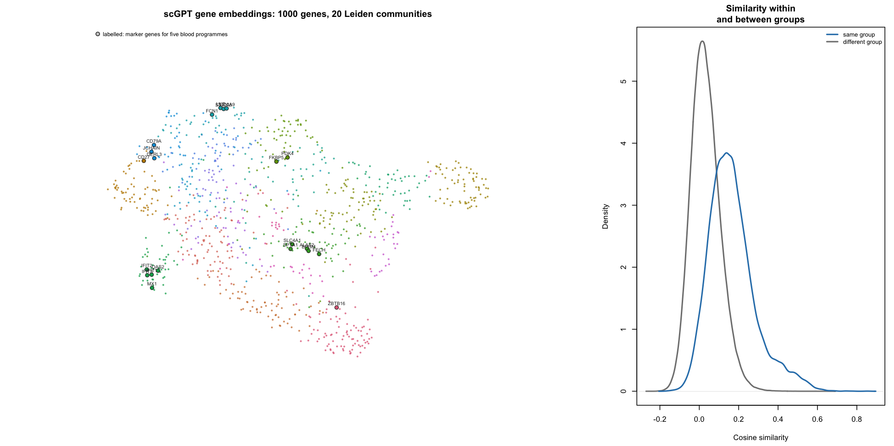

`analysis/R/03b_plot_fm_groups.R` draws the representation being
grouped, laying the genes out with UMAP on the same cosine metric and
the same neighbourhood size, and colouring them by the Leiden community
they were assigned. The layout is for reading only: the communities are
found in 512 dimensions, so genes drawn near one another need not be
neighbours, and nothing in the grouping depends on the picture.

Within-group pairs have mean cosine similarity 0.167 against 0.033
between groups, so the communities do correspond to genuinely higher
similarity rather than to an arbitrary cut of a homogeneous cloud.

| Programme | Marker genes | Groups | All in one group |
|:---|:---|:---|:---|
| Erythroid | ALAS2, SLC4A1, FECH, BPGM, SPTA1 | FM_08 | TRUE |
| Interferon | IFIT1, IFIT3, IFIT2, MX1, OAS2 | FM_09 | TRUE |
| Plasma cell | JCHAIN, DERL3, CD79A, CD27 | FM_04, FM_14 | FALSE |
| Glucocorticoid | FKBP5, ZBTB16, PDK4 | FM_01, FM_07 | FALSE |
| Myeloid | LYZ, S100A8, S100A9, FCN1 | FM_12 | TRUE |

Marker genes for five familiar whole-blood programmes give a check on
the tensor, the LayerNorm and the vocabulary mapping, none of which
would announce a mistake by failing loudly. The erythroid, interferon
and myeloid sets each fall entirely within one community. The
plasma-cell and glucocorticoid sets split across two, with the bulk of
each together: JCHAIN, DERL3 and CD79A share a group while CD27 sits
apart, and FKBP5 with PDK4 share a group while ZBTB16 sits apart.
Nothing here was selected for coming out well, and the coherence is the
intended representation showing through.

## Checks

The nearest-neighbour structure is biologically coherent, providing a
useful check on the tensor, normalisation and vocabulary mapping:
`ALAS2` sits with `SLC4A1`, `FECH`, `BPGM` and `SPTA1`; `IFIT1` with
`IFIT3`, `IFIT2`, `MX1` and `OAS2`; `JCHAIN` with `DERL3`, `CD79A` and
`CD27`; `FKBP5` with `ZBTB16` and `PDK4`; `LYZ` with `S100A8`, `S100A9`
and `FCN1`. These relationships are consistent with the intended
representation.

The graph is connected, with no gene assigned by default for lack of
edges.

| Item                 | Value |
|:---------------------|------:|
| Genes (nodes)        |  1000 |
| Edges                | 10520 |
| Median degree        |    19 |
| Isolated genes       |     0 |
| Connected components |     1 |

Mean cosine similarity is 0.167 within groups and 0.033 between them, a
five-fold separation. The partition therefore captures structure in the
embedding space rather than an arbitrary division of an unstructured
cloud.

All 1,000 genes are assigned, with no missing labels or isolated genes.
The group vector is stored in panel order and aligns exactly with the
model input. The Stage 3 gate is passed.

## Results

Twenty groups, ranging from 16 to 91 genes. Every group is large enough
for a group- and factor-specific inclusion probability to be informed by
its members, which is what the grouped prior needs.

The groups are interpretable as whole-blood biology, recovered from
pretraining alone with no access to these data:

| Group | Genes | Examples |
|:---|---:|:---|
| FM_01 | 91 | ZBTB16, TSPAN5, NCAM1, HDAC9, AUTS2, NELL2, NRCAM, BASP1 |
| FM_02 | 81 | ALOX15, SLC6A8, OR2W3, PTGDR2, SLC25A20, ESPN, NMUR1, ASCC2 |
| FM_03 | 73 | SPTB, ANK1, SMPD3, TMOD1, DMTN, NFIX, RAP1GAP, B3GAT1 |
| FM_04 | 68 | SPON2, FGFBP2, CD160, KLRF1, GZMH, S1PR5, KLRD1, SH2D1B |
| FM_05 | 68 | RPL39, RPS3A, RPS15A, RPL9, RPS5, RPS26, RPS29, RPL35 |
| FM_06 | 66 | BAG1, IGF2BP2, MYC, FBL, GADD45GIP1, FKBP4, SRP9, HELLS |
| FM_07 | 65 | FKBP5, DDIT4, PER1, DUSP2, THBS1, PDK4, IRS2, DUSP1 |
| FM_08 | 63 | ALAS2, SLC4A1, SNCA, STRADB, CA1, MYL4, GMPR, GYPC |
| FM_09 | 49 | OAS3, MX1, IFIT3, IFI6, OAS2, GBP5, RSAD2, IFIT1 |
| FM_10 | 45 | GUK1, MT-ND6, GPX1, PFDN5, PRDX6, TOMM7, SNRPD2, MZT2B |
| FM_11 | 42 | NID1, PRSS23, LGALS3, MRC2, IFITM3, COL9A3, PDGFRB, PTGDS |
| FM_12 | 41 | KRT1, PI3, LTF, IL5RA, MMP9, DEFA3, VCAN, PADI4 |
| FM_13 | 40 | SIGLEC8, ADORA3, SIGLEC1, CCR2, CD300E, STAB1, CMKLR1, CHST2 |
| FM_14 | 39 | JCHAIN, HLA-DRB5, HLA-DQB1, PLD4, IL13RA1, UBE2J1, CD79A, HLA-DQA1 |
| FM_15 | 39 | TLR2, FLT3, CD163, HCAR3, RNF144B, IRAK3, ALOX5AP, CLEC4E |
| FM_16 | 33 | ALPL, PROK2, FFAR2, LIMK2, ADGRG3, CYP4F3, MGAM, MME |
| FM_17 | 32 | CPT1A, SLC14A1, ABCA1, LGR6, TCF7L2, COL5A3, TRPM6, ARHGAP31 |
| FM_18 | 25 | TUBB2A, HSPH1, UBB, PEBP1, HSPB1, CLU, HSP90AB1, TUBA1A |
| FM_19 | 24 | TXNDC5, LDLR, DHCR24, FADS2, FADS1, SCD, AK1, CYP51A1 |
| FM_20 | 16 | ITGA2B, PPBP, ITGB3, PF4, RGS18, GNG11, GP1BB, TUBB1 |

Among them are recognisable programmes: interferon-stimulated genes
(`OAS3`, `MX1`, `IFIT3`, `RSAD2`), erythroid genes (`ALAS2`, `SLC4A1`,
`CA1`, `GYPC`), platelet genes (`ITGA2B`, `PPBP`, `PF4`, `GP1BB`),
ribosomal proteins, glucocorticoid and immediate-early responders
(`FKBP5`, `DDIT4`, `PER1`, `DUSP1`), NK and cytotoxic markers (`KLRF1`,
`GZMH`, `KLRD1`), B and plasma cells with MHC class II (`JCHAIN`,
`CD79A`, `HLA-DQB1`), neutrophil granule genes (`LTF`, `DEFA3`, `MMP9`)
and cholesterol biosynthesis (`LDLR`, `DHCR24`, `FADS1`, `SCD`).

Recovering this structure is a useful prerequisite, not the main result.
It shows that the external information is meaningful. Whether it
improves the longitudinal model will be assessed through held-out
reconstruction.

## Saved outputs

- `analysis/objects/groups/03_fm_groups.csv` — one group per panel gene
- `analysis/figures/progress/03_fm_groups.png`, `03b_fm_gene_graph.png`
- `analysis/results/tables/03_fm_group_examples.csv`
- `analysis/results/metrics/03_fm_*.csv`, `03b_marker_coherence.csv`

## Decisions

The LayerNorm from the scGPT gene encoder is applied, matching the
published workflow rather than reading the raw embedding matrix.

The graph uses the union of each gene’s 15 nearest neighbours by cosine
similarity, so a gene that is nobody else’s neighbour keeps its own
edges and cannot become isolated. Edges with negative similarity are
dropped, since they would assert that two genes belong together because
they point in opposite directions.

The Leiden resolution follows the prespecified group-count rule above,
with a fixed and recorded seed. Group labels are reassigned by
decreasing size so that they do not depend on Leiden’s internal
ordering.

## Limitations and open points

The chosen resolution of 2.7 sits on a steep part of the resolution
curve, where the number of communities changes quickly with the
resolution. The prespecified rule reached its target cleanly and the
resulting groups are biologically coherent, but the partition is not
deeply stable to that choice. This mainly affects interpretation; the
matched random controls test the grouping mechanism regardless of
exactly where the boundaries fall.

Group sizes are uneven, from 16 to 91. The size-adjusted prior is
designed for exactly this, since the hyperparameters scale with group
size, and Test C will check that the expected sparsity does not change
with the partition.

## Files

- `analysis/python/01_extract_scgpt_gene_embeddings.py`
- `analysis/R/03_build_fm_groups.R`
- `analysis/R/03b_plot_fm_groups.R` — figure only, writes no grouping;
  the sole user of `uwot`
- `analysis/R/00_setup.R` — added the community-detection seed

## Next

Stage 4, curated and random groups. Build Reactome pathway-overlap
similarities, apply the same graph and community strategy, then generate
the matched random partitions that preserve the informed group sizes
exactly.

# Stage 4 — Curated and random controls

## Objective

Build the curated comparator and the matched random controls, and check
that every grouping vector lines up with the frozen panel.

## Implementation

`analysis/R/04_build_curated_groups.R` builds the Reactome groups and
`analysis/R/05_build_random_groups.R` the random partitions.

The curated groups exist to ask whether a foundation model adds anything
over established curated biology. For that question to be about the
information rather than the method, the two must be built the same way,
so the graph construction, community algorithm, resolution rule and seed
are all identical to Stage 3, and only the similarity changes: cosine
similarity between embeddings becomes Jaccard similarity between the
Reactome pathway sets of each gene.

One difference is deliberate and required by the analysis plan. Genes
sharing no pathway have Jaccard similarity exactly zero, and no edge is
created between them. A nearest-neighbour rule applied blindly would
connect every gene to its fifteen closest others whether or not Reactome
asserts any relationship, inventing curated structure that does not
exist.

| Item                    | Value                           |
|:------------------------|:--------------------------------|
| Source                  | Reactome via reactome.db 1.95.0 |
| Pathways used           | 1765                            |
| Neighbours per gene (k) | 15                              |
| Zero-similarity edges   | dropped                         |
| Minimum group size      | 5                               |
| Chosen resolution       | 1.6                             |
| Groups                  | 20                              |
| Unassigned genes        | 3                               |
| Leiden seed             | 10                              |

The random partitions are the negative control for the grouping
mechanism itself. Grouping genes at all changes the prior, quite apart
from whether the grouping is meaningful, because pooling inclusion
indicators shrinks them towards a common rate within each group. Each
informed grouping therefore gets its own null family, built by permuting
which genes carry which labels while leaving the group-size distribution
exactly as it was, so the null differs from the informed grouping in
content and not in shape. Five replicates per family are generated with
deterministic seeds and saved before any model is fitted.

## Checks

The two graphs are comparable in size and connectivity. Foundation
model: 10,520 edges, median degree 19. Curated: 10,582 edges, median
degree 19. Both have a single connected component and no isolated genes.
The two comparators are therefore matched in graph structure and differ
in their similarity source, which is what the comparison requires.

| Item                 | Value |
|:---------------------|------:|
| Genes (nodes)        |  1000 |
| Edges                | 10582 |
| Median degree        |    19 |
| Isolated genes       |     0 |
| Connected components |     1 |
| Largest component    |  1000 |

Mean Jaccard similarity is 0.223 within groups and 0.021 between them.
About 66% of gene pairs share no pathway at all, which is why the
zero-similarity rule matters.

Three genes could not be placed. Genes with no positive-similarity
neighbour, or left in communities of fewer than five genes, are
collected into one explicit `CUR_unassigned` group rather than left as
singletons; a group of one carries no pooling, since its inclusion
probability would be informed by a single Bernoulli draw. The analysis
plan allows this rule, and at three genes it barely engages.

The random partitions preserve the intended group sizes.

| Check                                            | Value |
|:-------------------------------------------------|:------|
| Families                                         | 2     |
| Replicates per family                            | 5     |
| Partitions                                       | 10    |
| Group sizes match the informed grouping          | TRUE  |
| Any partition identical to its informed grouping | FALSE |
| Mean gene-level agreement with informed grouping | 0.062 |
| Expected agreement if labels were independent    | 0.059 |

Group sizes match their informed grouping exactly, no permutation
reproduces the grouping it is a null for, and gene-level agreement with
the informed grouping is 0.062 against 0.059 expected under
independence.

All twelve grouping vectors, comprising the two informed groupings and
ten random partitions, are complete and aligned to the panel. The Stage
4 gate is passed.

| Check                           | Value |
|:--------------------------------|------:|
| Grouping vectors checked        |    12 |
| All aligned to the panel order  |     1 |
| All complete (no missing group) |     1 |

## Results

The two informed sources produce substantially different partitions of
the same genes.

| Item                                                           |  Value |
|:---------------------------------------------------------------|-------:|
| Foundation-model groups                                        | 20.000 |
| Curated groups                                                 | 20.000 |
| Adjusted Rand index between them                               |  0.085 |
| Mean adjusted Rand index, random against its informed grouping | -0.001 |

The adjusted Rand index between them is 0.085, against essentially zero
for the random partitions. Both are individually coherent, so the low
agreement is not a failure of either: they organise the same genes along
different axes. The overlap map shows agreement in several readily
interpretable biological groups. The foundation-model ribosomal group
maps onto the curated ribosomal groups, which Reactome splits into large
and small subunit; the interferon groups correspond; so do the cytotoxic
lymphocyte groups. Elsewhere the partitions diverge, because pathway
co-membership and the co-expression context learnt from single cells are
different relations.

If the partitions agreed closely, the foundation-model arm might add
little over curated biology. Their difference makes the comparison
informative.

## Saved outputs

- `analysis/objects/groups/04_curated_groups.csv`,
  `05_random_groups.csv`
- `analysis/figures/progress/05_grouping_comparison.png`
- `analysis/results/tables/04_curated_group_examples.csv`
- `analysis/results/metrics/04_*.csv`, `05_*.csv`

## Decisions

The curated grouping uses the same graph, algorithm, resolution rule and
seed as the foundation-model grouping, so the two differ only in
similarity.

Zero-similarity edges are dropped, so Reactome is never asked to assert
a relationship it does not record.

Genes Reactome cannot place are collected into one `CUR_unassigned`
group rather than left as singleton groups.

Random partitions are generated once, with deterministic seeds, and
saved before fitting. They are never regenerated inside a fitting
function, so every model sees the same partitions.

## Limitations and open points

Jaccard similarity on pathway membership is sensitive to how deeply a
gene is annotated. A gene in three pathways and a gene in three hundred
can share all three and still score low, and Reactome’s hierarchy means
broad parent pathways are counted alongside specific ones. The
prespecified similarity is applied as written, but these properties of
Reactome annotation should be kept in mind when interpreting the curated
comparator.

`CUR_unassigned` holds three genes. It is a legitimate group for the
model, but it is a group only in the sense of being a residual, so it
should not be interpreted as a programme.

## Files

- `analysis/R/04_build_curated_groups.R`
- `analysis/R/05_build_random_groups.R`

## Next

Stage 5, the grouped prior itself. Add `prior_groups` to bayesSYNCfm
with size-adjusted hyperparameters, implement the grouped variational
updates and ELBO terms, expose the group-level inclusion probabilities,
and run package tests A to F.

# Stage 5 — Grouped-prior implementation

## Objective

Implement the group-informed prior in bayesSYNCfm and establish, by test
rather than by inspection, that it is correct and that the original
model is untouched.

## Implementation

`bayesSYNC()` gains one argument, `prior_groups`, a named vector or
factor of length p whose names are the variable names. Everything else
about the interface is unchanged, and `prior_groups = NULL` is the
original model.

The change is confined to the prior on the loading inclusion indicators.
The likelihood, the temporal basis, the FPCA representation, the slab
distribution, the annealing schedule, the orthonormalisation and the
factor-selection machinery are all untouched.

Group `k` of size $n_k$ receives $\pi_{kq}\sim\mathrm{Beta}(a_k, b_k)$
with $\rho_k = n_k/p$, $a_k = \rho_k c_0$ and $b_k = \rho_k d_0$. This
holds the prior mean at $c_0/(c_0+d_0)$ for every group, so the prior
expected number of active variables per factor stays at
$p\,c_0/(c_0+d_0)$ whatever the partition, while the prior concentration
scales with group size. With one group containing every variable,
$n_1 = p$ gives $a_1 = c_0$ and $b_1 = d_0$.

The variational Beta update becomes a sum within each group rather than
over all variables:

$$
a^{\ast}_{kq} = c\left(a_k + \sum_{j \in G_k} E_q[\gamma_{jq}]\right) - c + 1,
\qquad
b^{\ast}_{kq} = c\left(b_k + n_k - \sum_{j \in G_k} E_q[\gamma_{jq}]\right) - c + 1,
$$

with $c$ the inverse temperature of the annealing schedule. The
inclusion update for variable `j` then uses the expectations of its own
group, $m(j)$. Group sums are formed by a matrix product against a group
indicator, so the result cannot depend on how some helper happens to
order its output.

Both affected ELBO terms change consistently. The
$q(b_{jq},\gamma_{jq})$ contribution remains a sum over variables and
factors, with each variable contributing the expected log inclusion
probability of its group. The Beta contribution becomes a sum over
groups and factors, each with its own $a_k, b_k$.

A misaligned grouping could silently pool the wrong genes. The input
checks therefore reject wrong length, missing names, duplicated names, a
gene set that does not match the model variables, missing labels, or
combining the grouping with variable-specific probabilities. Reordering
by name happens only after the two name sets have been shown to agree
exactly.

All existing outputs are preserved, with three additions:
`prior_groups`, `group_inclusion_prob` (a groups-by-factors matrix of
$E(\pi_{kq}\mid Y)$) and `group_prior_hyperparameters`.

## Checks

| Test | Description | Result | Detail |
|:---|:---|:---|:---|
| Test A | prior_groups = NULL reproduces bayesSYNC | PASS | ELBO -1975.097168 |
| Test B | single group reduces to factor-specific prior | PASS | ELBO -1975.097168 |
| Test C | size-adjusted prior preserves expected sparsity | PASS | target 0.92308, max deviation 2.22e-16 |
| Test D | grouped Beta update matches the equations | PASS | max \|difference\| 7.14e-14 |
| Test D2 | implemented hyperparameters preserve sparsity | PASS | sum n_k E(pi_k) = 0.92308 |
| Test E | correct groups recover the signal at least as well | PASS | AUC correct 1.000, random 0.932, vanilla 0.939 |
| Test F | grouped fits run with and without annealing | PASS | ELBO annealed -11577.7, unannealed -10420.3 |
| Outputs | original outputs preserved, new ones added | PASS | added: prior_groups, group_inclusion_prob, group_prior_hyperparameters |

Tests A and B return the identical ELBO, −1975.097168, as required by
the calibration: a single group containing every variable must reduce to
the factor-specific prior exactly, not approximately. Had the size
adjustment been wrong, these two numbers would differ.

Test D checks the coded update against the equations rather than against
a reimplementation of itself. Without annealing the inverse temperature
is one, so $E(\pi_{kq}\mid Y)$ must equal
$(a_k + \sum_{j \in G_k}\mathrm{ppi}_{jq})/(a_k + b_k + n_k)$, computed
from returned quantities alone. It matches to 7 × 10⁻¹⁴, which exercises
the group sums, the size-adjusted hyperparameters and the posterior mean
together.

## Results

All tests pass, so the Stage 5 gate is met.

Test E examines whether the implementation can exploit a known grouping.
In a small simulation where the active variables of each factor sit in
one group, recovery of the truly active set is perfect with the correct
grouping and materially worse with either alternative.

| Model   |    AUC |
|:--------|-------:|
| correct | 1.0000 |
| random  | 0.9322 |
| vanilla | 0.9389 |

The matched random grouping performs about as well as no grouping at
all, as expected: pooling genes into groups is not by itself helpful.
The matched random controls will allow the real-data comparison to
distinguish the effect of grouping from the information used to
construct the groups. This is a sanity check on a simulation built to
favour the method, not evidence about the real data.

## Saved outputs

- `analysis/results/metrics/05b_grouped_prior_tests.csv`
- `analysis/results/metrics/05b_test_e_recovery.csv`

## Decisions

In grouped mode `omega_hat` is returned as `NULL`. It describes a
factor-specific inclusion probability, which the grouped model does not
have, and filling it with a derived quantity would invite exactly the
wrong reading. The group-level probabilities are returned under their
own name instead.

Group labels supplied by the user are mapped to consecutive codes
internally, and the original labels are kept for the returned object.
Unused factor levels are dropped rather than becoming empty groups.

The grouped prior is refused in combination with
`bool_var_spec_prob = TRUE`, since the two specify incompatible sharing
structures for the same indicators.

A stale default was corrected in the package documentation:
`bayesSYNC.Rd` still described `bool_var_spec_prob` as defaulting to
`TRUE`, which it has not for some time. The `.Rd` files were edited by
hand rather than regenerated, because the installed roxygen2 is a major
version ahead of the one that produced them and regenerating would have
rewritten every file in `man/`, mixing unrelated formatting changes into
this change.

## Limitations and open points

Test E uses one simulation with one seed, block-structured so that each
factor’s active variables lie entirely within one group. Real groupings
will not align with the factors that neatly, so it shows the
implementation can exploit a grouping when one is genuinely there, not
how much it will help in practice.

The grouped prior is not wired into `bayesSYNC_model_choice()`, which
selects the number of factors or components. Model choice will therefore
be run without grouping, or the number of factors fixed in advance, as
the analysis plan already assumes.

## Files

- `bayesSYNCfm/R/bayesSYNC.R` — `prior_groups`, size-adjusted
  hyperparameters, grouped updates, grouped ELBO,
  `check_prior_groups()`, new outputs
- `bayesSYNCfm/man/bayesSYNC.Rd`
- `analysis/R/05b_test_grouped_prior.R`

## Next

Stage 6, the first full-data comparison. Fit vanilla, curated-group and
foundation-model bayesSYNC to the same 1,000-gene panel with identical
settings, together with the matched random controls, and check that
every method converges cleanly.

# Stage 6 — Full-data comparison

## Objective

Fit every condition to the same data under identical settings, and check
that each converges before anything is held out.

## Implementation

`analysis/R/06_fit_models.R` fits thirteen models to the frozen
1,000-gene panel: vanilla bayesSYNC, the curated grouping, the
foundation-model grouping, and five matched random partitions for each
informed grouping. `analysis/R/06b_compare_fits.R` summarises them.

The gene panel, subjects, observations and all other fitting settings
are held fixed: $Q = 5$, $L = 2$, $K = 5$, the dense grid, the scaling,
the annealing schedule, the tolerances and the seed. The conditions
differ in `prior_groups` and in nothing else, and no model is tuned
separately.

Each fit took about seventeen minutes, three and a half hours in total.

## Checks

All thirteen converged, in 115 or 116 iterations. `Q = 5` was
deliberately over-specified and every condition pruned to the same three
active factors, with the two unused ones driven to exactly zero.

Selection is not saturated but it is dense: the three active factors
carry roughly 640, 750 and 500 genes at posterior inclusion probability
above 0.5. The inclusion probabilities are sharply bimodal, so genes are
decisively in or out rather than uncertain.

The grouped prior is doing real work rather than shrinking every group
to a common rate. Group inclusion probabilities range from about 0.09 to
0.49 across foundation-model groups on the first factor.

## Results

| Condition | Arm | ELBO | Iterations | Runtime (min) | Active factors | Genes selected |
|:---|:---|---:|---:|---:|---:|---:|
| vanilla | vanilla | -569084.2 | 115 | 15.6 | 3 | 962 |
| fm | informed | -569210.5 | 116 | 16.8 | 3 | 962 |
| curated | informed | -569245.4 | 116 | 16.4 | 3 | 961 |
| random_curated_5 | random | -569280.1 | 115 | 16.8 | 3 | 959 |
| random_fm_1 | random | -569284.6 | 116 | 16.6 | 3 | 962 |
| random_fm_2 | random | -569284.7 | 116 | 17.1 | 3 | 961 |
| random_curated_4 | random | -569284.8 | 116 | 16.7 | 3 | 961 |
| random_fm_4 | random | -569287.0 | 115 | 17.3 | 3 | 962 |
| random_fm_3 | random | -569287.8 | 115 | 17.0 | 3 | 961 |
| random_fm_5 | random | -569288.2 | 115 | 17.6 | 3 | 961 |
| random_curated_2 | random | -569288.5 | 115 | 16.4 | 3 | 960 |
| random_curated_1 | random | -569289.4 | 115 | 17.0 | 3 | 963 |
| random_curated_3 | random | -569290.4 | 115 | 16.8 | 3 | 962 |

| Grouping | ELBO informed | ELBO random mean | Random SD | Gain over matched random | Gap to vanilla |
|:---|---:|---:|---:|---:|---:|
| fm | -569210.5 | -569286.5 | 1.7 | 76.0 | -126.3 |
| curated | -569245.4 | -569286.6 | 4.2 | 41.3 | -161.2 |

The full-data comparison gives two contrasting results. Both informed
groupings fit substantially better than their size-matched random
partitions: the foundation-model grouping by 76 units of ELBO against a
spread of 1.7 among its five nulls, the curated grouping by 41 against a
spread of 4.2. These are large separations relative to the variation
among the nulls. Because the random partitions preserve the group-size
distribution, this difference cannot be attributed to the generic effect
of pooling genes into groups; it is attributable to which genes are
grouped together. The foundation-model grouping also fits better than
the curated one, by about 35.

Vanilla bayesSYNC nevertheless has the highest ELBO of all thirteen,
ahead of the foundation-model grouping by 126 and the curated grouping
by 161. On this dataset, at this panel size, the ungrouped prior
describes the observed data better than any grouping tried.

These results need to be interpreted with some care. The ELBO is a lower
bound on the log marginal likelihood, and the conditions differ in their
prior, so the comparison is a legitimate one between models but the
bounds need not be equally tight. A difference of this size is unlikely
to be explained by that alone, but it is not a certainty either.

The ELBO also measures fit to the data used to estimate the model. The
main question is whether external biological structure helps recover
programmes that generalise, which requires the held-out comparison in
Stage 7.

Selection is dense: each active factor loads on half to three-quarters
of the panel. In that regime the likelihood dominates the prior for most
genes, so the grouped prior has limited leverage, and its main effect is
on the minority of genes whose loading is genuinely uncertain. A sparser
regime would give the mechanism more room. This is a property of
whole-blood data with strong shared structure rather than a fault in the
implementation, and it is not something to tune away after seeing the
result.

## Saved outputs

- `analysis/figures/progress/06_full_data_comparison.png`
- `analysis/results/metrics/06_condition_comparison.csv`,
  `06_informed_vs_random.csv`, `06_fit_summary.csv`

## Decisions

We retain `Q = 5` and allow the model to prune to three active factors,
rather than fixing the number of factors in advance.

The dense grid used here already contains the candidate held-out days
exactly, so Stage 7 changes the data and nothing else.

## Limitations and open points

The fitted objects are about 680 MB each, so this stage occupies 8.9 GB,
driven by the reconstructed trajectories and their credible bands stored
on a 400-point grid for every subject and gene. There is ample disk
here, but each held-out replicate costs the same again, so the grid size
is the thing to reduce first if space becomes a constraint.

Vanilla ranks first by ELBO. This is not yet an answer to the primary
question, and it should still be reported if the held-out results
differ. The two comparisons measure different things and both are
relevant.

## Files

- `analysis/R/06_fit_models.R`
- `analysis/R/06b_compare_fits.R`

## Next

Stage 7, the primary evaluation. Create and save a fixed
subject-specific mask holding out one internal post-vaccination visit
per eligible subject, balanced across days 1 and 7, refit every
condition to exactly the same masked data, and compare paired
reconstruction error on the original analysis scale.

# Stage 7 — Held-out evaluation

## Objective

Ask whether an informed prior improves reconstruction of observations
that were not used for fitting. One internal post-vaccination visit per
subject is hidden, every condition is refitted on identical masked data,
and the hidden expression vectors are compared against their predictions
on the original analysis scale.

The masks come first and are saved before anything is refitted, so that
every condition is evaluated on exactly the same held-out observations.

## Implementation

`analysis/R/07_build_holdout_mask.R` builds the masks. Nothing in the
assignment uses expression values, the groupings or any fitted model:
only the visit design and a fixed seed.

A visit is a candidate for masking if the subject still has observations
on both sides of it once it is removed. Reconstructing it is then
interpolation between retained visits, which is the question the
evaluation asks. Holding out a subject’s last visit would instead test
extrapolation beyond the observed range, and the two should not be mixed
in one error summary. The distinction is not hypothetical: one subject
has no visit after day 7, so for that subject only day 1 is a candidate.
A second subject has no day 1 visit and is therefore assigned day 7. The
remaining 71 subjects have both days available and are assigned at
random.

The assignment is balanced between day 1 and day 7 within each study
group, so the held-out day is not confounded with the COVR/HC
distinction by chance. Subjects must also retain at least three visits.

| Item                                     | Value |
|:-----------------------------------------|------:|
| Subjects in the dataset                  |    73 |
| Subjects with no interior internal visit |     0 |
| Subjects with too few visits             |     0 |
| Subjects eligible                        |    73 |
| Subjects with a single candidate visit   |     2 |
| Masks built                              |     1 |
| Held-out visits per mask                 |    73 |

Subjects held out at each day, by study group.

|      |   1 |   7 |
|:-----|----:|----:|
| COVR |  17 |  16 |
| HC   |  20 |  20 |

### What is masked, and when

Subject $i$ is observed at times $t_{i1} < \dots < t_{iT_i}$. The mask
picks one index $m(i)$ per subject, subject to the rules above, and
splits the observations into

$$
\mathcal{H} = \bigl\{ (i, t_{i,m(i)}) \bigr\}_{i=1}^{N},
\qquad
\mathcal{R} = \bigl\{ (i, t_{is}) : s \neq m(i) \bigr\},
$$

with $|\mathcal{H}| = 73$ and $|\mathcal{R}| = 290$.

Two things about this are worth being explicit, because they are the
difference between this design and a leave-one-out one.

The unit that is hidden is a whole observation, not a single
measurement: at $t_{i,m(i)}$ all $p = 1{,}000$ genes go together. Hiding
one gene at a time would leave the other 999 at that visit to inform the
subject’s factor scores there, and the model would reconstruct the
missing one almost by construction.

All subjects are masked at once, and each condition is fitted once.
Thirteen conditions means thirteen fits, not $13 \times 73$.
Leave-one-out over the 73 held-out points would be 949 fits at about
eighteen minutes each, roughly twelve days of compute, and the pairing
it would buy is already available: every condition is scored on exactly
the same $\mathcal{H}$, so the comparisons between conditions are paired
within subject regardless.

The cost of masking simultaneously is that the population mean curve
near a held-out day is estimated partly from other subjects observed on
that day. The prediction for subject $i$ at day 1 is not independent of
day 1 information in the sample as a whole, only of subject $i$’s own.
That is what the evaluation is meant to ask, since the question is
whether the model can place a subject on a shared programme, and it is
why the mask balances the two days across subjects: with 37 subjects
losing day 1 and 36 losing day 7, both days stay represented in
$\mathcal{R}$ at 35 and 37 observations.

### How a held-out point is predicted

Each condition is fitted to $\mathcal{R}$ alone, giving $\hat{\mu}_j$,
$\hat{b}_{jq}$ and, for each subject, the scores behind $\hat{h}_{qi}$.
The reconstruction at the held-out time $t^{*}_i = t_{i,m(i)}$, which is
an exact point of the fitting grid by construction, is

$$
\hat{y}_{ij}(t^{*}_i) = \hat{\mu}_j(t^{*}_i) + \sum_{q=1}^{Q} \hat{b}_{jq} \hat{h}_{qi}(t^{*}_i) .
$$

The model is fitted to standardised data, so this is returned to the
original scale with that fit’s own per-gene constants,

$$
\tilde{y}_{ij} = \hat{y}_{ij}(t^{*}_i) \, s_j + m_j ,
$$

where $m_j$ and $s_j$ are the mean and standard deviation across
subjects of the subject-specific means of gene $j$, computed from
$\mathcal{R}$. Each condition estimates its own, and the held-out visit
contributes to neither.

Error is summarised per subject across genes and then across subjects,

$$
\mathrm{RMSE}_i = \sqrt{\frac{1}{p} \sum_{j=1}^{p}
\bigl( \tilde{y}_{ij} - y_{ij}(t^{*}_i) \bigr)^2 },
$$

and two conditions are compared through the within-subject differences
$d_i = \mathrm{RMSE}_i^{A} - \mathrm{RMSE}_i^{B}$, tested with a paired
Wilcoxon signed-rank test on the 73 pairs.

The offset-corrected metric adds to every prediction the per-gene
difference, on the retained visits only, between what the subject shows
and what the condition predicts,

$$
o_{ij} = \frac{1}{T_i - 1} \sum_{s \neq m(i)}
\bigl( y_{ij}(t_{is}) - \tilde{y}_{ij}(t_{is}) \bigr),
$$

and scores $\tilde{y}_{ij} + o_{ij}$ instead. It uses no held-out value
and is computed identically for every condition. The retained visits at
day 0 and around day 28 are not exact grid points, unlike the held-out
days, so the predictions entering $o_{ij}$ are read at the nearest grid
point, which is within half a spacing, under 0.05 days.

### Implementation

`analysis/R/07b_fit_masked.R` refits the thirteen conditions to
$\mathcal{R}$, with the gene panel, $Q$, $L$, $K$, the grid, the
scaling, the annealing schedule, the tolerances and the seed all as they
were at Stage 6. Only the data change.

What it caches is a slimmed fit. Almost the whole of a 755 MB fitted
object is the reconstructed trajectories and their credible bands, held
on a 400-point grid for every subject and gene, and the evaluation needs
those at one grid point per subject. The script takes that slice, drops
the three trajectory lists and keeps everything else, which brings a
cached fit to 25 MB and a full set of thirteen to about 0.3 GB.
Replicates are then affordable.

`analysis/R/07c_evaluate_holdout.R` scores the fits. It returns the
predictions to the original analysis scale, summarises the error per
subject across the 1,000 genes, and compares conditions in pairs on the
same subjects. It also scores a reference predictor, each subject’s own
mean across its retained visits, which uses no model and no hidden value
and says whether the fitted trajectories are worth anything at this time
point.

## Checks

| Check                                            | Value |
|:-------------------------------------------------|:------|
| Held-out observations                            | 73    |
| Exactly one per eligible subject                 | TRUE  |
| All held-out visits internal post-vaccination    | TRUE  |
| All held-out visits bracketed by retained visits | TRUE  |
| Held-out times fall on the fitting grid          | TRUE  |
| Minimum retained visits per subject              | 3     |
| Day 1 observations retained in other subjects    | 35    |
| Day 7 observations retained in other subjects    | 37    |
| Observations used for fitting                    | 290   |

The mask hides 73 of the 363 observations, one per subject, leaving 290
for fitting. Both internal days remain well represented among the
retained observations, 35 at day 1 and 37 at day 7, so neither day
disappears from the data the models are fitted to.

The held-out times fall exactly on the dense grid used at Stage 6. This
is checked rather than assumed: the script rebuilds the grid and tests
membership, so widening the candidate set later would be caught rather
than silently producing predictions off the grid. Days 1 and 7 are on
the grid by construction, and day 0 and day 28 are not, which is why the
candidate set is restricted to the two internal days.

The extraction and unscaling were verified against the Stage 6 fits
before any refitting. Undoing the per-gene scaling recovers the stored
observations exactly. Reading the fitted trajectories at a grid point
and unscaling them reproduces the fitted values in the right subject:
across genes and subjects at day 1, within-gene predicted and observed
values correlate at 0.46, against 0.04 when the subject labels are
shuffled, so the subject alignment is real rather than assumed. The 95%
bands cover 95% of the in-sample values at those times.

All thirteen masked fits converged, in 121 to 130 iterations, each
pruning $Q = 5$ to the same three active factors and selecting between
931 and 941 genes. Runtimes were 17 to 20 minutes, four hours in total.

| Grouping | ELBO informed | ELBO random mean | Random SD | Gain over matched random | Gap to vanilla |
|:---|---:|---:|---:|---:|---:|
| fm | -456755.7 | -456837.1 | 11.5 | 81.4 | -130.6 |
| curated | -456802.7 | -456823.1 | 6.1 | 20.4 | -177.6 |

On the masked data the Stage 6 ordering repeats. Vanilla still has the
highest ELBO, and both informed groupings still beat their size-matched
nulls: the foundation-model grouping by 81 against a spread of 12 among
its five, close to the 76 seen on the full data. Fitting a subset of the
visits did not disturb the in-sample result.

## Results

| Condition | Arm | RMSE | RMSE day 1 | RMSE day 7 | RMSE offset-corrected | Band coverage |
|:---|:---|---:|---:|---:|---:|---:|
| subject_mean | reference | 0.2848 | 0.3200 | 0.2486 | 0.2848 | NA |
| fm | informed | 0.5120 | 0.5517 | 0.4713 | 0.3110 | 0.8994 |
| random_fm_4 | random | 0.5120 | 0.5520 | 0.4709 | 0.3112 | 0.8994 |
| random_fm_1 | random | 0.5122 | 0.5524 | 0.4708 | 0.3115 | 0.8991 |
| random_fm_3 | random | 0.5122 | 0.5523 | 0.4709 | 0.3114 | 0.8991 |
| curated | informed | 0.5126 | 0.5529 | 0.4712 | 0.3119 | 0.8988 |
| random_fm_2 | random | 0.5127 | 0.5532 | 0.4710 | 0.3122 | 0.8986 |
| random_curated_1 | random | 0.5128 | 0.5533 | 0.4710 | 0.3123 | 0.8987 |
| random_curated_2 | random | 0.5128 | 0.5533 | 0.4711 | 0.3123 | 0.8988 |
| random_fm_5 | random | 0.5128 | 0.5534 | 0.4710 | 0.3123 | 0.8988 |
| vanilla | vanilla | 0.5128 | 0.5534 | 0.4710 | 0.3124 | 0.8987 |
| random_curated_3 | random | 0.5129 | 0.5536 | 0.4711 | 0.3125 | 0.8985 |
| random_curated_4 | random | 0.5130 | 0.5536 | 0.4712 | 0.3126 | 0.8987 |
| random_curated_5 | random | 0.5132 | 0.5542 | 0.4711 | 0.3129 | 0.8983 |

| Comparison | Metric | Error | Reference error | Difference | Subjects better | p |
|:---|:---|---:|---:|---:|---:|:---|
| FM vs vanilla | rmse | 0.5120 | 0.5128 | -0.0008 | 29 | 0.495 |
| Curated vs vanilla | rmse | 0.5126 | 0.5128 | -0.0002 | 32 | 0.590 |
| FM vs matched random | rmse | 0.5120 | 0.5124 | -0.0003 | 26 | 0.096 |
| Curated vs matched random | rmse | 0.5126 | 0.5129 | -0.0003 | 34 | 0.758 |
| Vanilla vs subject mean | rmse | 0.5128 | 0.2848 | 0.2280 | 0 | 1.16e-13 |
| FM vs vanilla | rmse_offset | 0.3110 | 0.3124 | -0.0014 | 41 | 0.037 |
| Curated vs vanilla | rmse_offset | 0.3119 | 0.3124 | -0.0005 | 38 | 0.178 |
| FM vs matched random | rmse_offset | 0.3110 | 0.3117 | -0.0007 | 35 | 0.413 |
| Curated vs matched random | rmse_offset | 0.3119 | 0.3125 | -0.0006 | 41 | 0.041 |
| Vanilla vs subject mean | rmse_offset | 0.3124 | 0.2848 | 0.0276 | 41 | 0.767 |

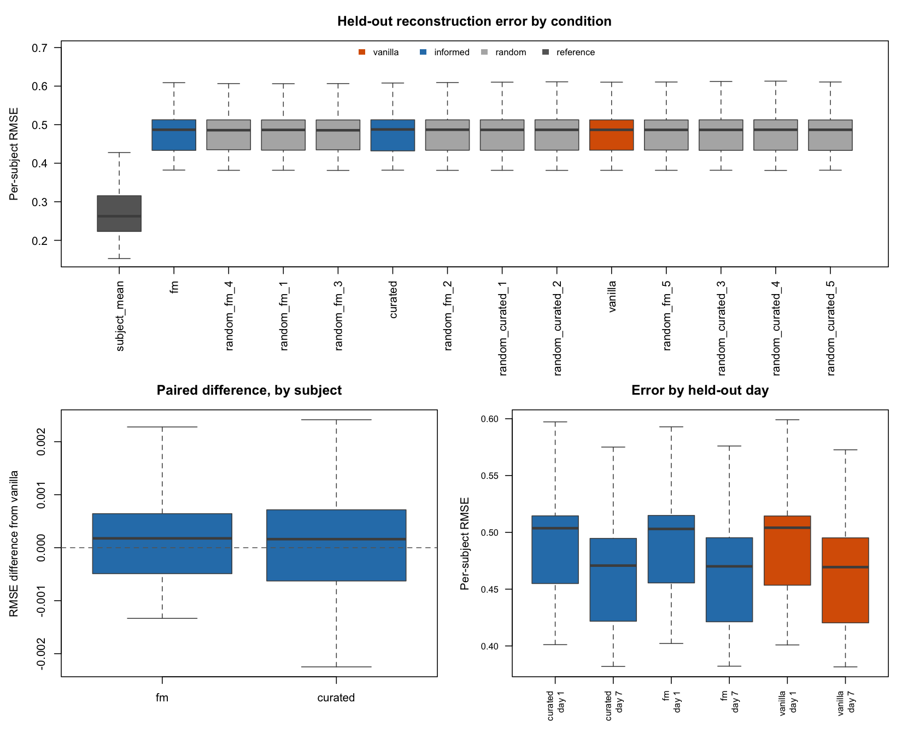

No condition reconstructs the held-out visits better than any other. The
thirteen mean per-subject errors span 0.5120 to 0.5132, a range of about
two parts in a thousand. The foundation-model grouping is nominally
first on both metrics, but three of its own five random partitions fall
between it and vanilla, which is the clearest statement of the result: a
grouping cannot be said to beat its nulls when its nulls are interleaved
with it.

The paired tests agree. Against matched random partitions the
foundation-model grouping differs by −0.0003 on the primary metric and
−0.0007 on the offset-corrected one, neither reliable. Two of the ten
comparisons fall below 0.05, both on the secondary metric and both
unadjusted, with differences of two to four parts in a thousand of the
error and with 41 of 73 subjects on the better side. That is what a set
of ten tests looks like when nothing is there.

The result that does stand out is the reference predictor. Each
subject’s own mean over its retained visits reconstructs the held-out
visit with error 0.285, against 0.513 for vanilla, and it wins for every
one of the 73 subjects. The models are beaten by an average.

The reason is structural rather than a fault in the fitting. bayesSYNC
writes each observation as a per-gene population curve plus a subject
term that passes through three active factors with two spline components
each, so six numbers carry everything that distinguishes one subject
from another across 1,000 genes and five visits. A per-gene subject
intercept is not in the model. On these data the between-subject
variation in a gene has median standard deviation 0.31 against 0.162
within subject, so the missing intercept is most of what there is to
predict, and the fitted residual correlates 0.65 with it.

Granting every condition that offset, measured on the retained visits
alone, is what the second metric does. It brings the error down to 0.311
for the foundation-model grouping and 0.312 for vanilla, and leaves them
no better than assuming the subject does not move between visits, which
is what the reference amounts to once the level is given: the paired
difference between vanilla and the reference is 0.028 with $p = 0.77$.

Day 1 is harder than day 7 for every condition, 0.552 against 0.471,
consistent with day 1 sitting nearer the peak of the response. Credible
bands cover 89.9% of held-out values against a nominal 95%, so they are
slightly too narrow out of sample, having covered 95% in sample at Stage
6.

The honest summary is that the informed prior improves fit to the data
the model sees, reproducibly and by an amount that survives a change of
dataset, and that this improvement does not reach a visit the model
never saw. Two things could produce that, and this experiment does not
separate them. The prior may be adding something real that
reconstruction at one time point is too blunt to detect, or the ELBO
gain may reflect a better description of the observed data that carries
no predictive content. What the experiment does show is that the
temporal part of the model, on this dataset and this panel, barely
improves on assuming no change, and a prior on which genes load on which
factor cannot help predict through factors that carry little.

## Saved outputs

- `analysis/objects/masks/07_holdout_masks.rds`, `07_holdout_masks.csv`
- `analysis/figures/progress/07_holdout_mask.png`,
  `07_holdout_comparison.png`
- `analysis/results/metrics/07_mask_summary.csv`, `07_mask_checks.csv`,
  `07_mask_balance.csv`
- `analysis/results/metrics/07_masked_fit_summary.csv`,
  `07_holdout_summary.csv`, `07_holdout_paired.csv`,
  `07_holdout_subject_errors.csv`

## Decisions

Candidate visits are interior to each subject’s own retained observation
times, not merely internal to the study design. This keeps every
held-out point an interpolation.

Day 1 and day 7 are balanced within study group rather than across the
sample as a whole.

One mask to begin with. The saved table already carries a `replicate`
column, so adding three to five further masks is a change to one
constant in the script and nothing else.

The masks are saved under `analysis/objects/masks/` and tracked, since
`analysis/data/processed/` is not in the repository and the comparison
has to be reproducible from a fresh clone.

Cached masked fits drop the full trajectory lists and keep the held-out
slice. The trajectories can be regenerated by refitting if they are ever
wanted, and keeping them would cost thirty times the disk for output the
evaluation does not read.

Errors are summarised per subject before conditions are compared, so
each subject contributes one number and the comparisons are paired on
the same subjects. Pooling all genes and subjects into one figure would
be dominated by whichever genes happen to be most variable.

A second error metric was added after the vanilla fit was scored and
before any grouped condition was fitted, so it could not be chosen for
the answer it gives. The model places each subject on Q factor loadings
above a population mean curve and has no per-gene subject intercept,
while between-subject variation per gene is about twice the
within-subject temporal variation on these data. The raw error is
therefore dominated by a subject offset that no condition models, which
compresses the differences the project is asking about. The second
metric grants every condition the same offset, measured on the retained
visits alone and computed identically for each, and so isolates the
temporal shape. The pre-specified raw error remains the primary metric
and both are reported.

## Limitations and open points

Every subject contributes one held-out point, so the paired comparison
has 73 pairs and each pair is a whole 1,000-gene expression vector.

Day 1 and day 7 are not equally hard to reconstruct: day 1 sits near the
peak of the innate response, day 7 on a flatter part of the trajectory.
Errors should be reported by day as well as pooled, since pooling could
hide a difference in one and not the other.

Each masked fit estimates its own scaling constants from the retained
observations, so the scaling differs slightly from Stage 6 and between
replicates. This is the right way round, since a scaling estimated with
the held-out visit included would leak it into the fit, but it means
predictions must always be returned to the original scale with the
constants of the fit that produced them.

The reference predictor was included as a floor and turned out to be a
ceiling. A subject mean cannot represent any time trend, so a model that
fails to beat it at the held-out visit is not using the temporal
structure it was given, and none of the thirteen did.

One mask, one panel, one dataset. The evaluation is a single held-out
visit per subject, so it asks a narrow question, and a prior could
matter for programme recovery while making no difference to
interpolation at one time point. Replicate masks would sharpen the
estimate of each difference, but with the informed groupings interleaved
among their own nulls there is no effect for further replicates to
resolve.

The comparison is also underpowered by construction, since the quantity
being compared is mostly the subject offset that no condition models.
The offset-corrected metric removes that, and it does not change the
conclusion.

## Files

- `analysis/R/07_build_holdout_mask.R`
- `analysis/R/07b_fit_masked.R`
- `analysis/R/07c_evaluate_holdout.R`
- `analysis/R/00_setup.R` (adds `path_masks()`)

## Next

The gate in `plan.md` is met: one fair out-of-fit comparison is
complete, and the minimum project is finished. Stage 8, programme
stability under subject subsampling, was conditional on the held-out
comparison working, and the sense in which it did not work matters for
what comes next. The comparison ran as designed and gave a clean answer;
the answer is that no grouping helps at this task.

Adding held-out replicates would not change that, since the informed
groupings sit among their own nulls rather than close to them. The open
question is whether the reproducible in-sample gain means anything, and
reconstruction at one visit cannot answer it. Stage 7d takes that
question to the fits themselves.

# Stage 7d — Why the two comparisons disagree

## Objective

Both fitting runs found the informed groupings fitting the observed data
better than their size-matched random partitions, and the held-out
comparison found no difference between any of the thirteen conditions.
Four questions of the cached fits, with nothing refitted, ask where that
gap comes from: how far the priors move the posterior at all, where the
in-sample advantage sits, whether the groupings capture anything real,
and whether they buy stability instead of accuracy.

## Implementation

`analysis/R/07d_compare_posteriors.R` runs all four on the 26 fits
already saved.

Factor labels and signs are arbitrary, so every comparison of two fits
matches their three active factors first, by loading correlation,
choosing the best of the six permutations exhaustively rather than
greedily.

The ELBO decomposition needs the variational Beta parameters, which are
not returned. They are recovered exactly from the probabilities that are
returned, because their total does not depend on the inclusion sums:
$c^{\ast}_{kq} + d^{\ast}_{kq} = a_k + b_k + n_k$, so multiplying the
returned probability by that total gives back the internal parameters.

## Checks

Rebuilding the same parameters from the inclusion sums instead gives a
slightly different answer, because the group probabilities are updated
before the inclusion indicators within a sweep and the two are therefore
one iteration apart at convergence. The discrepancy is at most 0.58 of a
gene across all thirteen fits, and it is recorded per fit in
`07d_elbo_parts.csv`. It is reported rather than hidden because a fixed
fraction of a gene is negligible across the whole panel and not
negligible inside a 16-gene group.

All thirteen fits have three active factors, so the matching compares
like with like throughout.

## Results

### The priors barely move the posterior

| Condition | Arm | Loading correlation | PPI correlation | Mean \|PPI difference\| | Jaccard | Genes flipped |
|:---|:---|---:|---:|---:|---:|---:|
| fm | informed | 0.99875 | 0.97955 | 0.03689 | 0.94444 | 14 |
| curated | informed | 0.99960 | 0.99148 | 0.02264 | 0.96147 | 6 |
| random_fm_4 | random | 0.99963 | 0.99348 | 0.01704 | 0.97036 | 4 |
| random_curated_5 | random | 0.99988 | 0.99719 | 0.01492 | 0.97595 | 6 |
| random_fm_3 | random | 0.99980 | 0.99588 | 0.01476 | 0.97926 | 4 |
| random_fm_1 | random | 0.99984 | 0.99664 | 0.01303 | 0.97653 | 6 |
| random_curated_1 | random | 0.99991 | 0.99776 | 0.01218 | 0.98142 | 7 |
| random_curated_4 | random | 0.99992 | 0.99818 | 0.01021 | 0.98422 | 5 |
| random_curated_2 | random | 0.99995 | 0.99866 | 0.01014 | 0.97926 | 6 |
| random_curated_3 | random | 0.99996 | 0.99883 | 0.01013 | 0.98115 | 5 |
| random_fm_2 | random | 0.99996 | 0.99879 | 0.00994 | 0.98365 | 6 |
| random_fm_5 | random | 0.99995 | 0.99872 | 0.00994 | 0.98576 | 4 |

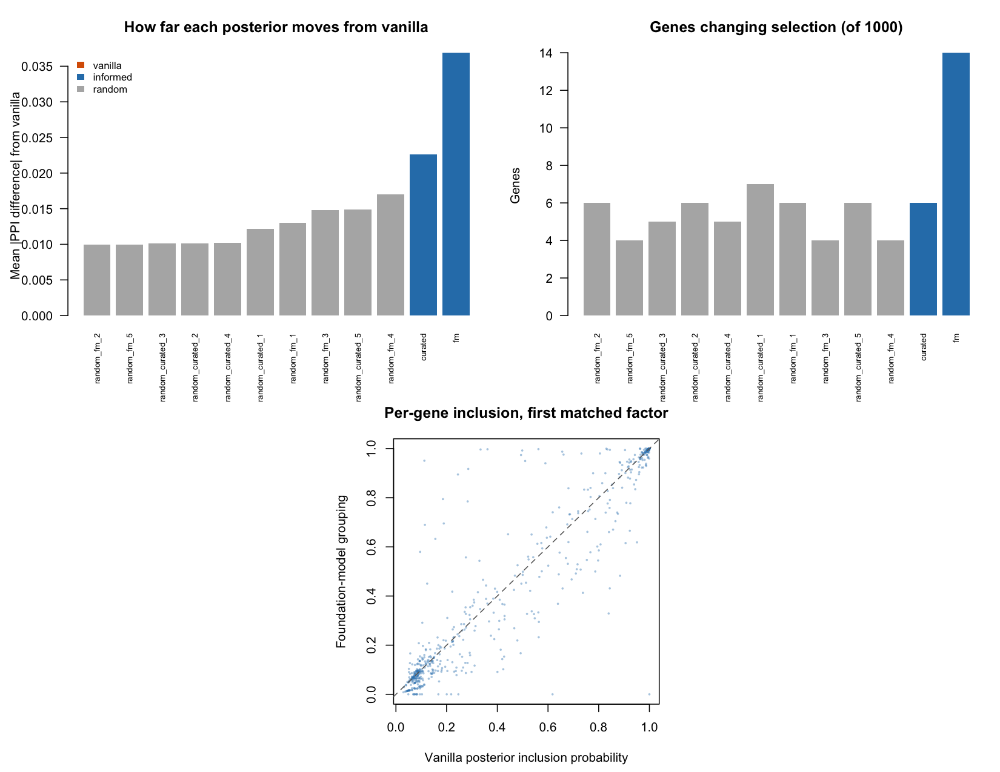

Every condition’s loadings correlate with vanilla’s at 0.9987 or above.
The foundation-model grouping moves the posterior furthest, and moving
furthest means a mean change in inclusion probability of 0.037 and a
different selection call for 14 genes out of 1,000. Its matched random
partitions move it by 0.010 to 0.017, flipping four to seven genes.

So the informed groupings do something, and they do about three times as
much as a random partition of the same group sizes. They also do very
little. With posteriors this close, the held-out predictions could not
have differed, and Stage 7 was in that sense answering a question the
fits had already settled.

### The in-sample advantage sits in the prior, not the fit

| Grouping | Total ELBO | Inclusion term | Beta term | Prior terms | Indicator entropy | Everything else |
|:---|---:|---:|---:|---:|---:|---:|
| fm | 81.5 | 165.4 | 11.0 | 176.4 | -56.9 | -38.0 |
| curated | 20.4 | 57.4 | 5.3 | 62.6 | -23.6 | -18.6 |

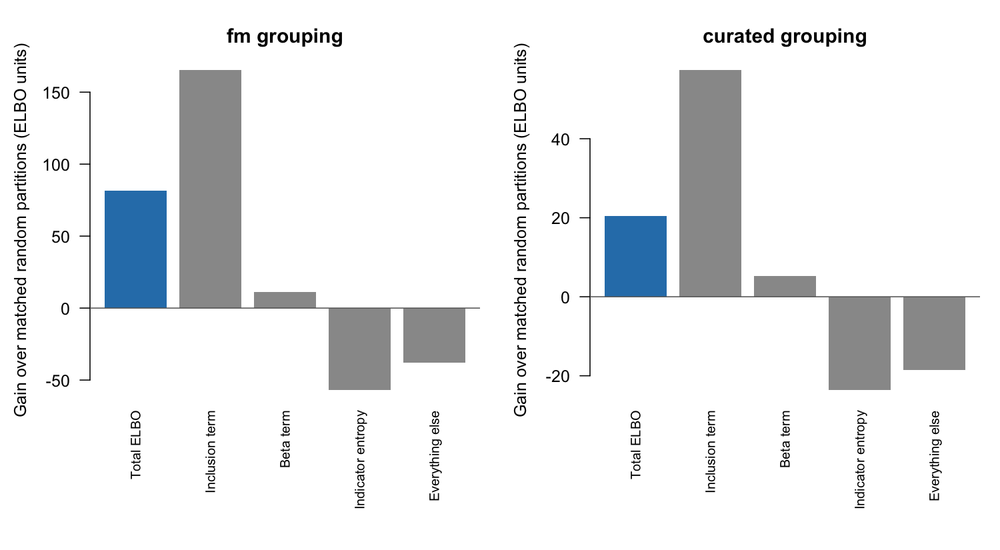

The 81 units by which the foundation-model grouping beats its nulls
decompose into 165 gained on the term that rewards each gene’s inclusion
probability for agreeing with its group’s rate, 11 on the Beta term, 57
paid back in the entropy of the inclusion indicators, and 38 paid back
in everything else. Curated shows the same pattern at a quarter of the
size.

Two things follow. The grouped prior sharpens selection: the indicators
become more decisive, which costs entropy. And the block that contains
the data-fit term is 38 units worse for the informed grouping than for
its nulls, so the informed grouping does not describe the observed data
better.

The gain is real and it replicates, but it measures how well the
partition matches the selection pattern the model infers, not how well
the model accounts for the data. A prior that matches the posterior it
induces earns a higher marginal likelihood bound legitimately, and that
is a different claim from predicting a new observation better. The Stage
6 comparison and the group differentiation below are close to two views
of one quantity.

The parts are not orthogonal, since the inclusion probabilities differ
between conditions and enter every term, and the remainder holds the
spline and Gaussian loading contributions as well as the likelihood. The
signs and magnitudes are unambiguous even so.

### The groupings do capture something real

| Condition | Arm | Mean group probability | SD across groups | Range across groups |
|:---|:---|---:|---:|---:|
| curated | informed | 0.2921 | 0.08333 | 0.3691 |
| fm | informed | 0.2813 | 0.10570 | 0.4068 |
| random_fm_1 | random | 0.2917 | 0.03601 | 0.1413 |
| random_fm_2 | random | 0.2922 | 0.03641 | 0.1364 |
| random_fm_3 | random | 0.2961 | 0.03925 | 0.1676 |
| random_fm_4 | random | 0.2970 | 0.03745 | 0.1555 |
| random_fm_5 | random | 0.2947 | 0.03696 | 0.1440 |
| random_curated_1 | random | 0.2891 | 0.05375 | 0.2357 |
| random_curated_2 | random | 0.2970 | 0.04119 | 0.1763 |
| random_curated_3 | random | 0.2948 | 0.04344 | 0.1768 |
| random_curated_4 | random | 0.2927 | 0.04901 | 0.2325 |
| random_curated_5 | random | 0.2965 | 0.05294 | 0.1974 |

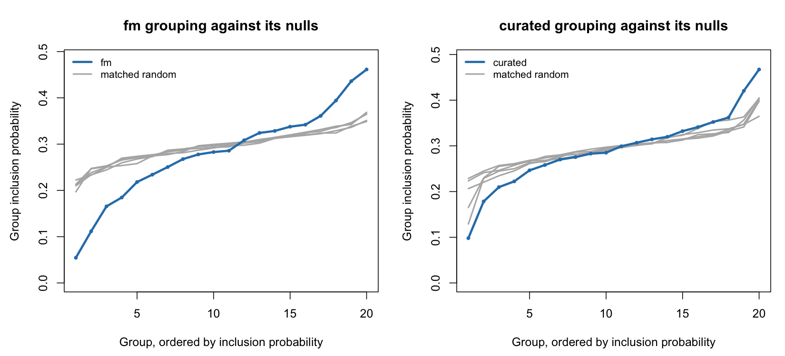

This is the clearest positive result in the project. Sorting each
factor’s group probabilities and averaging the sorted profiles gives a
curve that does not depend on how groups or factors are labelled. The
foundation-model grouping runs from 0.05 to 0.46 across its twenty
groups, while all five of its size-matched random partitions stay
between about 0.20 and 0.36. Its standard deviation across groups is
0.106 against 0.036 to 0.039 for the nulls, and every null is below it.
Curated sits in between, at 0.083 against 0.041 to 0.054.

The scGPT partition separates genes that load on the inferred factors
from genes that do not, and it does so far beyond what group sizes alone
can produce. Whatever the embeddings encode about these genes is related
to how the genes behave in this dataset.

### It does not buy stability either

| Condition | Arm | Loading correlation | Jaccard of selected genes | Genes flipped |
|:---|:---|---:|---:|---:|
| vanilla | vanilla | 0.84586 | 0.69763 | 29 |
| curated | informed | 0.84006 | 0.70059 | 32 |
| fm | informed | 0.83059 | 0.69663 | 35 |
| random_fm_1 | random | 0.84025 | 0.69550 | 35 |
| random_fm_2 | random | 0.84597 | 0.69762 | 30 |
| random_fm_3 | random | 0.83831 | 0.70544 | 30 |
| random_fm_4 | random | 0.83444 | 0.70136 | 31 |
| random_fm_5 | random | 0.84467 | 0.70135 | 30 |
| random_curated_1 | random | 0.84529 | 0.69553 | 35 |
| random_curated_2 | random | 0.84353 | 0.70037 | 31 |
| random_curated_3 | random | 0.84528 | 0.70052 | 30 |
| random_curated_4 | random | 0.84536 | 0.70290 | 33 |
| random_curated_5 | random | 0.84953 | 0.70198 | 26 |

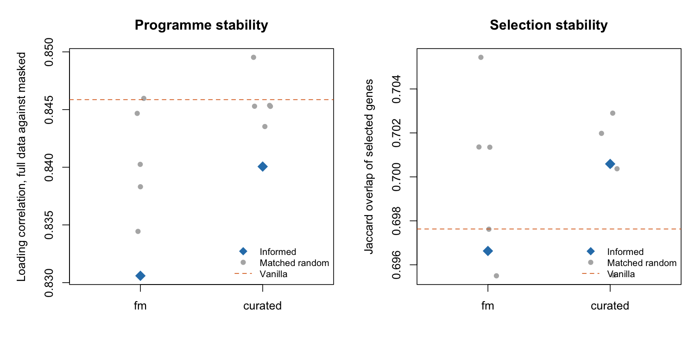

Every condition was fitted twice on the same subjects with the same
seed, once on all 363 observations and once on the 290 that survive the
mask, so comparing a condition’s two fits measures how much its
programmes move when the data change, and the five matched partitions
give that measure a null.

Nothing moves in the direction the project hoped for. The
foundation-model grouping’s loadings correlate at 0.831 between its two
fits, against a null mean of 0.841 with all five nulls above it, and
vanilla at 0.846. Curated is 0.840 against 0.846, again with all five
nulls above. Selection overlap tells the same story more weakly.

Taken singly, an informed grouping falling below all five of its nulls
has probability one in six under exchangeability, which is not evidence.
It happens in both families, in the same direction, on a measure where
the informed groupings started with no reason to be worse. The reading
consistent with everything above is that the prior displaces the
posterior slightly from where the likelihood alone would put it, and
that displacement is not reproduced when the data change.

## Saved outputs

- `analysis/figures/progress/07d_posterior_agreement.png`,
  `07d_elbo_decomposition.png`, `07d_group_probabilities.png`,
  `07d_stability.png`
- `analysis/results/metrics/07d_posterior_agreement.csv`,
  `07d_elbo_parts.csv`, `07d_elbo_decomposition.csv`,
  `07d_group_spread.csv`, `07d_stability.csv`, `07d_stability_gap.csv`

## Decisions

The stability question is asked with the fits in hand rather than by
refitting. The perturbation is the mask, which removes one visit per
subject, and it is identical for every condition.

The Beta parameters are recovered from the returned probabilities rather
than rebuilt from the inclusion sums, so that the decomposition uses the
internal state at convergence rather than a version of it one iteration
out of date.

## Limitations and open points

The mask is a weaker and differently shaped perturbation than dropping
subjects. It removes 20% of observations while keeping every subject, so
it disturbs the temporal estimates more than the subject-level ones, and
subject subsampling would do the reverse. A positive stability result
here would have justified the full subsampling run; a null one makes it
less attractive, but does not settle it.

The ELBO parts are not an orthogonal decomposition, and the remainder is
not the likelihood alone.

The group differentiation result is the one that deserves following up.
It says the scGPT partition tracks something real about which genes
load, and the project has so far only asked whether that helps the two
things bayesSYNC was measured on. It might matter for interpretation, or
in a sparser regime where the prior has more leverage, and neither has
been tested.

## Files

- `analysis/R/07d_compare_posteriors.R`

## Next

The four diagnostics leave a coherent picture and a clear choice. The
prior acts, its action is aligned with real structure, and at this panel
size and sparsity the likelihood is strong enough that the action
changes almost nothing the model then does.

Two things follow from that and neither is Stage 8 as written. Stage 7e
tests whether the prior has leverage when selection is not dense.
Separately, the group differentiation result stands on its own and is
worth reporting whatever happens next.

# Stage 7e — Does the prior have leverage in a sparser regime?

## Objective

Stage 7d found the foundation-model grouping changing the selection call
for 14 genes out of 1,000. One explanation is the regime rather than the
grouping: each active factor loads on half to three-quarters of the
panel, and where the likelihood is that decisive a prior on inclusion
has little room to act.

This is a diagnostic of the regime. The configuration is changed after
seeing the Stage 7 result, so nothing here can be reported as a
headline; it exists to say whether the null result depends on the
sparsity setting.

## Implementation

`analysis/R/07e_sparsity_diagnostic.R` does two things.

The first needs no fitting. A gene’s inclusion log-odds is a data term
plus a prior term, and the prior term is known, so the data terms can be
recovered from the cached vanilla fit and the selection under any other
prior strength predicted by holding them fixed and iterating the rate to
its fixed point. This sizes the experiment.

The second refits three conditions at the chosen strength: vanilla, the
foundation-model grouping, and one matched random partition, so the
grouping can be compared against both. Everything else is held at the
Stage 7 settings, including the mask, the panel and the seed. Only $d_0$
changes, from $p$ to $1000p$.

| $d_0$ as a multiple of $p$ | Prior log-odds | Predicted selection, factor 1 | Factor 2 | Factor 3 |
|---:|---:|---:|---:|---:|
| 1e+00 | -0.87 | 0.664 | 0.533 | 0.459 |
| 1e+01 | -2.87 | 0.566 | 0.479 | 0.361 |
| 1e+02 | -5.14 | 0.497 | 0.430 | 0.296 |
| 1e+03 | -7.44 | 0.449 | 0.383 | 0.241 |
| 1e+04 | -9.74 | 0.410 | 0.355 | 0.198 |
| 1e+05 | -12.04 | 0.364 | 0.326 | 0.182 |

The prior term enters as $\psi(c_0 + s) - \psi(d_0 + p - s)$, which
moves about as $-\log d_0$, so each tenfold increase in $d_0$ buys
roughly 2.3 of log-odds. The data log-odds are bimodal, with a quarter
of gene-factor pairs below $-1.25$ and a quarter above $+18$. Genuine
sparsity would need $d_0$ larger by something like $e^{18}$, which is
not a prior anyone would defend. The dense selection is a property of
the evidence, not a tuning choice.

## Checks

At $d_0 = 1000p$ the prediction was that selection on the leading factor
would fall from 0.665 to 0.449. The refit gave 0.448.

It also did something the prediction could not anticipate, since the
prediction holds the factor structure fixed: the model pruned from three
active factors to one. The sparser regime is therefore not the same
model with fewer genes selected, but a smaller model.

## Results

| Regime | Condition | ELBO | Active factors | Selection per factor | Genes selected | Genes flipped vs vanilla |
|:---|:---|---:|---:|---:|---:|---:|
| dense | vanilla | -456625.1 | 3 | 0.552 | 941 | NA |
| sparse | vanilla | -491765.3 | 1 | 0.448 | 448 | NA |
| dense | fm | -456755.7 | 3 | 0.544 | 931 | 14 |
| sparse | fm | -491748.0 | 1 | 0.454 | 454 | 20 |
| dense | random_fm_1 | -456842.0 | 3 | 0.553 | 937 | 6 |
| sparse | random_fm_1 | -491833.5 | 1 | 0.448 | 448 | 0 |

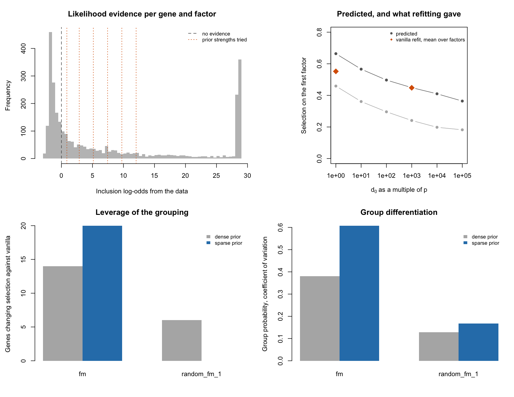

The prior does gain leverage, and the ordering reverses. In the sparser
regime the foundation-model grouping has the highest ELBO of the three,
ahead of vanilla by 17 and ahead of its matched random partition by 85.
In the dense regime vanilla led both. The contrast between informed and
random widens at the same time: the grouping now changes the selection
call for 20 genes against vanilla, while the random partition of the
same group sizes changes none at all, against 14 and 6 before.

| Regime | Condition | Mean group probability | SD across groups | Coefficient of variation |
|:---|:---|---:|---:|---:|
| dense | fm | 0.281000 | 1.06e-01 | 0.380 |
| sparse | fm | 0.000441 | 2.68e-04 | 0.608 |
| dense | random_fm_1 | 0.292000 | 3.60e-02 | 0.129 |
| sparse | random_fm_1 | 0.000449 | 7.52e-05 | 0.167 |

Group differentiation survives the change of scale and increases in
relative terms. The absolute probabilities collapse, from about 0.28 to
about 0.0004, so the spread has to be read as a coefficient of variation
to be comparable: the foundation-model grouping goes from 0.38 to 0.61,
its matched random partition from 0.13 to 0.17. The grouping separates
its groups more sharply, not less, when the prior is stronger.

| Regime | Condition   | Mean per-subject RMSE |
|:-------|:------------|----------------------:|
| dense  | vanilla     |                0.5128 |
| sparse | vanilla     |                0.4985 |
| dense  | fm          |                0.5120 |
| sparse | fm          |                0.4981 |
| dense  | random_fm_1 |                0.5122 |
| sparse | random_fm_1 |                0.4986 |

None of it reaches prediction. The three sparse conditions differ from
each other by 0.0005 in held-out error, the same negligible margin as
before, and the foundation-model grouping is again nominally first.

The regime itself does far more than any prior information. Every sparse
fit reconstructs the held-out visits better than every dense fit, 0.498
against 0.512, an improvement of about 0.014, which is roughly
twenty-five times the largest difference between conditions in either
regime. A model with one factor and 448 selected genes predicts better
than one with three factors and 941. All of them remain far behind the
per-subject mean at 0.285.

## Saved outputs

- `analysis/figures/progress/07e_sparsity.png`
- `analysis/results/metrics/07e_prior_leverage.csv`,
  `07e_data_log_odds.csv`, `07e_regime_summary.csv`,
  `07e_group_spread.csv`, `07e_holdout_error.csv`

## Decisions

$d_0 = 1000p$ was chosen from the analytic prediction, as the point
where selection changes substantially while the model still selects a
good part of the panel, and fixed before the refits.

One matched random partition rather than five, because the diagnostic
asks whether the informed grouping acts differently from a random one of
the same shape, not how large that difference is relative to a null
distribution.

## Limitations and open points

The reversal of the ELBO ordering is measured against a single random
partition, so there is no null spread to judge the gap of 85 against.
Reading it as evidence that content matters more in the sparser regime
requires the other four partitions, and this diagnostic does not have
them.

The prior used here has an implied mean inclusion probability of about
$10^{-6}$. It is a device for probing the regime, not a defensible
prior, and the fact that it improves held-out reconstruction says more
about the model being over-parameterised at $Q = 5$ with dense selection
than about the prior being right.

Pruning to a single factor makes the comparison between regimes one
between two different models. The held-out improvement cannot be
attributed to sparsity alone.

## Files

- `analysis/R/07e_sparsity_diagnostic.R`

## Next

The diagnostic answers its question. The Stage 7 null is not simply an
artefact of dense selection, since the prior does gain leverage when it
is strong enough to matter, and the informed grouping separates from a
random one more clearly there than it did before. The leverage is still
far too small to move prediction, and the largest effect in this table
belongs to model size rather than to any external information.

The result worth following up is the one the diagnostic strengthened
rather than the one it was aimed at: the foundation-model partition
differentiates its groups about three times as sharply as a size-matched
random partition in both regimes. Stage 7f asks that question in a form
where the answer cannot be an artefact.

# Stage 7f — Does the grouping explain the model’s own selection?

## Objective

Stage 7d measured group differentiation on fits that used the grouping.
A grouped prior induces group structure in the inclusion probabilities
by construction, so part of that effect could be the prior seeing its
own reflection.

The clean version measures the same thing on the vanilla posterior,
which never saw any grouping, and gives it a real null rather than a
rank among five.

## Implementation

`analysis/R/07f_grouping_signal.R` computes the proportion of variance
in vanilla’s per-gene inclusion probabilities explained by group
membership, as a one-way $\eta^2$ averaged over the three active
factors, and compares it against 10,000 permutations of the gene labels.
Permuting labels preserves the group sizes exactly, so the null holds
the shape of the partition fixed and varies only its content, exactly as
the matched random partitions do.

Both vanilla fits are used, the full-data one and the masked one. They
are fitted to different data, so agreement between them is a
replication.

## Results

| Fit       | Grouping | Explained variance | Null mean | Null SD |    z | p     |
|:----------|:---------|-------------------:|----------:|--------:|-----:|:------|
| full_data | fm       |            0.11376 |   0.01900 | 0.00362 | 26.2 | 1e-04 |
| full_data | curated  |            0.06633 |   0.01898 | 0.00358 | 13.2 | 1e-04 |
| masked    | fm       |            0.14687 |   0.01900 | 0.00357 | 35.8 | 1e-04 |
| masked    | curated  |            0.06463 |   0.01903 | 0.00353 | 12.9 | 1e-04 |

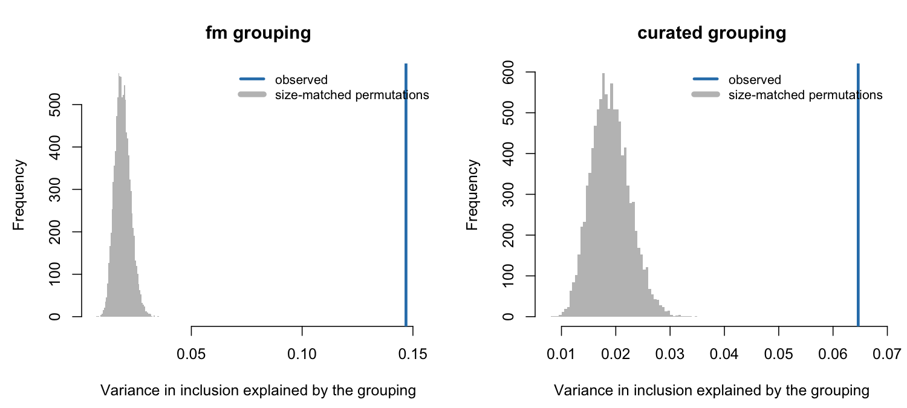

The foundation-model partition explains 14.7% of the variance in which
genes the masked vanilla fit selects, against a null centred at 1.9%
with a standard deviation of 0.36%, which is 36 standard deviations away
and beyond every one of 10,000 permutations. The full-data fit gives
11.4%, at 26 standard deviations. Reactome membership gives 6.5% and
6.6%, around 13 standard deviations, so it carries the same kind of
information at roughly half the strength.

Nothing in this measurement involves the grouped prior. The model was
fitted without any grouping, the partitions were built at Stages 3 and 4
from embeddings and pathway membership alone, and the null preserves
their group sizes. The scGPT embeddings are related to which genes this
dataset recruits onto its dynamic factors, and the relationship is
strong.

That makes the Stage 7d differentiation result safe to keep, since the
two agree in ordering and magnitude, and it makes the central negative
result sharper rather than softer. The information is there. Supplying
it through a prior on loading inclusion moves 14 genes out of 1,000.

## Saved outputs

- `analysis/figures/progress/07f_grouping_signal.png`
- `analysis/results/metrics/07f_grouping_signal.csv`

## Decisions

The statistic is computed on the vanilla posterior rather than on the
grouped fits, so that no part of it can be induced by the prior under
test.

The p-values are reported as bounded by the number of permutations
rather than extrapolated from a normal approximation, although the
z-scores are given as an effect size.

## Limitations and open points

Explained variance in inclusion probabilities is not the same as
biological validity. It says the partition is related to what this model
selects on this panel, which is what the project needs to know, and it
says nothing about whether the groups correspond to coherent biology.
Pathway enrichment would be interpretation, and against Reactome-derived
groups it would be circular.

The panel was chosen for within-subject change before vaccination, so
this result concerns the genes that vary in that particular way and does
not generalise to the transcriptome.

## Files

- `analysis/R/07f_grouping_signal.R`

## Next

Stage 7g asks what the programmes themselves contain, before the
conclusions.

# Stage 7g — What the programmes represent

## Objective

Everything to this point compares conditions against each other. This
asks whether the dynamic factors bayesSYNC recovers correspond to
anything about the subjects, and what the fitted trajectories actually
look like. It uses the Stage 6 full-data fits, which retain the
reconstructed trajectories and their credible bands.

Both the vanilla and the foundation-model fits are examined. Stage 7d
showed their posteriors to be nearly identical, so agreement here is a
check rather than a discovery; a disagreement would have meant something
was wrong with that conclusion.

## Implementation

`analysis/R/07g_interpret_programmes.R` summarises each subject’s latent
trajectory on each active factor two ways: the signed value at day 1,
and the amplitude, the range of the trajectory over the grid. The
amplitude does not depend on the factor’s sign, which is arbitrary. The
foundation-model factors are matched to vanilla’s by loading
correlation, and sign-flipped where needed, before anything is compared.

Two colour conventions run through the figures and are kept apart on
purpose. Cohort, a property of the subjects, is purple for COVR and
green for HC. Model, a property of the fit, is orange for vanilla and
blue for the foundation-model grouping, as in every other figure in this
report.

Cohort, sex, their interaction and age are the covariates, nominated by
the study design rather than chosen after looking at the fits. A
difference between two stratified tests is not a test of a difference,
so the sex-dimorphic question is asked as the interaction term in a
linear model that also adjusts for age.

The scores are posterior means treated as though observed, which ignores
their estimation uncertainty. The p-values are unadjusted, and there are
six interaction tests.

## Results

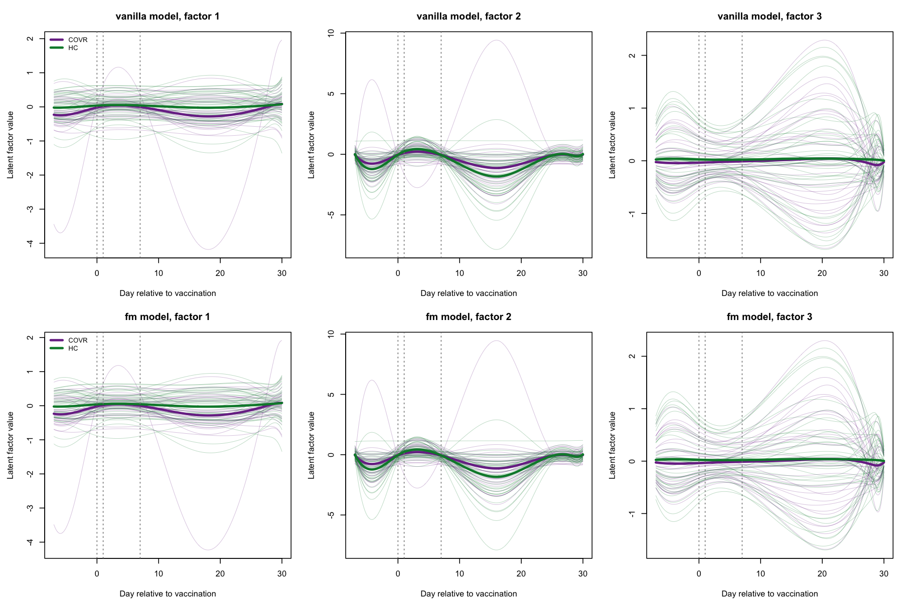

The three factors have distinct shapes, and the two models produce the
same three. All of them are tightly bunched between day −7 and day 7,
where the visits are, and fan out afterwards. Factor 2 is the one with a
clear vaccination response: a rise peaking around day 3, common to
nearly every subject.

| Model   | Factor   | Summary   | Interaction estimate |        p |
|:--------|:---------|:----------|---------------------:|---------:|
| fm      | factor_1 | amplitude |               0.1931 | 0.572000 |
| vanilla | factor_1 | amplitude |               0.1912 | 0.576000 |
| fm      | factor_1 | score     |              -0.0796 | 0.609000 |
| vanilla | factor_1 | score     |              -0.0757 | 0.622000 |
| fm      | factor_2 | amplitude |              -0.4104 | 0.694000 |
| vanilla | factor_2 | amplitude |              -0.4198 | 0.686000 |
| fm      | factor_2 | score     |              -0.7237 | 0.000841 |
| vanilla | factor_2 | score     |              -0.7213 | 0.000827 |
| fm      | factor_3 | amplitude |               0.3812 | 0.252000 |
| vanilla | factor_3 | amplitude |               0.3761 | 0.258000 |
| fm      | factor_3 | score     |               0.1155 | 0.428000 |
| vanilla | factor_3 | score     |               0.1180 | 0.413000 |

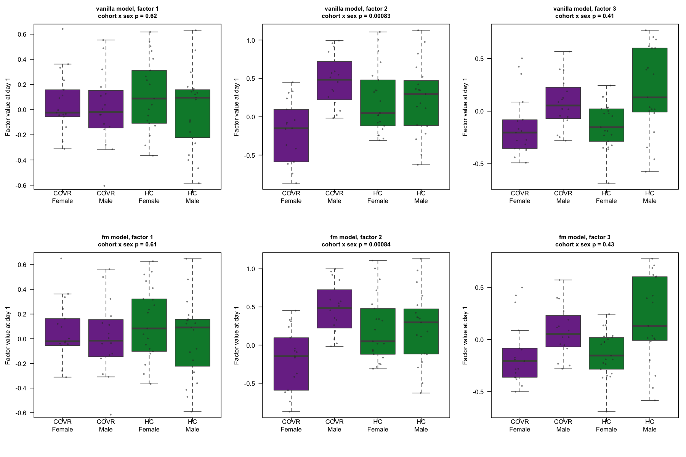

Factor 2 carries a cohort by sex interaction at $p = 0.00083$ under the
vanilla model and $p = 0.00084$ under the foundation-model grouping,
both adjusted for age. Among the recovered subjects the score separates
the sexes strongly, while among healthy controls it barely differs, and
the direction of the cohort contrast reverses between sexes. Six
interaction tests were run per model, so a Bonferroni threshold would be
0.008 and this survives it. No other factor or summary comes close under
either model.

The published analysis of these data reports a sex-dimorphic imprint of
prior mild COVID-19 on the influenza vaccination response. A
three-factor model fitted to 1,000 genes, with no knowledge of cohort,
sex or age, recovers a programme whose subject scores carry that same
interaction.

| Factor   | Score correlation | Amplitude correlation |
|:---------|------------------:|----------------------:|
| factor_1 |            0.9999 |                0.9999 |
| factor_2 |            1.0000 |                1.0000 |
| factor_3 |            1.0000 |                0.9998 |

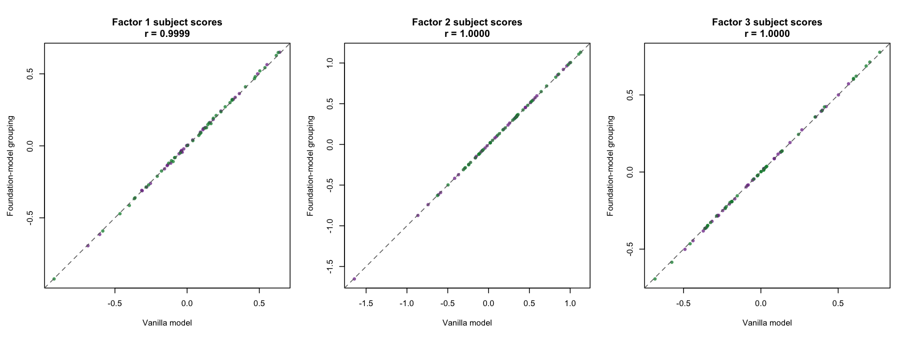

The two models place the subjects in the same positions, at correlations
of 0.9999 and above on every factor. This is the Stage 7d conclusion
arriving from a different direction: the informed prior does not change
what the model learns, so it does not change what the programmes are
associated with either. The association is a property of the data and
the model class, not of the prior under test.

A factor separating the sexes could simply be carrying sex-chromosome
genes, which would make the association a fact about the panel. None of
the eleven usual markers, XIST and the Y-linked set, is in the panel at
all, so that explanation is unavailable.

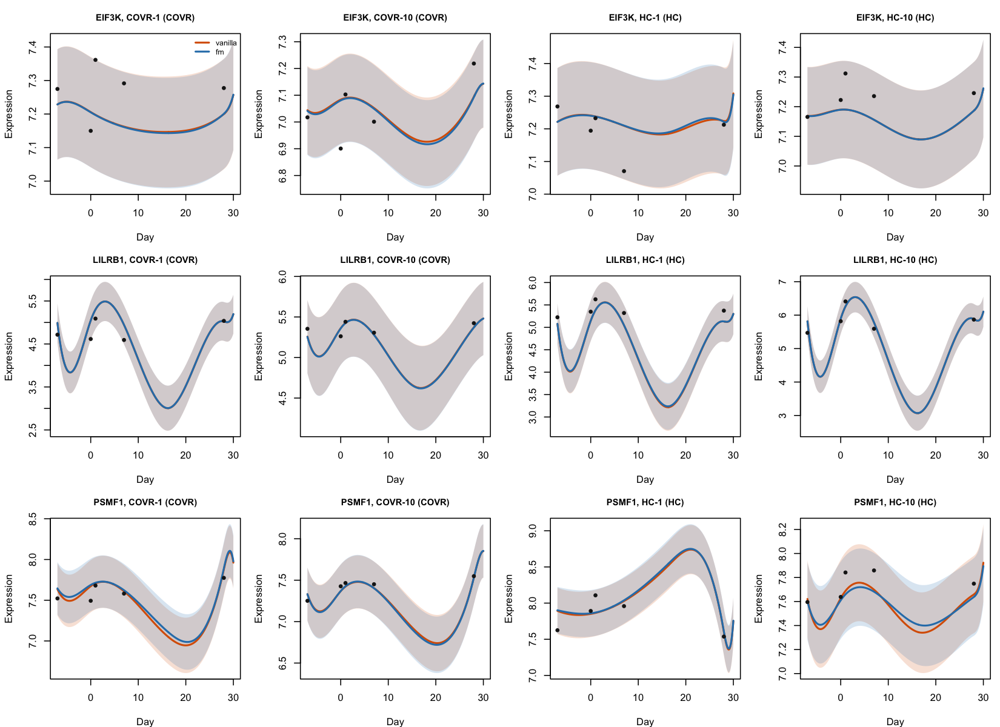

The gene-level reconstructions show what the factors buy and what they
cost, with both models drawn on the same axes. LILRB1, the gene loading
most strongly on factor 2, is fitted with a coherent post-vaccination
rise that tracks its observations closely in every subject shown, and
the credible bands are narrow where the data are. The orange vanilla
curve is mostly invisible beneath the blue one, which is the point.

They also show something that needs saying plainly. Between day 7 and
day 28 there are no observations at all, and the fitted trajectories
swing through that window with bands no wider than where the data are.
For LILRB1 the model asserts a fall of more than two log2 units around
day 16 and a return by day 28, on no evidence. The bands describe
uncertainty in the factor scores and the residual variance, not
uncertainty about the shape of a curve through a three-week gap, and
they should not be read as though they did.

## Saved outputs

- `analysis/figures/progress/07g_latent_trajectories.png`,
  `07g_scores_by_cohort.png`, `07g_model_agreement.png`,
  `07g_gene_trajectories.png`
- `analysis/results/metrics/07g_subject_scores.csv`,
  `07g_score_associations.csv`, `07g_interaction_tests.csv`,
  `07g_model_agreement.csv`, `07g_sex_gene_check.csv`,
  `07g_factor_pve.csv`

## Decisions

The sex-dimorphic question is tested as an interaction, not by comparing
stratified tests.

Both a signed and a sign-free summary of each subject’s trajectory are
reported, because the sign of a factor is arbitrary and a result that
appears only in the signed summary needs that context.

Both models are examined rather than vanilla alone, so that the
association cannot be read as a property of one arbitrary condition.

Cohort and model use separate colour pairs throughout, purple and green
for the subjects, orange and blue for the fits. One pair for both would
invite comparison across the wrong axis.

## Limitations and open points

The association is between an estimated score and an observational
grouping. Prior infection was not randomised, the cohorts differ in ways
beyond the matching variables, and nothing here supports a causal
reading.

The interaction is one result among six tests on three factors, in one
dataset, from posterior means treated as data. It is a reason to look
further, not a finding in its own right.

The trajectories are unconstrained between day 7 and day 28 and the
credible bands do not widen there. Any interpretation of programme shape
in that window is interpretation of the spline basis.

## Files

- `analysis/R/07g_interpret_programmes.R`

# Conclusions

## What was established

The grouped prior is implemented, documented and validated. It reduces
exactly to the original model when every gene shares one group, leaves
the default path bit-identical to the unmodified package, keeps the
prior expected sparsity unchanged under any partition, matches a direct
implementation of the variational update, and in simulation with correct
groups recovers the true loadings better than either vanilla or random
groups, at AUC 1.000 against 0.939 and 0.932. Whatever the real-data
results say, they are not saying the mechanism does not work.

On GSE194378, thirteen conditions were fitted twice under identical
settings, differing only in the prior on loading inclusion.

## What the comparisons found

External gene structure is informative about this dataset. The scGPT
partition explains 14.7% of the variance in vanilla’s gene selection
against 1.9% expected from partitions of the same shape, replicated on a
second fit, with no grouped prior involved. Reactome carries the same
signal at half the strength. This is the project’s positive result and
it is the most securely measured thing in it.

Using that structure as a prior changes the fitted model very little.
Loadings correlate with vanilla’s at 0.999, and 14 genes out of 1,000
change selection. The informed groupings do move the posterior about
three times as far as size-matched random partitions do, so the effect
is real, and it is tiny.

The informed groupings fit the observed data better than their nulls,
reproducibly, by 76 and 81 units of ELBO. The gain sits entirely in the
terms involving the inclusion prior, while the block containing the data
fit is slightly worse. It measures agreement between the partition and
the inferred selection pattern, which is close to what the Stage 7f test
measures directly.

Nothing reaches the held-out data. The thirteen conditions span two
parts in a thousand in reconstruction error, with each informed grouping
interleaved among its own nulls. Programme stability under a data
perturbation shows no advantage either, and if anything the informed
groupings sit marginally below their nulls.

Every model is beaten by a per-subject mean, and by a wide margin: 0.285
against 0.513. Granting the models each subject’s own level closes most
of that gap, to 0.311, and what remains is that the fitted trajectories
predict a held-out visit no better than assuming the subject does not
move.

## Why

The model gives each subject six numbers, three active factors with two
spline components each, to describe 1,000 genes across five visits.
There is no per-gene subject intercept. On these data the
between-subject variation in a gene is about twice the within-subject
temporal variation, so the reconstruction target is mostly a quantity
the model does not represent, and the paired comparison between
conditions is correspondingly insensitive.

Selection is dense because the evidence is decisive. The likelihood
contributes a median inclusion log-odds of about 2 and an upper quartile
of 18, while the entire spread of prior log-odds available to a grouping
is around 2.7, and tightening the prior moves it only as $-\log d_0$. A
prior on inclusion cannot compete with evidence of that strength, and
the density of selection is a property of the data rather than a tuning
choice.

The temporal signal is weak at the held-out points. Five visits over 37
days, with the response concentrated near day 1, leave about four
retained observations to estimate a smooth two-component curve per
factor, and the resulting trajectories do not beat a flat line at the
visit that was hidden.

So the chain runs: real external information, a narrow channel through
which the model can accept it, and an evaluation dominated by variation
the model does not model. Each link is measured rather than assumed.

## What this does and does not say

It does not say that foundation-model gene representations are
uninformative for longitudinal programme learning. Stage 7f says the
opposite, on the only part of the question this design could measure
cleanly.

It does not say the grouped prior is wrongly specified or implemented.
Stage 5 shows it working where the grouping is correct and the regime
allows it to act.

It does say that on this dataset, with this model and this panel,
external structure supplied through the inclusion prior does not change
what the model learns in any way that reconstruction or stability can
detect, and it says why in terms that would apply to any dataset with
the same three properties.

## What would add light, and what would not

More replicates of the held-out mask would not help. The informed
groupings are interleaved with their nulls, not close to them, so there
is no effect for replication to resolve. Subject subsampling, the
original Stage 8, is in the same position after the cheaper perturbation
at Stage 7d pointed slightly the wrong way. More clustering resolutions
or a second scGPT checkpoint would be tuning group construction against
an outcome, which the project rules out and which the diagnostics say is
not the bottleneck.

The binding constraint is the model, not the grouping. A per-gene
subject intercept would change every downstream result, because it would
remove the component that dominates the reconstruction error and let the
comparison see the temporal part. That is a change to bayesSYNC’s model
rather than to its prior, which this project deliberately does not make,
and it is the clearest recommendation to come out of the work.

Failing that, the constraint is the data. A design with more time
points, or one where the response is large relative to between-subject
differences, would give the temporal part something to recover. The
fallback datasets in `plan.md` were specified for feasibility rather
than for this, and adopting one would be a new project rather than a
further stage.

Two smaller things would be worth having if the work is written up. The
sparse-regime reversal at Stage 7e rests on a single random partition,
and four more fits would give it a null distribution. And the Stage 7f
result invites the obvious descriptive question of what the informative
groups contain, which is interpretation rather than validation and must
not be tested against the Reactome information used to build the curated
comparator.

<!-- Reusable stage template: analysis/report/stage_template.Rmd -->
