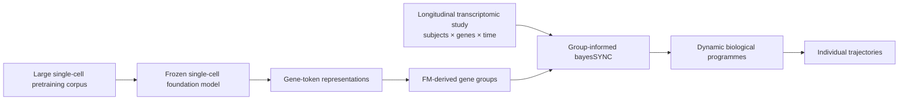

# EmbedSYNC

**Foundation-model-informed longitudinal biological programme learning with bayesSYNC**

EmbedSYNC asks whether biological structure learnt by a large pretrained single-cell model can improve the recovery of stable, predictive and interpretable longitudinal gene programmes from smaller repeated-measures studies.

The central idea is simple: use a frozen foundation model to provide **external information about relationships among genes**, while leaving the longitudinal study to determine which dynamic programmes are actually supported by the data and how they vary across individuals.

> **Status:** early implementation. The analysis plan is fixed; package and real-data work are being implemented in stages.

## Concept



scGPT is used as a **single-cell foundation model**. EmbedSYNC does not treat bulk longitudinal samples as cells and does not fine-tune the foundation model. Instead, it extracts the static gene-token representations learnt during pretraining and uses them to define gene relationships.

## Model extension

bayesSYNC represents longitudinal expression as

\[
y_{ij}(t)
=
\mu_j(t)
+
\sum_{q=1}^{Q} b_{jq}h_{iq}(t)
+
\varepsilon_{ij}(t),
\]

where \(h_{iq}(t)\) is subject \(i\)'s trajectory along dynamic factor \(q\), and \(b_{jq}\) is the loading of gene \(j\) on that factor.

EmbedSYNC changes only the prior sharing structure for the spike-and-slab loading indicators. If gene \(j\) belongs to external group \(k=m(j)\),

\[
\gamma_{jq}\mid \pi_{kq}
\sim
\operatorname{Bernoulli}(\pi_{kq}).
\]

The external groups inform **which genes may be selected together**. They do not force common loading signs, loading magnitudes or temporal trajectories.

The grouped prior is calibrated so that changing the partition does not automatically change the expected overall sparsity. See [`plan.md`](plan.md) for the full specification.

## Comparison

The project compares the same downstream longitudinal model under four information sources:

| Model | Prior information |
|---|---|
| Vanilla bayesSYNC | None |
| Curated biology | Reactome-derived gene groups |
| Foundation model | scGPT gene-embedding-derived groups |
| Negative control | Matched random groups with the same group sizes |

The primary evaluation is **within-subject held-out-visit reconstruction**. Pathway enrichment is used for interpretation, not as the main validation criterion.

A secondary analysis asks whether external biological information improves the **stability of learnt programmes** under subject subsampling.

## Data

The planned primary dataset is **GSE194378**, a longitudinal whole-blood RNA-seq study around seasonal influenza vaccination. The exact usable sample set, technical replicates and final gene panel are established during the first feasibility stage rather than assumed.

Fallback datasets are specified in [`plan.md`](plan.md).

## Repository structure

```text
EmbedSYNC/
├── README.md
├── plan.md
├── PROGRESS.Rmd
├── analysis/
│   ├── R/
│   ├── python/
│   ├── data/
│   ├── metadata/
│   ├── objects/
│   ├── results/
│   └── figures/
└── bayesSYNCfm/      # the group-informed R package
```

`bayesSYNCfm/` holds the R package implementing the group-informed prior. It is a derivative of [`bayesSYNC`](https://github.com/hruffieux/bayesSYNC), installed under its own name so that both packages can be used side by side, and it is tracked as part of this repository.

## Progress

The detailed scientific log is maintained in [`PROGRESS.Rmd`](PROGRESS.Rmd). It records:

- data and software versions;
- QC and implementation checks;
- provisional and final results;
- failed gates and negative findings;
- analysis decisions;
- figures and tables produced along the way.

To render the report locally:

```r
rmarkdown::render("PROGRESS.Rmd")
```

This creates `PROGRESS.html`, which is treated as a local build artefact.

## Reproducibility principles

The project is intentionally bounded and laptop-scale.

- No foundation-model fine-tuning.
- No raw FASTQ processing.
- No download of the foundation model's single-cell training corpus.
- Foundation-model embeddings are extracted once and cached.
- All model comparisons use the same gene panel and held-out observations.
- Random controls preserve the informed group-size distributions.
- A null or negative foundation-model result is retained rather than tuned away.

## Project stages

1. Verify the unmodified bayesSYNC package locally.
2. Establish real-data feasibility.
3. Freeze the common gene panel.
4. Extract scGPT gene representations and construct FM groups.
5. Construct Reactome and matched-random groups.
6. Implement and test the grouped bayesSYNC prior.
7. Run the first full-data comparison.
8. Evaluate held-out visits.
9. Assess programme stability if the primary comparison is sound.

The detailed gates and stopping rules are in [`plan.md`](plan.md).

## Software

- `bayesSYNCfm`, included in this repository, derived from [bayesSYNC](https://github.com/hruffieux/bayesSYNC)
- [scGPT](https://github.com/bowang-lab/scGPT)

## Licence and citation

Licence and citation information will be added once the implementation is sufficiently stable for public release.
