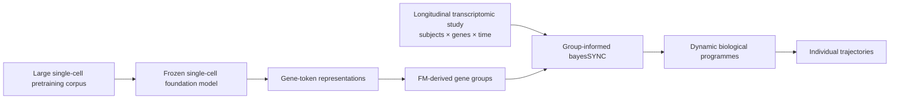

# EmbedSYNC

**Foundation-model-informed longitudinal biological programme learning with bayesSYNC**

EmbedSYNC asks whether biological structure learnt by a large pretrained single-cell model can improve the recovery of stable, predictive and interpretable longitudinal gene programmes from smaller repeated-measures studies.

The central idea is simple: use a frozen foundation model to provide **external information about relationships among genes**, while leaving the longitudinal study to determine which dynamic programmes are actually supported by the data and how they vary across individuals.

> **Status:** stages 0–7 complete, which is the minimum project set out in [`plan.md`](plan.md). The grouped prior is implemented and tested, and both the full-data and the held-out comparisons have been run on GSE194378. See [`Findings so far`](#findings-so-far).

## Concept



scGPT is used as a **single-cell foundation model**. EmbedSYNC does not treat bulk longitudinal samples as cells and does not fine-tune the foundation model. Instead, it extracts the static gene-token representations learnt during pretraining and uses them to define gene relationships.

## Model extension

bayesSYNC represents longitudinal expression as

```math
y_{ij}(t)
=
\mu_j(t)
+
\sum_{q=1}^{Q} b_{jq}h_{iq}(t)
+
\varepsilon_{ij}(t),
```

where $h_{iq}(t)$ is subject $i$'s trajectory along dynamic factor $q$, and $b_{jq}$ is the loading of gene $j$ on that factor.

EmbedSYNC changes only the prior sharing structure for the spike-and-slab loading indicators. If gene $j$ belongs to external group $k=m(j)$,

```math
\gamma_{jq}\mid\pi_{kq}\sim\mathrm{Bernoulli}(\pi_{kq}).
```

The external groups inform **which genes may be selected together**. They do not force common loading signs, loading magnitudes or temporal trajectories.

The grouped prior is calibrated so that changing the partition does not automatically change the expected overall sparsity. See [`plan.md`](plan.md) for the full specification.

## Comparison

The project compares the same downstream longitudinal model under four information sources:

| Model | Prior information |
|---|---|
| Vanilla bayesSYNC | None |
| Curated biology | Reactome-derived gene groups |
| Foundation model | scGPT gene-embedding-derived groups |
| Negative control | Matched random groups with the same group sizes |

The primary evaluation is **within-subject held-out-visit reconstruction**. Pathway enrichment is used for interpretation, not as the main validation criterion.

A secondary analysis asks whether external biological information improves the **stability of learnt programmes** under subject subsampling.

## Findings so far

Both comparisons have been run on the frozen 1,000-gene panel, with 13 conditions fitted under identical settings and differing only in the prior on loading inclusion.

The content of a grouping affects how well the model fits the data it sees. Both informed groupings beat their size-matched random partitions on the ELBO, the foundation-model grouping by 76 units on the full data and by 81 on the masked data, against a spread of a few units among the five nulls in each case. Because the random partitions preserve group sizes exactly, this is attributable to which genes are grouped together rather than to pooling as such. Vanilla bayesSYNC nevertheless fits best of all thirteen.

That advantage does not reach observations the model has not seen. On the primary evaluation, reconstruction of one held-out internal visit per subject, the thirteen conditions are indistinguishable, and each informed grouping sits interleaved among its own random partitions. Every model is also beaten by a per-subject mean over the retained visits, which reflects the model's structure: subject-specific variation passes through three active factors with two spline components each, so it carries no per-gene subject intercept, and between-subject variation per gene is about twice the within-subject variation on these data.

Diagnostics run on the fitted models reconcile the two. The priors move the posterior very little, the foundation-model grouping furthest at 14 genes out of 1,000 changing selection. Its in-sample advantage sits entirely in the ELBO terms involving the inclusion prior, while the block containing the data fit is slightly worse, so the gain measures how well the partition matches the selection pattern the model infers rather than how well the model accounts for the data.

The scGPT partition does track real structure. Its inferred group inclusion probabilities range from 0.05 to 0.46 across twenty groups, while all five size-matched random partitions stay between 0.20 and 0.36, so the grouping separates genes that load on the inferred factors from genes that do not, well beyond what group sizes alone produce. It differentiates its groups about three times as sharply as a size-matched random partition, and does so under both the default prior and a much stronger one.

That structure still reaches neither prediction nor programme stability. Refitting under a prior a thousand times stronger gives the grouping more leverage and reverses the in-sample ordering, with the foundation-model grouping ahead of vanilla, while leaving held-out error between conditions unchanged at four parts in ten thousand.

The negative result is reported as it stands. Details, diagnostics and the decisions behind both comparisons are in [`PROGRESS.md`](PROGRESS.md).

## Data

The planned primary dataset is **GSE194378**, a longitudinal whole-blood RNA-seq study around seasonal influenza vaccination. The exact usable sample set, technical replicates and final gene panel are established during the first feasibility stage rather than assumed.

Fallback datasets are specified in [`plan.md`](plan.md).

## Repository structure

```text
EmbedSYNC/
├── README.md
├── plan.md
├── PROGRESS.Rmd
├── analysis/
│   ├── R/
│   ├── python/
│   ├── data/
│   ├── metadata/
│   ├── objects/
│   ├── results/
│   └── figures/
└── bayesSYNCfm/      # the group-informed R package
```

`bayesSYNCfm/` holds the R package implementing the group-informed prior. It is a derivative of [`bayesSYNC`](https://github.com/hruffieux/bayesSYNC), installed under its own name so that both packages can be used side by side, and it is tracked as part of this repository.

## Progress

The detailed scientific log is maintained in [`PROGRESS.Rmd`](PROGRESS.Rmd). It records:

- data and software versions;
- QC and implementation checks;
- provisional and final results;
- failed gates and negative findings;
- analysis decisions;
- figures and tables produced along the way.

The report is rendered in two formats:

```r
rmarkdown::render("PROGRESS.Rmd", output_format = "all")
```

`PROGRESS.md` is version-controlled and readable directly on GitHub, so the current state of the project can be read without cloning. `PROGRESS.html` has a floating table of contents and code folding, and is treated as a local build artefact.

Both are generated from cached results: the analysis scripts save small tables under `analysis/results/` and figures under `analysis/figures/progress/`, and the report reads those rather than refitting anything.

## Reproducibility principles

The project is intentionally bounded and laptop-scale.

- No foundation-model fine-tuning.
- No raw FASTQ processing.
- No download of the foundation model's single-cell training corpus.
- Foundation-model embeddings are extracted once and cached.
- All model comparisons use the same gene panel and held-out observations.
- Random controls preserve the informed group-size distributions.
- A null or negative foundation-model result is retained rather than tuned away.

## Project stages

1. Verify the unmodified bayesSYNC package locally.
2. Establish real-data feasibility.
3. Freeze the common gene panel.
4. Extract scGPT gene representations and construct FM groups.
5. Construct Reactome and matched-random groups.
6. Implement and test the grouped bayesSYNC prior.
7. Run the first full-data comparison.
8. Evaluate held-out visits.
9. Assess programme stability if the primary comparison is sound.

The detailed gates and stopping rules are in [`plan.md`](plan.md).

## Software

- `bayesSYNCfm`, included in this repository, derived from [bayesSYNC](https://github.com/hruffieux/bayesSYNC)
- [scGPT](https://github.com/bowang-lab/scGPT)

## Licence and citation

Licence and citation information will be added once the implementation is sufficiently stable for public release.
